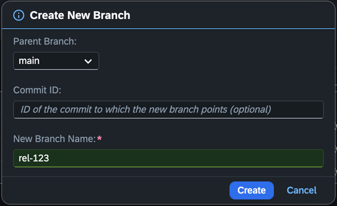

<!-- loio53b659cf81914b54abfdf287660e0466 -->

# Delete a Branch

> ### Caution:  
> **Branch Deletion**:
> 
> While it is possible to delete branches, please consider the possible negative effects of branch deletion, like losing the commit history.
> 
> Please make sure that the branch you are deleting is no longer in use on other systems. If you delete the branch while it's in use in other systems, this code can no longer be released there, even if there are open transport requests.
> 
> The branch will be deleted locally as well as on the remote repository. After the branch deletion, a pull of this branch is no longer possible on all system instances.

## Safe Deletion

### Overview

The Safe Remote Deletion feature in the Manage Software Components app is designed to ensure system integrity by preventing the accidental deletion of active repositories or branches. This feature protects against the creation of ghost software components: local clones that become disconnected from their remote repositories and lose pull and push capabilities.

> ### Caution:  
> Currently, this feature is available only for SAP managed software components.

### Summary

The Safe Remote Deletion feature ensures that:

-   No repository or branch is deleted while still in active use.
-   All systems maintain consistent software component and branch states.
-   Developers can manage repositories safely without risking data inconsistency or broken links.

### 

*Safe Branch Deletion* 

This feature prevents the remote deletion of a branch that is currently checked out \(active\) in any local repository.

Ensures:

-   No local repository references a non-existent branch.
-   Ongoing development remains consistent across systems.

## Branch Deletion Scenario

Steps:

1.  Create a software component in the Manage Software Components app.
2.  Clone the software component into two different systems.
3.  In one system, create and check out a new branch \(e.g., `rel-123`\).

    

4.  In the second system, refresh the branch list.
5.  Attempt to delete the branch `rel-123` remotely.

Expected Result:

The deletion fails because the branch is active in another system.

## Safe Remote Deletion Procedure

To safely delete a branch, you need to...

1.  Check out another branch in all local repositories where the branch is active.
2.  Initiate the remote deletion once the branch is no longer active anywhere.

> ### Tip:  
> Before performing any deletion operation, always verify clone and branch usage in all systems to ensure a clean and safe deletion process.

