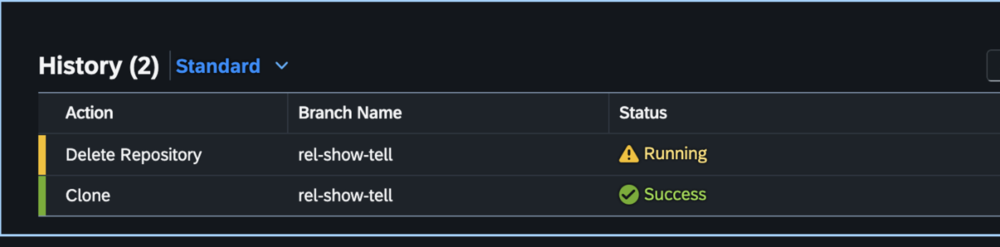

<!-- loioa982ba36da184788a133df4500b25a08 -->

# Delete Software Components

### Context

You want to delete a software component in order to:

-   get rid of software components that are no longer used.

-   get rid of software components that have been created by mistake \(such as a typo in the software component name\).

For every delete activity, the executing business user is documented in a log.

### Procedure

To delete a software component, perform the following steps:

1.  In the *Manage Software Components* app, pick the software component that you want to delete out of the list.

2.  Click onto the software component to be redirected to its detail page.

3.  Choose the *Delete* button in the upper right corner.

4.  You will be prompted to confirm the action and are able to choose if you want to delete only the local repository or the local repository in combination with the remote repository.

<a name="loioa982ba36da184788a133df4500b25a08__section_j3z_ffl_vvb"/>

## Software Component Deletion in a Service Instance

### Types of Software Component Deletion

<table>
<tr>
<th valign="top">

Empty Software Component

</th>
<th valign="top">

Used Software Component

</th>
</tr>
<tr>
<td valign="top">

The software component contains no object locally in the service instance and no changes are committed to the remote repository. The remote repository, the associated structure package of the software component, and the software component itself are deleted. The deletion of the ABAP structure package and software component is executed without creating a transport request.

</td>
<td valign="top">

The software component contains objects locally and possible changes are committed to the remote repository. The remote repository is then deleted and the software component is locked. Since the software component is locked, no object changes can be released \(pushed to remote\) anymore.

</td>
</tr>
</table>

### Local and Remote Deletion - SAP-managed Software Components

****

<table>
<tr>
<td valign="top">

 

</td>
<td valign="top">

**Local Deletion**

</td>
<td valign="top">

**Local and Remote Deletion**

</td>
<td valign="top">

**Safe Deletion**

</td>
</tr>
<tr>
<td valign="top">

**Use Case**

</td>
<td valign="top">

Only the local representation of the software component is deleted. Local means all ABAP objects including the parent structure package.

</td>
<td valign="top">

When deleting local and remote representations, local means only the current system instance is deleted.

*The software component will be remotely deleted. As a consequence, no actions can be performed anymore. Please make sure to first delete the software component locally on all system instances where it's cloned. The component can't be deleted from the other systems after it's remotely erased. This action can't be undone.*

</td>
<td valign="top">

The Safe Remote Deletion feature ensures that:

-   No repository or branch is deleted while still in active use.
-   All systems maintain consistent software component and branch states.
-   You can manage repositories safely without risking data inconsistency or broken links.

</td>
</tr>
<tr>
<td valign="top">

**Consequences**

</td>
<td valign="top">

You can re-clone the software component again.

> ### Caution:  
> A local deletion can be critical when database tables are deleted. The local \(not transported\) table entries contained in this table will be lost. This is a possible scenario in test or production systems, since development systems usually don't contain any business data \(like table entries\).

</td>
<td valign="top">

This step should be performed as a last step once all local deletions on other system instances have been performed.

> ### Note:  
> A distributed local deletion \(deleting local software components on other system instances than the current one\) is not possible.

</td>
<td valign="top">

This utility prevents the remote deletion of a software component if it is still cloned on any local system.

</td>
</tr>
</table>

### Local and Remote Deletion - Customer-managed Software Components \(Bring Your Own Git\)

****

<table>
<tr>
<td valign="top">

 

</td>
<td valign="top">

**Local Deletion**

</td>
<td valign="top">

**Remote Deletion**

</td>
</tr>
<tr>
<td valign="top">

**Use Case**

</td>
<td valign="top">

Only the local representation of the software component is deleted. Local means all ABAP objects including the parent structure package.

</td>
<td valign="top">

You can delete the software component remotely if you select *Unregister*. This option appears only for components that are not cloned. The linked Git repository will be unregistered from the Manage Software Components app. You cannot use the linked Git repository with the software component again, nor can you link it with new software components. This action is irreversible.

> ### Note:  
> Make sure to first delete the software component locally on all system instances where it's cloned.
> 
> Your git repository in your selected git provider will not be deleted.

</td>
</tr>
<tr>
<td valign="top">

**Consequences**

</td>
<td valign="top">

You can re-clone the software component again.

</td>
<td valign="top">

The remote Git repository cannot be used again or linked with a new software component.

</td>
</tr>
</table>

### Resulting behavior in service instances where the deleted software component is still imported

1.  No further Git actions, including pull, switch branch and others, are possible.
2.  Changes to ABAP objects of the deleted software component can no longer be released.
3.  Non-released requests, in which object changes have already been recorded before the software component was deleted, must be handled specially.

    For example, you can delete the recorded object changes from the transport request. Alternatively, the transport layer of the transport request can be deleted.

<a name="loioa982ba36da184788a133df4500b25a08__section_i3q_q23_43b"/>

## Result

The selected software component is deleted centrally if the checkbox *remote deletion* for SAP-managed or the *unregister* option for customer-managed components was selected. Otherwise it is only a local deletion, affecting the current system instance.

> ### Caution:  
> Here, centrally means the repository visible throughout the global account is deleted.

You can no longer pull or clone the software component to a service instance.

If this software component has already been cloned to a service instance, objects are not deleted in the ABAP instances but the status of the software component and all belonging objects are changed to *read-only*. You're not able to make any changes to the dedicated structure package and the development package that is contained in there. If you want to delete the objects, you must delete them and import the deletion into other systems, before you delete the software component.

## Restoring Deleted Software Components

> ### Note:  
> Currently, you can't restore software components that have been deleted. Use new software component names instead of reusing previously deleted software components or software component names.

## Safe Deletion

### Overview

The Safe Remote Deletion feature in the Manage Software Components app is designed to ensure system integrity by preventing the accidental deletion of active repositories or branches. This feature protects against the creation of ghost software components \(SC\): local clones that become disconnected from their remote repositories and lose pull and push capabilities.

> ### Caution:  
> Currently, this feature is available only for SAP managed software components.

### Behavior Demonstration

*Repository Deletion Scenario*

1.  Create a new software component in the Manage Software Components Fiori app.
    1.  Navigate to *Manage Software Components* in your Fiori launchpad.
    2.  Click on the *Create* button.
    3.  Fill out all the necessary information.

2.  Clone the software component into two different systems.
    1.  Click on *Clone* for the newly created software component.
    2.  Fill out the required information, such as the branch to be checked out, the repository role and rollback mechanism.
    3.  Clone the software component on another system instance in the same global account as well.

3.  Attempt to delete the remote software component from one system.
    1.  Click on the *Delete* button.
    2.  Select the checkbox: *Delete remote repository*.
    3.  Enter the name of the software component.
    4.  Select the checkbox: "I understand the consequences".
    5.  In the end click on *Delete*.

The deletion will be triggered asynchronously in the background. Search for the software component and open it. Under the tab *History*, you will now be able to see the running deletion process as shown in the picture below.

After a few minutes, refresh the table and you will see *Error* as the status. To see more details, click onto the action, where you will be able to navigate to the *Execution Log* for more detailed error messages.

*Expected Result:*

The deletion fails because the software component is still cloned in another system.

