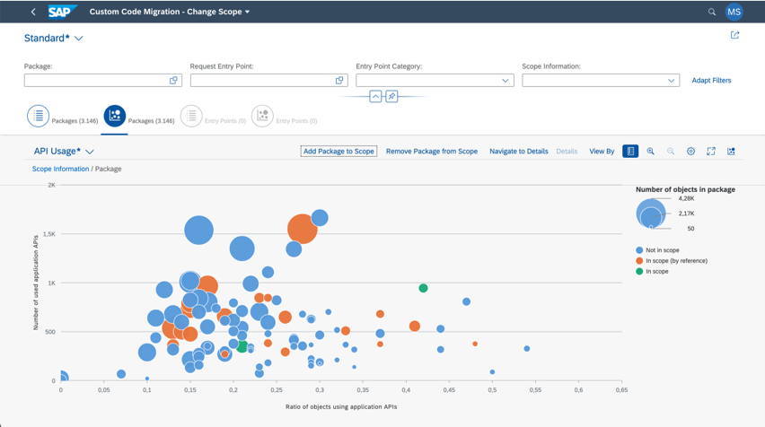

<!-- loiofec4927062e3471cadfe73fedf464225 -->

<link rel="stylesheet" type="text/css" href="../css/sap-icons.css"/>

# Dependency Analysis

In this topic, you will learn more about dependency analysis in the Custom Code Migration app.

<a name="loiofec4927062e3471cadfe73fedf464225__section_n3x_lyl_lzb"/>

## Purpose

You can utilize dependency analysis to identify dependencies from your custom code to the SAP standard and thus which part of your custom code can be transformed to the SAP BTP, ABAP Environment. To do this, you can use the *Scoping* app within the Custom Code Migration app. This app provides you with a set of measures that analyze how likely it is for you to be able to transform your code to the SAP BTP, ABAP environment.

> ### Note:  
> Please be aware that as of the SAP BTP, ABAP environment 2411 release, you now need to initiate scope calculation manually after project creation. Scope calculation no longer starts automatically at project creation.

This is how you start a dependency analysis in the Scoping app:

1.  In your project, select the *Scope* tab in the lower half of the project overview page.

2.  Select *Change Scope*.

3.  Select the second *Packages* tab from the left. This tab is marked with a bubble chart icon.

4.  Select the *Settings* \(:gear:\) button.

5.  Under *Measures*, choose your metrics for the chart axes.

    > ### Tip:  
    > This way you can set up your own individualized chart to perform dependency analysis of your custom code with SAP standard. You can determine, for example, how often your custom code calls SAP application APIs or uses DB accesses to SAP application tables such as the `MARA` table.

The following measures are available:

**The measures and their meanings**

<table>
<tr>
<th valign="top">

Measure

</th>
<th valign="top">

Explanation

</th>
</tr>
<tr>
<td valign="top">

Number of Changes

</td>
<td valign="top">

Number of changes per object within the last year

</td>
</tr>
<tr>
<td valign="top">

Number of application API usages

</td>
<td valign="top">

All usages of application APIs such as classes, interfaces, and function modules

</td>
</tr>
<tr>
<td valign="top">

Number of application DB API usages

</td>
<td valign="top">

All database operations on database tables or views; i.e., only the number of different database tables and views are counted, not the overall number of accesses

</td>
</tr>
<tr>
<td valign="top">

Number of distinct app. DB APIs used

</td>
<td valign="top">

Database operations on distinct database tables or views

</td>
</tr>
<tr>
<td valign="top">

Number of distinct application APIs used\*

</td>
<td valign="top">

Distinct usages of application APIs; i.e., only the number of different APIs are counted, not the overall number of accesses

</td>
</tr>
<tr>
<td valign="top">

Number of objects in package

</td>
<td valign="top">

Overall number of custom code objects within a package or request entry point

</td>
</tr>
<tr>
<td valign="top">

Number of objects using appl. DB APIs

</td>
<td valign="top">

Number of objects within a package or request entry point accessing application-specific database tables or views

</td>
</tr>
<tr>
<td valign="top">

Number of objects using application APIs

</td>
<td valign="top">

Number of objects within a package or request entry point using application APIs

</td>
</tr>
<tr>
<td valign="top">

Proportion of objects using app. APIs

</td>
<td valign="top">

Ratio between objects using application APIs and all objects within the package/request entry point

</td>
</tr>
<tr>
<td valign="top">

Proportion of objects using app. DB APIs

</td>
<td valign="top">

Ratio between objects using application-specific database tables or views and all objects within the package/request entry point

</td>
</tr>
</table>

\*With this measure, for example, you can check how many dependencies to different APIs your code has. In the best case, both this number and the number of locations where you are accessing those APIs are small.

After adjusting your settings, your chart could look as follows:

You can then also save your individual settings as your own view. This way, you won't have to adjust your settings again the next time you want to use the chart.

**Related Information**  

[Custom Code Migration](custom-code-migration-651ef65.md)

[Complexity Analysis](complexity-analysis-548c8d0.md "In this topic, you will learn more about complexity analysis in the Custom Code Migration app.")

