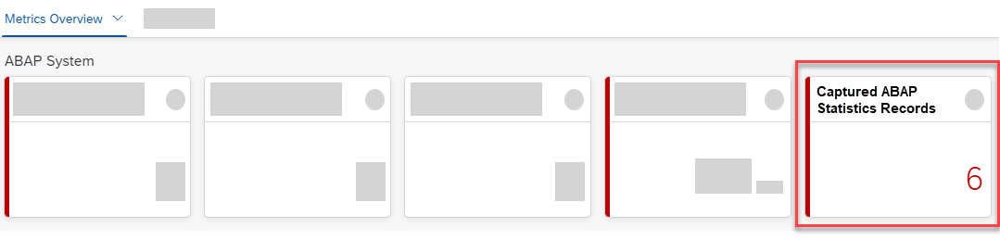
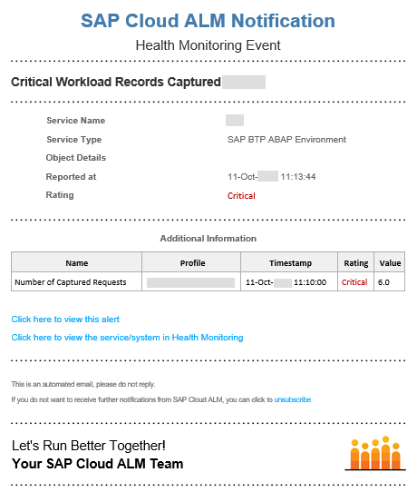

<!-- loioe92554459f3b4f68b53be0712fbd98d6 -->

# Getting Alerted About Expensive Outbound Communication Using SAP Cloud ALM

If you use SAP Cloud ALM to monitor your applications in a Cloud system landscape, you can also use health metrics to get alerted about expensive outbound communication.

<a name="loioe92554459f3b4f68b53be0712fbd98d6__prereq_wcp_bn4_y5b"/>

## Prerequisites

You have SAP Cloud ALM set up \(see [Central Health Monitoring Using SAP Focused Run and SAP Cloud ALM](central-health-monitoring-using-sap-focused-run-and-sap-cloud-alm-8d6e2e7.md)\).

You have captured request statistics relating to outbound communication using the *Capture Request Statistics* app, and you have selected the checkbox *Health Monitoring* in the relevant capture profiles \(see [Capturing Request Statistics Relating to Expensive Outbound Communication](capturing-request-statistics-relating-to-expensive-outbound-communication-f33b3d2.md)\).

## Procedure

1.  Log on to SAP Cloud ALM and call up Health Monitoring.

2.  On the Health Monitoring dashboard for your ABAP system, check the metric *Captured ABAP Statistics Records*.

    

    The number of captured ABAP statistics records that is shown in SAP Cloud ALM is the total number of captured records for profiles with the checkbox *Health Monitoring* selected.

3.  If the number of records is above zero, you have a clear indication that there was expensive outbound communication in the ABAP system during the last 5 minutes.

4.  Choose the *Captured ABAP Statistics Records* tile and then *History*.

    On the *History* popup, you can find out how many records were captured by the profile that you've chosen and how the number of records changed over time.

    > ### Note:  
    > A high number of captured ABAP statistics records with a high calling time are an indication that the performance of outbound communication gets critical. Use the settings in SAP Cloud ALM if you want to get notified with an e-mail as soon as a critical number of ABAP statistics records have been captured.
    > 
    > 

<a name="loioe92554459f3b4f68b53be0712fbd98d6__result_uqk_14l_cvb"/>

## Results

You can now go to the technical monitoring cockpit to analyze the expensive outbound communication in more detail.

**Related Information**  

[Analyzing Expensive Outbound Communication Using the Technical Monitoring Cockpit](analyzing-expensive-outbound-communication-using-the-technical-monitoring-cockpit-bfe3098.md "With the technical monitoring cockpit, you can analyze expensive outbound communication in detail.")

