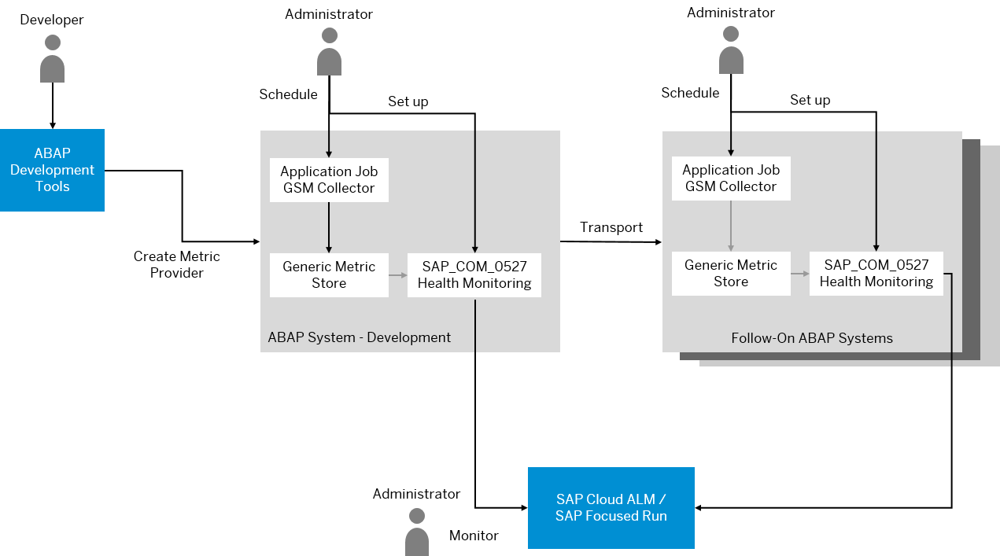

<!-- loioe4de41eaea9d49a5be76bfca81f736ab -->

# Health Monitoring Using Your Own Metrics

In addition to using the metrics for health monitoring provided by SAP, you can define your own application-specific metrics for the health monitoring of your customer and partner solutions running on the ABAP environment. The new metrics can be consumed by Health Monitoring in SAP Cloud ALM.

<a name="loioe4de41eaea9d49a5be76bfca81f736ab__section_ykr_yzl_x5b"/>

## Background and Use Case

As a customer or partner, you can use SAP Cloud ALM or SAP Focused Run to monitor the health of your systems. As part of the health monitoring in SAP Cloud ALM and SAP Focused Run, you get metrics defined by SAP that support you to watch technical issues such as the number of ABAP runtime errors, failed application jobs, or locked business users, for example, in the ABAP environment of SAP BTP.

For your own customer or partner solutions running on the ABAP environment, you might want to define your own application-specific metrics to be able to monitor the health of these solutions. As a partner, you might also want to provide additional health monitoring metrics for your partner solution to your customers.

<a name="loioe4de41eaea9d49a5be76bfca81f736ab__section_tgz_nbm_x5b"/>

## Architecture Overview

To define, set up, and use your own metrics, you proceed as follows:

1.  Using ABAP Development Tools \(ADT\), a developer at your customer or partner company defines the relevant metrics for your solution.
2.  As an administrator, you schedule an application job using the app *Schedule Metric Provider Collection*.

    The application job collects the metrics that you have defined and stores the values in the generic metric store.

3.  As an administrator, you define a communication arrangement based on the communication scenario `SAP_COM_0527` \(*Health Monitoring*\) in your ABAP system.

    As a result, a technical background job pushes the measured metrics automatically to SAP Cloud ALM or SAP Focused Run.

**Related Information**  

[Central Health Monitoring Using SAP Focused Run and SAP Cloud ALM](central-health-monitoring-using-sap-focused-run-and-sap-cloud-alm-8d6e2e7.md "Learn more about how you can monitor the ABAP environment using SAP Focused Run and SAP Cloud ALM.")

[Developing Metrics for Health Monitoring](../30-development/developing-metrics-for-health-monitoring-a7a5cfa.md "Learn how you can add your own metrics to Health Monitoring in SAP Cloud ALM or SAP Focused Run.")

