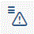

<!-- loio6a6b17f2d0464487a6c3f8a7cb61e812 -->

# How to Define Authorizations Based on Restrictions

<a name="loio6a6b17f2d0464487a6c3f8a7cb61e812__HowToMaintainAccessRestrictionsNew_context"/>

## Context

The authorization concept for business roles is based on the concept of granting authorizations \(as opposed to denying them\). By adding business catalogs to a business role and assigning the business role to a business user, you can control which applications the business user is authorized to carry out. As a next step, you define how the customer data can be accessed. You do this by adding authorization values to the restriction fields. Restriction fields are organized in restriction types. Restriction types that contain general organizational restriction fields can be found in the top section called *General*. These restriction types contain only one restriction field. The settings you make for the single restriction types sum up to the authorization that is granted to the business role and therefore to the assigned business users.

> ### Caution:  
> Please note that assigning multiple business roles to a business user increases the risk of overriding existing authorizations.

For example, you have created the business roles 1 and 2 that both include the business catalog A. In business role 1, you restricted the access rights for sales organization to A. In business role 2, you allowed to work with data for all sales organizations. The business user to whom you assign both roles will then have full access to the data for all sales organizations.

This overriding effect can also be caused if one restriction type is used in different assigned business roles of different business catalogs.

Using the *Maintain Business Roles* app, you have the following options for maintaining restrictions:

<a name="loio6a6b17f2d0464487a6c3f8a7cb61e812__HowToMaintainAccessRestrictionsNew_steps"/>

## Procedure

-   In the *Maintain Restrictions* UI, you can maintain restrictions for business roles. These restrictions are the basis of authorizations that are granted to the business users who are assigned to this business role. The business catalog defines which access categories are available for maintaining and for which fields restriction values can be maintained.

    The following access categories are available:

    -   *Write, Read, Value Help* \(write access\)
    -   *Read, Value Help* \(read access\)
    -   *Value Help* \(value help access\)

    The business role aggregates the authorizations of the assigned catalogs.

    The available restriction fields represent the authorization-relevant attributes of the business objects that are used in a role. Authorization for these fields can be granted on write, read or value help level \(for example for a particular sales area\).

    You can select or enter single values \(pre-defined by SAP or customer-specific configuration\) and ranges.

    For more information, see *Display Restriction Types* \(Related Information\).

    > ### Note:  
    > When you set an access category to *Restricted* you can define the data access for each restriction type and restriction field according to your process requirements. You can do this on*Read*, *Write* and *Value Help* level.

**Write** 

-   The default value access category when a role is created is *No Access*. This means that this business role has no write authorizations at all \(display only\). You can add specific authorizations \(*Restricted*\) or in cases where you want to grant full access for all restriction types and restriction fields, you can choose *Unrestricted* \(‘*\**’\).

    Switching the write access to *Restricted* allows you to define which data can be edited by the users assigned to this business role.

-   In the *Values* area, you can define the authorization values for the desired restriction fields.

    If you don’t want to grant access to a restriction field on purpose, you can choose the status *Not maintained*.

-   Every authorization you define in the *Write* access category is inherited to the *Read* and *Value Help* access category.

**Read**

-   The default status of the access category *Read* is *Unrestricted*.

    Switching the read access to *Restricted* allows you to define which data can be seen by the users assigned to this business role.

    In the *Values* section, you can define the instance-based restrictions for the desired restriction fields used for value helps.

    For more information about the *Values* area, please refer to the *Write* section above.

-   Every authorization you define in the *Read* access category is inherited to the *Value Help* access category.

**Value Help** 

-   You can define authorizations for value helps that are used in a business role. These value help authorizations will not influence the defined restrictions for read access.

    In the context of a business role, you can authorize the value help access, for example to business partners that belong to certain authorization groups.

*Leading Restriction*

-   In this section, we will describe how you can reduce the maintenance effort of restriction fields that are used in multiple restriction types of an access category.

-   Restriction types that contain general organizational restriction fields can be found in the top section called *General*. These restriction types contain only one restriction field.

    The status of the restriction fields that belong to this section can be changed to*Leading Restriction*. You can do this by selecting the *Leading Restriction* checkbox. This status is visible through the*Leading Restriction* symbol in the *Restrictions Overview*. The respective symbol looks like this:

    

    That means the value in this field is automatically inherited to other restriction types the field is used in as well.

    You want to, for example, define that the values for the country templates for Austria and Switzerland are applied in all restriction types the *Company Code* field is used in. So you select the values `AU01` \(for Austria\) and `CH01` \(for Switzerland\) and switch *Leading Restriction* on. Then these values are automatically inherited to all occurrences of the *Company Code* field.

    *Default Values from Business Catalogs*

    Business catalogs can contain default values. In rare cases, these might overwrite the values defined by you in the Restrictions and Values section. The system then displays a message listing the default values that are added from the business catalog. To avoid this, you then need to remove the respective business catalog from the business role. The respective symbol that is visible in the *Restrictions Overview* looks like this:

    

**Related Information**  

[Display Restriction Types](display-restriction-types-9203905.md "You can use this app to display restriction types and their validity.")

 <?sap-ot O2O class="- topic/link " href="03540a86736543c4b94070d08df40744.xml" text="" desc="" xtrc="link:2" xtrf="file:/home/builder/src/dita-all/jjq1673438782153/loio2080d0faf9d84ce6aa14caa4caa32935_en-US/src/content/localization/en-us/6a6b17f2d0464487a6c3f8a7cb61e812.xml" output-class="" outputTopicFile="file:/home/builder/tp.net.sf.dita-ot/2.3/plugins/com.elovirta.dita.markdown_1.3.0/xsl/dita2markdownImpl.xsl" ?> 

[Maintain Restrictions in Business Role](https://launchpad.support.sap.com/#/notes/2598733)

