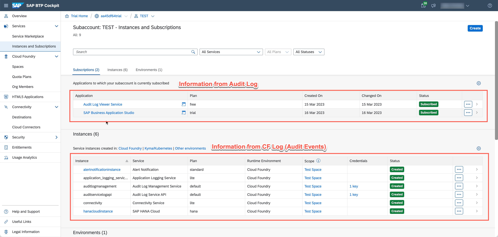

<!-- loio3dcbb16f447c42bca55eb58d060db764 -->

# How to Use Audit Log to Check Who Started an Application or a Service Instance

You can use audit logging functionality to find out which user activated a specific application or a service instance.

The following scenarios are possible:

-   [Audit Log for Applications](audit-log-for-applications-50a8092.md)
-   \(Only for Cloud Foundry subaccounts\) [Cloud Foundry Audit Events for Service Instances](cloud-foundry-audit-events-for-service-instances-f51ced4.md)

