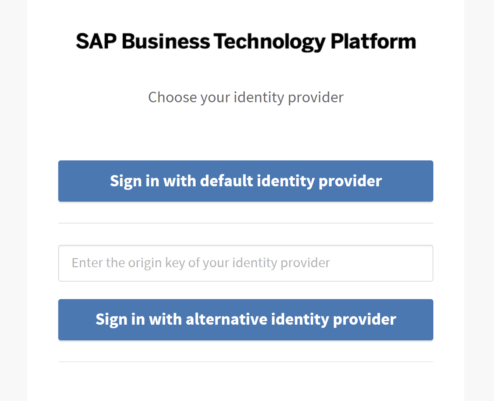
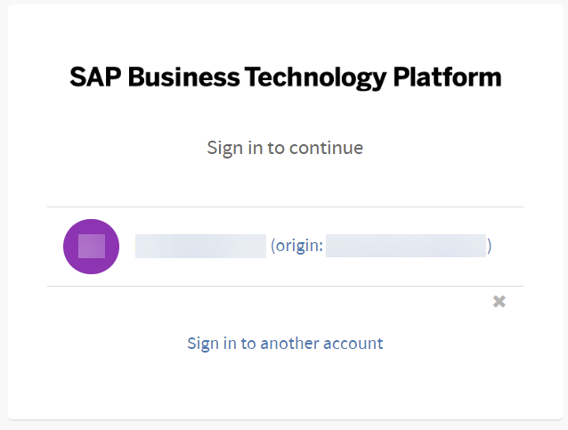

<!-- loio7eb094334422418f8909647699fea598 -->

# Log on with a Browser to the Cloud Foundry CLI and Service Dashboards

Platform users of the Cloud Foundry environment have the option to log on with a custom identity provider or the default identity provider.

<a name="loio7eb094334422418f8909647699fea598__prereq_dy3_3f1_pqb"/>

## Prerequisites

-   You know the origin key of the identity provider.

    For more information, see [Establish Trust and Federation of Custom Identity Providers for Platform Users](establish-trust-and-federation-of-custom-identity-providers-for-platform-users-c368984.md).

-   You don't already have a session with the Cloud Foundry environment.

    If you're already authenticated, you skip the logon process and go straight to your application.

## Context

When accessing a web application, like a service dashboard \(for example `logs.cf.eu10.hana.ondemand.com`\) or you log into your Cloud Foundry account using the CLI with `cf login -sso`, you’re prompted by a login screen. This method enables you to log on to a custom identity provider or makes it easier to log on when multifactor authentication is required.

## Procedure

1.  Navigate to the URL for your service dashboard or provided by the CF CLI.

    The login screen appears.

    If this is the first time you're logging on or your browser cache has been cleaned of cookies, you're prompted to provide the origin key of your custom identity provider or choose the default identity provider.

      
      
    **Logon Page Without Cookies**

    

    Otherwise, the sign-in page lists your accounts on custom identity providers with which you previously logged on.

      
      
    **Logon Page With Previous Logon**

    

2.  Choose your identity provider and log on.

**Related Information**  

[Log On with a Custom Identity Provider to the Cloud Foundry Environment Using the Cloud Foundry Command-Line Interface](log-on-with-a-custom-identity-provider-to-the-cloud-foundry-environment-using-the-cloud-d477618.md "Learn how to use different methods to log on to Cloud Foundry using a custom identity provider (IdP).")

