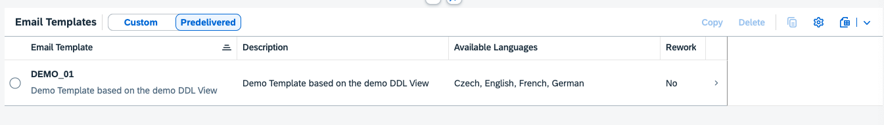

<!-- loiocef4f21ba1f643318a9723b607aba838 -->

# Maintaining Email Templates

Find out how to work with email templates.

<a name="loiocef4f21ba1f643318a9723b607aba838__section_npk_ynj_3fc"/>

## Overview

With this app, you can copy pre-delivered email templates and adapt the custom templates to streamline your email correspondence.

<a name="loiocef4f21ba1f643318a9723b607aba838__prerequisites"/>

## Prerequisites

Editing is enabled only if the system allows it. If not, an error message appears when users click the Edit or Copy button. You can find more details at [2283716](https://me.sap.com/notes/2283716).

<a name="loiocef4f21ba1f643318a9723b607aba838__procedure"/>

## Procedure

In the list view, users can find all released SAP templates and the customer's copied templates.

### Predelivered/Custom Templates

Predefined email templates are provided by applications. Users can copy these templates, creating custom email templates found under the Custom tab. Custom templates can be adapted, and new language-specific variants can be created.

### Action

****

<table>
<tr>
<th valign="top">

Action

</th>
<th valign="top">

Description

</th>
</tr>
<tr>
<td valign="top">

Copy

</td>
<td valign="top">

You can copy each template. Afterwards the copied template can be adapted.

</td>
</tr>
<tr>
<td valign="top">

Delete

</td>
<td valign="top">

You can only delete custom email templates.

</td>
</tr>
</table>

### Filters

****

<table>
<tr>
<th valign="top">

Filter

</th>
<th valign="top">

Description

</th>
</tr>
<tr>
<td valign="top">

Search

</td>
<td valign="top">

You can search for the ID and the Description combined in the list of templates

</td>
</tr>
<tr>
<td valign="top">

Email Template

</td>
<td valign="top">

You can filter for specific Email Templates

</td>
</tr>
<tr>
<td valign="top">

Rework Required

</td>
<td valign="top">

You can filter for **Rework required** Templates. More details Rework required

</td>
</tr>
</table>

### Email Template

On the Object Page of an Email Template, users can view the header details along with all the metadata. Customers can change only the Name and Description.

In the table view of Email Template Content, users can see the language-specific versions of the email template. By clicking on a line, they can view the content.

### Actions

****

<table>
<tr>
<th valign="top">

Action

</th>
<th valign="top">

Description

</th>
</tr>
<tr>
<td valign="top">

Edit/Delete \(at top\)

</td>
<td valign="top">

Standard Actions Edit/Delete of the Email Template

</td>
</tr>
<tr>
<td valign="top">

Upgrade \(at top\)

</td>
<td valign="top">

You can upgrade the template to a newer version. More details Rework required

</td>
</tr>
<tr>
<td valign="top">

Create/Copy/Delete \(at Email Template Content table\)

</td>
<td valign="top">

Standard Actions Create/Copy/Delete of the language specific Email Template Content

</td>
</tr>
</table>

### Email Template Content

On the Object Page of an Email Template Content, users can view the language-specific content of the email template. They can adapt the Subject, HTML Body, and Text Body. Additionally, on the right side, users can see the available Data Fields, which they can use in the bodies for rendering.

### Actions

****

<table>
<tr>
<th valign="top">

Actions

</th>
<th valign="top">

Description

</th>
</tr>
<tr>
<td valign="top">

Delete

</td>
<td valign="top">

Standard Actions Delete of the Email Template Content

</td>
</tr>
<tr>
<td valign="top">

Preview Body HTML

</td>
<td valign="top">

Displays in a Popup the html body in a html control

</td>
</tr>
<tr>
<td valign="top">

HTML Tidy

</td>
<td valign="top">

Action for the HTML Body to tidy the html.

</td>
</tr>
</table>

<a name="loiocef4f21ba1f643318a9723b607aba838__section_z3y_y1d_kfc"/>

## Rework Required

Custom templates will be shown as *Rework required* if the original template is deprecated. Whether a template is out of date is shown in the list and in the email template object page. If the original email template is deprecated, upgrade it to the successor. You can do this by clicking *Upgrade* in the email template object page. When selected, the original template will be changed to the successor. In this step, the underlying CDS view may change and the existing data field in the body needs to be reviewed.

You can find more information in the SAP note [330213](https://me.sap.com/notes/330213).

