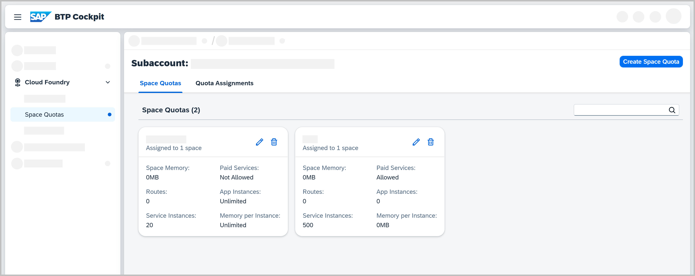

<!-- loio4e5f0eec96fd40b686d84b497d30ced3 -->

<link rel="stylesheet" type="text/css" href="../css/sap-icons.css"/>

# Managing Space Quotas

Learn what a space quota is, what type of information you will find on the *Space Quotas* page in the SAP BTP cockpit, and what you can do with a space quota in the Cloud Foundry environment.

<a name="loio4e5f0eec96fd40b686d84b497d30ced3__section_sx2_y4r_bcc"/>

## What Is a Space Quota?

A space quota defines the upper consumption limit for all resources in a space, such as:

-   Memory

-   Route

-   Services

-   Instance memory

-   Application instances

> ### Note:  
> Assigning a space quota to a space is optional. A space without an assigned space quota shares the consumption limits defined in the org quota with all the other spaces part of the org.

When working with space quotas, keep in mind the following additional specifics:

-   You can create unlimited space quotas in an organization \(org\), but you can assign only one space quota to a space at a time.

-   If a space quota is larger than the org quota, the org quota limit is applied.

    Example: If you create a space quota with memory of 2048MB but the org quota has a total memory of 1024MB, then the space is going to use the org quota instead.

-   Also, you can have only one space quota named "dev" in an org, but two orgs can have two separate space quotas with the same name "dev".

-   When creating a space quota, you can define whether a space quota allows you to use paid services within a space.

<a name="loio4e5f0eec96fd40b686d84b497d30ced3__section_utn_gqr_bcc"/>

## Prerequisites

To create, edit, or assign space quotas in an org, you must have the Org Manager role.

<a name="loio4e5f0eec96fd40b686d84b497d30ced3__section_dkl_mqr_bcc"/>

## What Can You Find on the Space Quotas Page?

You can switch between the following views on this page:

-   *Space Quotas*

    

    You find the following in this view:

    -   A list of all space quotas you have created and whether they are assigned to a space.

    -   Details about each space quota tile related to the space, such as:

        -   *Memory \(MB\)*: Total amount of memory

        -   *Routes*: Total number of routes

        -   *Services*: Total number of service instances

        -   *Paid Services*: Selected if you'd like to allow the provisioning of instances of paid service plans

        -   *App Instances*: Total number of application instances

        -   *Instance Memory \(MB\)*: Maximum amount of memory an application instance can have \(`-1` represents an unlimited amount\)

    -   The option to create a space quota.

        For more information, see [Create Space Quotas](create-space-quotas-b13c4a2.md).

    -   The option to edit a space quota.

        For more information, see [Edit Space Quotas](edit-space-quotas-2a58364.md).

    -   The option to delete a space quota.

        You can delete a space quota only if it's not assigned to a space.

-   *Quota Assignments*

    

    You find the following in this view:

    -   A list of all the available spaces in the subaccount you have access to and whether they have a space quota assigned to them or if they are using the org quota instead.

    -   The option to :pencil2: a quota assignment.

    For more information, see [Assign Space Quotas to Spaces](assign-space-quotas-to-spaces-13028c4.md).

## What Can You Do with a Space Quota?

-   [Create Space Quotas](create-space-quotas-b13c4a2.md)

-   [Assign Space Quotas to Spaces](assign-space-quotas-to-spaces-13028c4.md)

-   [Edit Space Quotas](edit-space-quotas-2a58364.md)

**Related Information**  

[Managing Spaces](managing-spaces-5209d55.md "Learn what a Cloud Foundry space is, what type of information you will find on the Spaces page in the SAP BTP cockpit, and what you can do with or within a space.")

[About Roles in the Cloud Foundry Environment](about-roles-in-the-cloud-foundry-environment-0907638.md "Roles determine which features users can view and access, and which actions they can initiate.")

