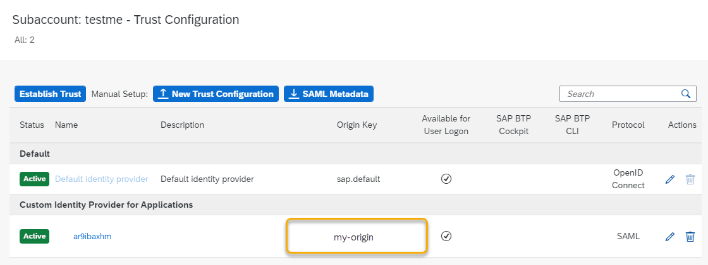

<!-- loio827ae664cf5448b1a2fa993a8372aafc -->

# Migrate from SAML Trust Configuration to OpenID Connect Trust with Identity Authentication

If your subaccount uses the SAML protocol to connect to your custom identity provider, you can't consume applications or application features that require direct authentication with Identity Authentication, such as SAP Build Work Zone and SAP Build Apps. To consume such applications or features, switch to using OpenID Connect \(OIDC\) with Identity Authentication.

<a name="loio827ae664cf5448b1a2fa993a8372aafc__prereq_znq_pz3_dxb"/>

## Prerequisites

-   The prerequisites for working with the SAP BTP command line interface \(CLI\) are fulfilled \(see [Log in](log-in-e241b30.md)\).

-   In the SAP BTP cockpit under *Custom Identity Provider for Applications*, there are no trust configurations with protocol OpenID Connect and no more than one with SAML; namely the configuration you want to migrate.

    For more information, see [Migration from SAML Trust to OpenID Connect Trust with Identity Authentication](migration-from-saml-trust-to-openid-connect-trust-with-identity-authentication-d097ce2.md).

## Procedure

1.  Find the origin key of the identity provider you want to switch.

    You can look up the origin key in the trust configuration in the SAP BTP cockpit, with the BTP command-line interface, or the Identity Provider Management API.

       
      
    **Finding the Origin Key in the Cockpit**

      

2.  To migrate the protocol of the trust configuration from SAML to OIDC, use the SAP BTP command line interface \(CLI\).

    For more information, see [Managing Trust from SAP BTP to an Identity Authentication Tenant](managing-trust-from-sap-btp-to-an-identity-authentication-tenant-6140107.md).

3.  Log on to the SAP BTP CLI \(see [Log in](log-in-e241b30.md).

4.  Make sure that you set the target to the relevant SAP BTP subaccount.

5.  Find the name of the Identity Authentication tenant you want to migrate to OpenID Connect. Use the following command:

    `btp list security/available-idp`

    You receive a list of all Identity Authentication tenants that are available in this subaccount. It's a good idea to copy the name of the Identity Authentication tenant you want to migrate.

6.  Migrate your trust configuration using the following command:

    `btp migrate security/trust ORIGIN --idp TENANT`

    > ### Example:  
    > `btp migrate security/trust my-origin-key --idp myidp.accounts.ondemand.com`

    The SAP BTP CLI returns that the trust configuration is active and that the protocol is OIDC.

7.  Look up whether your Identity Authentication tenant was migrated to a trust configuration with the OpenID Connect protocol. Go to your subaccount in the SAP BTP cockpit and choose *Security* \> *Trust Configuration*.

<a name="loio827ae664cf5448b1a2fa993a8372aafc__result_ktm_pfj_dxb"/>

## Results

In the cockpit, there's a new OIDC trust configuration for your Identity Authentication tenant. The original SAML trust configuration has been set to inactive and received a new ***oidc-migration-backup*** origin key. If you must roll back the change, the service uses this configuration to restore your original configuration.

In your Identity Authentication tenant, there's a new application that represents the trust configuration. The name is ***XSUAA\_*<subaccount\_display\_name\>****.

<a name="loio827ae664cf5448b1a2fa993a8372aafc__postreq_dpv_pfj_dxb"/>

## Next Steps

Configure your new Identity Authentication application to match your old configuration. Check that your users can log on with all the required attributes. If necessary, configure your new application to consume your corporate identity provider.

**Related Information**  

[Configuration of Identity Authentication After Migration from SAML to OIDC](configuration-of-identity-authentication-after-migration-from-saml-to-oidc-1fa7273.md "You replaced an SAML trust configuration to your custom identity provider with an OIDC trust configuration to Identity Authentication. Now, you need to make sure that the subaccount gets the same user attributes (names and values) as before.")

[Restore SAML Trust Configuration](restore-saml-trust-configuration-21d86cf.md "You replaced an SAML trust configuration to your custom identity provider with an OpenID Connect (OIDC) trust configuration to Identity Authentication, and the authentication of application users in the subaccount isn't working as you expected. Restore your SAML configuration to get your applications working again.")

