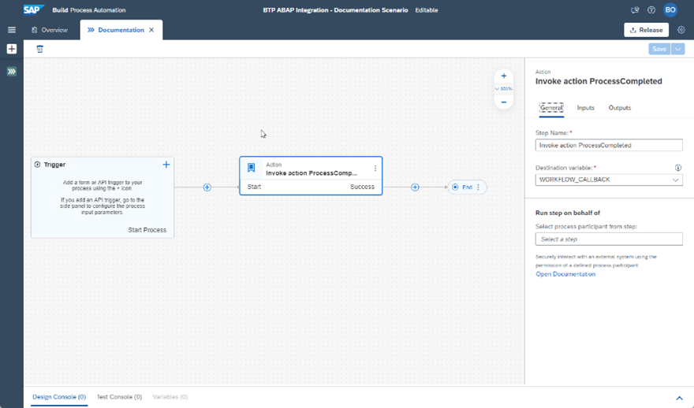
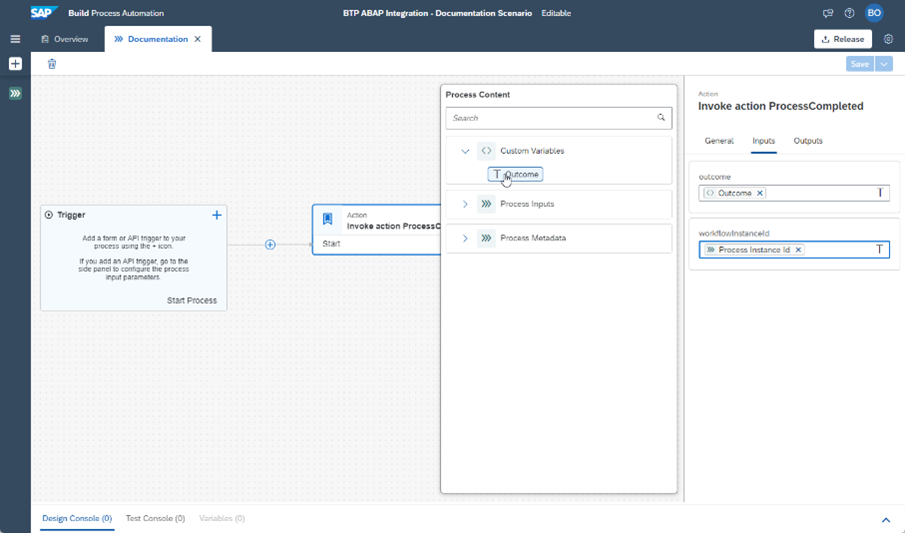

<!-- loio61e81af4a7f34a9ab9d3544b6fa68cd5 -->

# Model Action Project to Notify the ABAP Environment About Workflow Completion

As the workflow capability within SAP Build Process Automation doesn’t support the enterprise messaging service, you must model an additional action right before each end event for each process definition, that was started from the ABAP environment. This action calls an inbound service and notifies the ABAP Environment that the process that has been started on SAP Build Process Automation is now completed.


<a name="loio61e81af4a7f34a9ab9d3544b6fa68cd5__prereq_v2h_2rd_syb"/>

## Prerequisites

You've modeled a project with a process within SAP Build.


<a name="loio61e81af4a7f34a9ab9d3544b6fa68cd5__context_mpz_frd_syb"/>

## Context

The action triggers the completion in the ABAP environment tenant and must be called exactly once.

With this approach, cancellations on workflow instances directly from the workflow capability API aren’t communicated to the ABAP environment tenant.


## Procedure

1.  Create a new project in SAP Build by choosing *Build an Automated Process* \> *Actions*.

2.  Upload the API specification.

    > ### Sample Code:  
    > ```
    > 
    > <?xml version="1.0" encoding="utf-8"?>
    > <edmx:Edmx Version="4.0" xmlns:edmx="http://docs.oasis-open.org/odata/ns/edmx" xmlns="http://docs.oasis-open.org/odata/ns/edm">
    >   <edmx:DataServices>
    >     <Schema Namespace="com.sap.gateway.default.api_workflow_notification.v0001" Alias="SAP__self">
    >       <ComplexType Name="CT_NOTIFICATION_RESULT">
    >         <Property Name="notificationProcessed" Type="Edm.Boolean" Nullable="false"/>
    >       </ComplexType>
    >       <Action Name="ProcessCompleted">
    >         <Parameter Name="workflowInstanceId" Type="Edm.String" Nullable="false" MaxLength="36"/>
    >         <Parameter Name="outcome" Type="Edm.String" Nullable="false" MaxLength="255"/>
    >         <ReturnType Type="com.sap.gateway.default.api_workflow_notification.v0001.CT_NOTIFICATION_RESULT" Nullable="false"/>
    >       </Action>
    >       <EntityContainer Name="Container">
    >         <ActionImport Name="ProcessCompleted" Action="com.sap.gateway.default.api_workflow_notification.v0001.ProcessCompleted"/>
    >       </EntityContainer>
    >     </Schema>
    >   </edmx:DataServices>
    > </edmx:Edmx>
    > ```

3.  Enter a project name.

4.  In the *Add actions …* dialog, choose only the service operation *POST /Process Completed* and then choose *Add*.

5.  Modify the project settings as follows

    1.  Enable CSRF tokens for all actions in the project, and set *Token Fetch End Point* to `„/“`.

    2.  Set the URL prefix to `„/sap/opu/odata4/sap/api_workflow_notification/default/sap/api_workflow_notification/0001“`.


6.  Save the project.

7.  Release the project and publish it to the library.


<a name="loio61e81af4a7f34a9ab9d3544b6fa68fd5"/>

<!-- loio61e81af4a7f34a9ab9d3544b6fa68fd5 -->

## Using the Action in a Process


## Procedure

1.  Include a new action step as last step in your process by choosing *Actions* \> *Browse Library*.

2.  Search for „Invoke action ProcessCompleted“ and choose *Add*.

3.  Specify a destination variable in the action step details – create a new variable if necessary.

    

4.  Configure the inputs of the action step.

    1.  From *Process Metadata*, assign *Process Instance Id* to the *workflowInstanceId* input.

    2.  Optional. To communicate the result of the process, assign any relevant variable to the *outcome* input.

        


5.  When deploying your project, specify the destination created in the SAP BTP cockpit for the destination variable used in the action step.


