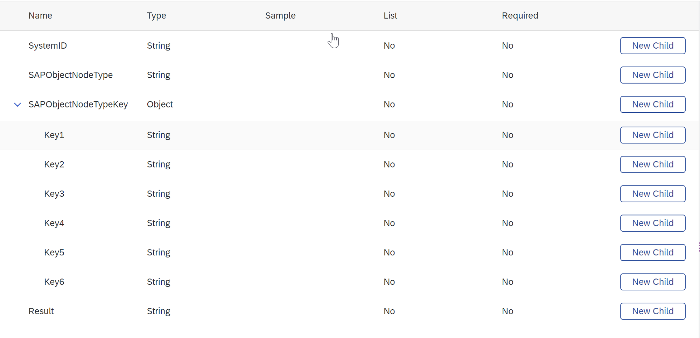

<!-- loio479958c5439f4aa6a51335a75376f907 -->

# Modeling Extension Processes

As the SAP Build Process Automation processes don't integrate using SAP Event Mesh, you must ensure the communication back to SAP S/4HANA Cloud through the process models.

<a name="loio479958c5439f4aa6a51335a75376f907__prereq_pwr_qfs_4qb"/>

## Prerequisites

-   You've created the destination for the workflow capability integration. See [Create Destinations](create-destinations-eb1d0a3.md).

-   You've set the scopes. See  <?sap-ot O2O class="- topic/xref " href="4a9937a2fa3b40bcb766563396ece79f.xml" text="" desc="" xtrc="xref:2" xtrf="file:/home/builder/src/dita-all/jjq1673438782153/loio2080d0faf9d84ce6aa14caa4caa32935_en-US/src/content/localization/en-us/479958c5439f4aa6a51335a75376f907.xml" output-class="" outputTopicFile="file:/home/builder/tp.net.sf.dita-ot/2.3/plugins/com.elovirta.dita.markdown_1.3.0/xsl/dita2markdownImpl.xsl" ?> .

-   You have the necessary roles to develop and deploy SAP Build Process Automation projects. See [Managing Project Members](https://help.sap.com/docs/build-process-automation/sap-build-process-automation/managing-project-members).

## Context

To ensure the communication, you have to model an additional service task right before each end event for each process, that was started from SAP S/4HANA Cloud.

> ### Note:  
> Cancellations of process instances on SAP Build Process Automation aren't communicated to the SAP S/4HANA Cloud system.

## Procedure

1.  To reate an action for communicating the process completion to the SAP S/4HANA Cloud system, create an actions project. See [Model Action Project to Notify the ABAP Environment About Workflow Completion](model-action-project-to-notify-the-abap-environment-about-workflow-completion-61e81af.md).

2.  Create a SAP Build Process Automation process.

    1.  Create a business project. See [Create a Business Process Project](https://help.sap.com/docs/build-process-automation/sap-build-process-automation/create-and-manage-projects?version=Cloud#create-a-business-process-project).

    2.  Create a data type for the input of the process.

        The data type is for receiving the input from the SAP S/4HANA Cloud system. You assign it to the process trigger. Choosing New Field, you enter the following Names:

        -   `SystemID`

        -   `SAPObjectNodeType`

        -   `SAPObjectNodeTypeKey`

        -   `Result`

        Add children to the `SAPObjectNodeTypeKey` field and name them `Key1` to `Key6`.

        The data type then looks as follows:

        

    3.  Create a business process. See [Create a Business Process](https://help.sap.com/docs/build-process-automation/sap-build-process-automation/create-business-process).

    4.  Receive the input from the SAP S/4HANA Cloud system.

        1.  Select the trigger tile.
        2.  Open the *Inputs/Outputs* tab.
        3.  Choose *Configure* next to *Process Inputs*.
        4.  Choose add *Input*.
        5.  Enter `ExchangeData` in the *Name* field, and select the previously created data type.
        6.  Choose *Apply*.

3.  Communicate the process completion to the SAP S/4HANA Cloud system.

    1.  Add the action that you created before each end event. For information about how to add actions, see [Add Actions to a Process](https://help.sap.com/docs/build-process-automation/sap-build-process-automation/add-actions-to-process).

    2.  On the *General* tab, create a destination variable for the completion callback so that you can map it to the destination on deployment.

    3.  On the *Inputs* tab, assign *Process Metadata* \> *Process Instance Id* to the *workflowInstanceId* input of the action.

    4.  Optional: On the *Inputs* tab, assign any variable to the outcome input of the action to indicate the result of the extension process to the caller.

4.  Release your project.

5.  Deploy your project.

    1.  In the *Runtime Variables* step, assign the destination for the workflow capability integration to the destination variable that you created.

**Related Information**  

[Configure Service Tasks](https://help.sap.com/viewer/e157c391253b4ecd93647bf232d18a83/Cloud/en-US/a8a6267f537841fbb22c159ba2af8835.html)

