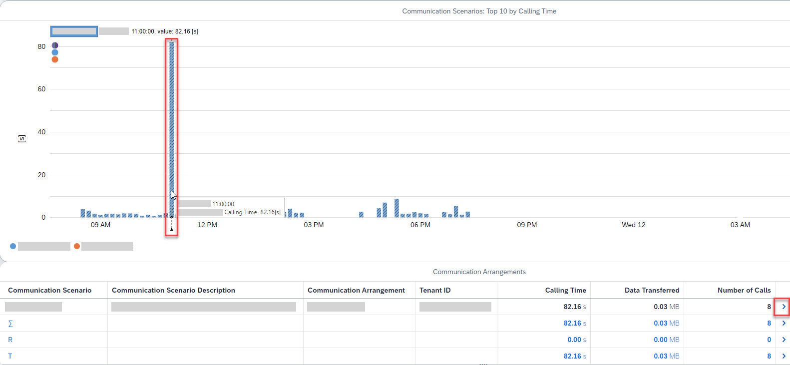
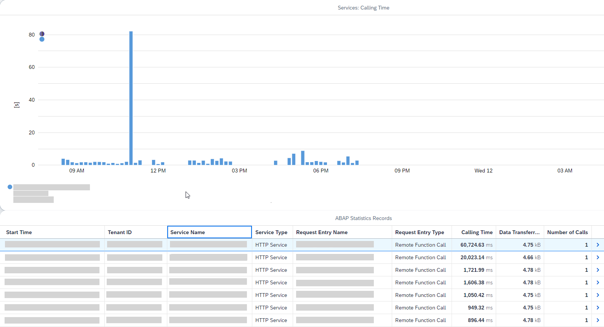

<!-- loioa0f1c7923e364795aa1c6a47df6083d1 -->

# Monitoring System Outbound Communication in General

Get an overview of the system outbound communication over time.

## Context

In the technical monitoring cockpit, the top 10 communication scenarios by calling time are shown, which helps you identify obvious expensive outbound communication. The focus is on outbound communication of type RFC, HTTP, and Web service.

## Procedure

1.  In the SAP Fiori launchpad, under *Technical Monitoring*, choose the *Application System Overview* tile.

    This opens the technical monitoring cockpit.

2.  On the dashboard shown, choose the *System Outbound Communication* tile.

    The top 10 communication scenarios by calling time are shown, including the related communication arrangements. In the chart, the development over time is shown. Only customer workload using customer communication arrangements is displayed; SAP workload and SAP communication arrangements are filtered out.

    

3.  In the chart, you can also click on a communication scenario at a particular time.

    As a result, the table of communication arrangements is updated with the single communication arrangements at this particular time.

    In this rather quiet test system, workload is low, but one communication scenario before 12 p.m. in the chart stands out with a long calling time.

    

4.  To analyze such a specific communication arrangement in more detail, choose its entry from the list of communication arrangements.

    The *Communication Arrangement* screen opens, where the selected communication arrangement with its related outbound services is shown. The chart indicates how the outbound services perform over time. You can now check whether calling time is distributed evenly or whether there are any outliers.

    In the list, you can find the single ABAP statistics records for the top outbound-calling services. The records include the calling time, the amount of transferred data and the number of calls.

    Again, in the example shown here, there's an outlier among the services that merits further investigation.

    

5.  To show more details of a single ABAP statistics record, choose it from the list.

    As a result, you navigate to the *ABAP Statistics Record* screen, where more details, such as the server response time and multiple subrecords are shown.

6.  To see the details of the HTTP subrecord, choose *HTTP*.

    Here, you can find the single outbound HTTP client calls that were made during the service request.

7.  To drill down to even more details, choose an entry from the table of HTTP client calls.

    You now get the HTTP client call details, including its calling time, and also the related communication arrangement.

<a name="loioa0f1c7923e364795aa1c6a47df6083d1__result_h5l_hm2_2vb"/>

## Results

The *System Outbound Communication* screen and its related drill-down screens are configured by default in such a way that they provide sample records of expensive system outbound communication. If you want to get a full set of ABAP statistics records for a particular communication arrangement with a long calling time, use the *Capture Request Statistics* app. With this app, you can capture request statistics relating to defined expensive outbound communication arrangements.

**Related Information**  

[Capturing Request Statistics Relating to Expensive Outbound Communication](capturing-request-statistics-relating-to-expensive-outbound-communication-f33b3d2.md "Use the Capture Request Statistics app to collect statistics of service requests with an expensive outbound communication (RFC, HTTP, or Web service).")

[System Outbound Communication](https://help.sap.com/viewer/b273a660af4e4948a49a316ea2438f24/Cloud/en-US/09e4959f3c8544218b248d99596f5d59.html "Find the top communication scenarios by calling time to identify workload issues with system outbound communication using HTTP, RFC, or Web service calls.") :arrow_upper_right:

