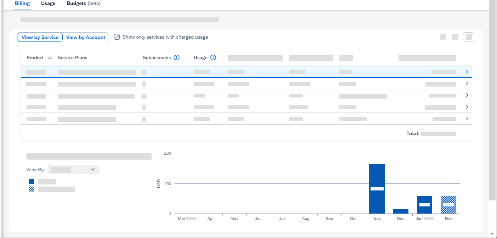

<!-- loiode6f0db8919f4e6f97e54bc4ddaf2ab8 -->

<link rel="stylesheet" type="text/css" href="../css/sap-icons.css"/>

# Monitoring Usage and Consumption Costs in Your Global Account

SAP BTP cockpit supports advanced usage and cost monitoring of services in your global account. You can compare the usage and costs of multiple services and subaccounts, see monthly trends, and drill into subaccounts and service plans for detailed information.

> ### Note:  
> -   The use of the consumption-based commercial model is subject to its availability in your country or region.
> 
> -   If your global account uses only the subscription-based commercial model, then refer only to information described here about usage data and the *Usage* view. You can ignore any information in this topic about costs, cloud credits, and the *Billing* view.

The *Costs and Usage* page in the cockpit provides a central and flexible experience for the following cost control flows:

-   Continuously monitor and analyze the monthly usage and costs of services consumed by subaccounts and directories in your global account.
-   Help you to verify your monthly billing statement against actual resource consumption.
-   Help you to verify periodic cross-charges between your various business units based on subaccount and directory allocation/distribution.

Check out also the [Enhancing Costs, Usage and Contract Transparency](https://community.sap.com/t5/technology-blogs-by-sap/enhancing-costs-usage-and-contract-transparency/ba-p/13614671) blog for more information.

<a name="loiode6f0db8919f4e6f97e54bc4ddaf2ab8__section_opc_4d3_m1c"/>

## Accessing Costs and Usage for Your Global Account

To monitor and track costs and usage in your global account, open the global account in the cockpit and choose *Costs and Usage* in the navigation area.

> ### Note:  
> The *Costs and Usage* page is available only if your global account uses the consumption-based commercial model.
> 
> If your global account uses the subscription-based commercial model exclusively, then you must access the *Usage* page instead.
> 
> The *Usage* page is similar to the *Costs and Usage* page, except you cannot see any data relating to costs or cloud credits since your eligible services are already prepaid and you aren't charged per usage. See [Using the Usage View](monitoring-usage-and-consumption-costs-in-your-global-account-de6f0db.md#loiode6f0db8919f4e6f97e54bc4ddaf2ab8__section_vff_dr3_m1c).

<a name="loiode6f0db8919f4e6f97e54bc4ddaf2ab8__section_u3v_vd3_m1c"/>

## Understanding the Cost and Usage Views

### Global Account and Contract Information

The upper area of the *Costs and Usage* page contains two side-by-side cards.

  
  
**Simplified graphic of the upper area of the Costs and Usage page**

<table>
<tr>
<th valign="top">

Card

</th>
<th valign="top">

What Information is Displayed

</th>
</tr>
<tr>
<td valign="top">

**Global Account Info** 

</td>
<td valign="top">

The *Global Account Info* card on the left displays general info about your global account.

</td>
</tr>
<tr>
<td valign="top">

**SAP BTP Enterprise Agreement**

or

**Cloud Platform Enterprise Agreement**

</td>
<td valign="top">

This is the card on the right; it provides information relating to your cloud-credit usage and costs per month relative to your total cloud credits for the current cloud credits period. It also shows your monthly trend of cloud-credit usage and costs.

This card is displayed only if your global account uses either the SAP BTPEA or CPEA flavor of the consumption-based commercial model.

Use the *Usage* and *Costs* buttons in this card to switch the view between usage and cost information.

In this card, you'll see warnings if you're approaching or exceeded your cloud credit limit for the current cloud credits period. Any overages are billed at list price, so make sure to contact SAP if you need more cloud credits.

Note the following:

-   Cloud-credit usage and cost information is displayed only for the current cloud credits period. The total contract duration is split into cloud credit periods \(typically one year each\) and the total cloud credits are divided between these periods.
-   Your cloud credit balance is calculated each month by deducting the corresponding costs of all SAP BTP services for the previous month.
-   If your global account has received a cloud-credit refund at any time during the current cloud credits period, you may see a difference between your total usage/costs and the monthly usage/costs in the chart.

</td>
</tr>
</table>

Pay attention that if your global account uses a combination of the consumption-based commercial model and the subscription-based commercial model, the card on the right shows billing and usage data that is charged solely according to the consumption-based commercial model. In other words, for services that are part of your subscription-based commercial agreement, the billing and usage data in this card applies only to consumption that exceeds your prepaid \(subscription\) quota. For this excess service usage, you are charged according to your contract for the consumption-based commercial model.

For example, if your subscription contract is entitled to consume a given service at a fixed cost for up to 100 unique site visits, and 151 unique site visits are registered, this card shows data relating only to the 51 visits that have exceeded the prepaid 100 visits.

> ### Tip:  
> To see more details about your contract, cloud credit or cost details, click  \(Expand\).

> ### Note:  
> To extract your cost and usage data to a spreadsheet document, use the *Export* option. For more information, see [Exporting Usage and Cost Data Information](monitoring-usage-and-consumption-costs-in-your-global-account-de6f0db.md#loiode6f0db8919f4e6f97e54bc4ddaf2ab8__section_vt2_dg4_2jb)..

### Filters and Search

Below the two cards, is the filter and search area:

<table>
<tr>
<th valign="top">

To Do This...

</th>
<th valign="top">

Do This...

</th>
</tr>
<tr>
<td valign="top">

Filter the data you want to view

</td>
<td valign="top">

Above the *Billing* and *Usage* tabs, apply the filters to choose which services, subaccounts, directories, or billing month you want to view.

You can also use the *Search* option. When you start typing, the search offers results that apply to service names, plan names, subaccount names, directory names, labels assigned to subaccounts and directories, product IDs \(SKU\), and metrics. The search offers suggestions only for items that are currently listed.

> ### Tip:  
> If you've set up labels in your subaccounts and directories that reflect the distribution of these entities to your company structure or projects, you can easily track and manage cross charges by entering the labels of your subaccount and directory labels in the search.

Your filter and search criteria are applied to both *Billing* and *Usage* views.

</td>
</tr>
<tr>
<td valign="top">

Share or save the filtered view

</td>
<td valign="top">

You can use the  \(Bookmarks\) option to copy the URL of the displayed view and the currently set filters.

You can then save this URL as a bookmark in your browser, or you can share it with a colleague so they can quickly open the same view and filter settings.

</td>
</tr>
</table>

### Billing and Usage Views

Below the filter and search area, are the *Billing* and *Usage* views, represented by tabs:

<table>
<tr>
<td valign="top">

**Billing** 

</td>
<td valign="top">

Shows the monthly billable service charges in your global account, based on the aggregation of your resource's actual usage.

The aggregation of usage from all your subaccounts is calculated according to the pricing structure and legally billable metric of each service, as mentioned in the [SAP BTP Service Description Guide](https://www.sap.com/about/trust-center/agreements/cloud/cloud-services.html?sort=latest_desc&search=SAP%20Business%20technology%20platform%20service%20description%20guide&tag=language:english).

> ### Note:  
> This view relevant only if your global account uses a consumption-based commercial model. If your global account uses only the subscription-based commercial model, then all your eligible services and entitled quota are prepaid.

For more information about this view, see [Using the Billing View](monitoring-usage-and-consumption-costs-in-your-global-account-de6f0db.md#loiode6f0db8919f4e6f97e54bc4ddaf2ab8__section_bfz_xd3_m1c).

</td>
</tr>
<tr>
<td valign="top">

**Usage** 

</td>
<td valign="top">

Shows the data representing your actual non-aggregated monthly usage for services consumed in your subaccounts within your global account.

This view applies to both the consumption-based and subscription-based commercial models.

For more information about this view, see [Using the Usage View](monitoring-usage-and-consumption-costs-in-your-global-account-de6f0db.md#loiode6f0db8919f4e6f97e54bc4ddaf2ab8__section_vff_dr3_m1c).

</td>
</tr>
</table>

  
  
**Simplified graphic of the Billing view of the Costs and Usage page**

The *Costs and Usage* page uses the same terminology that is used in your monthly balance statement, which facilitates better contract-to-billing traceability and verification for cost controllers. Get your latest balance statement from [SAP for Me](https://me.sap.com/).

> ### Remember:  
> -   The monthly balance statement, which is provided separately, contains legally binding information regarding your monthly costs. Details about costs on the *Costs and Usage* page in the cockpit are provided for informational purposes only. Any discrepancy between the information displayed in the cockpit and the information in your balance statement will be resolved in favor of the balance statement.
> -   Costs are displayed according to your contract currency.
> -   Global accounts are the only contractual billable entity for SAP BTP. Directories and subaccounts are used as structural entities in global accounts. The usage and cost data displayed for directories and subaccounts are estimations and may differ from the actual global account metrics. Hence, you should use their data only for internal cost estimations.
> 
>     The relative calculation per billable usage within each subaccount is an estimation only as it is based on certain measures, which in some cases can either be different from the metrics that are presented on the global account level, or that use different formulas than the ones used for billing.
> 
> -   Cloud credit information and monthly costs apply to all regions used by the subaccounts in your global account. Usage and cost data is updated after your monthly balance statement has been generated.
> -   Usage data is updated after your monthly balance statement has been generated. For new global accounts, data is updated with the first billing cycle.
> -   Prices are listed as estimates if a consumable item has not yet been billed.
> -   In the cost and usage charts, estimated values are used for the period between the last balance statement and the current date. These are displayed as striped bars.
> 
>     These estimates are based on resource usage values before computation for billing and might change after the next balance statement is issued. The estimated values are not projected or forecast values.
> 
> -   Some SAP BTP services report their billing and usage at the global account level, and not at the subaccount level. Such services are listed in the *Costs and Usage* page under a reserved technical entity named `REPORTED-AT-GLOBAL-ACCOUNT-LEVEL` with the ID `DEFAULT_SA`.

Here are some useful tips that are common to both the *Billing* and *Usage* views:

<table>
<tr>
<th valign="top">

To Do This…

</th>
<th valign="top">

Do This…

</th>
</tr>
<tr>
<td valign="top">

Find out what the table columns mean

</td>
<td valign="top">

Click the  \(More Info\) buttons in the column headings, where available.

</td>
</tr>
<tr>
<td valign="top">

Sort the data in ascending or descending order

</td>
<td valign="top">

Click a column heading in the table and choose the sort order you want.

Sorting the tables can be useful for determining which service plans and subaccounts have the highest and lowest costs.

</td>
</tr>
<tr>
<td valign="top">

Show or hide table columns

</td>
<td valign="top">

Click :gear: to configure which table columns you'd like to show and hide.

The tables in each view have columns that are hidden by default. Open this setting to check if any of these columns apply to your needs.

</td>
</tr>
<tr>
<td valign="top">

Maximize the tables across the entire page

</td>
<td valign="top">

Click  \(Expand\).

When you expand the view, the navigation panel is collapsed and the upper panel containing your global account and contract information is hidden.

Click  \(Collapse\) to go back to the standard view.

</td>
</tr>
<tr>
<td valign="top">

Adjust the width of table columns

</td>
<td valign="top">

Drag the column separators to the left or right.

</td>
</tr>
</table>

<a name="loiode6f0db8919f4e6f97e54bc4ddaf2ab8__section_bfz_xd3_m1c"/>

## Using the Billing View

You can use the *Billing* view to display, monitor, and analyze your monthly charges of billable services, which have been consumed by the subaccounts in your global account over the last 12 months.

The billing data represents the aggregation of usage and its rating, which is determined by the pricing structure of each service. You can view the bill items for previous months or the estimated charge for the current month, to monitor your consumption costs.

The parameters for charged usage can include the amount of data processed, the number of users, the duration of use, or the specific functionality or modules used by each service. The specifics of these metrics are outlined in your contract.

> ### Tip:  
> This view is available only if your global account uses a consumption-based commercial model.

In the *Billing* view, you can switch between the *View by Service* and *View by Account* perspectives:

<table>
<tr>
<td valign="top">

**View by Service** 

</td>
<td valign="top">

This perspective provides an overview of your charged usage across different services and their associated plans, and is useful for verifying billing details.

Here are some useful tips for working in this perspective:

-   To drill down and display more details about a particular service, click on an entry in the table or its  \(View Details\) button. When you drill down, a new pane opens and you can see, for example, exactly which subaccounts consume the selected service and the subtotal of charges and usage per directory and subaccount.

    In this detailed view, subaccounts are displayed in the context of their account hierarchy. If you want to hide their directories and display the subaccounts as a flat list, choose the *Show subaccounts only* checkbox.

    > ### Tip:  
    > In this detailed view, you can use the  \(Switch\) button for any subaccount to quickly open the *View by Account* perspective with the specific subaccount selected and displaying the plans it consumes.
    > 
    > You can also click :gear: to display and hide columns.

-   To filter the main table for specific services, use the *Service* dropdown list.

-   If the display is cluttered by too many service plans or account entities that have no charged usage, you can choose the *Show only services with charged usage* checkbox to hide them.

-   To filter the main table for specific subaccounts or directories, use the *Subaccounts/Directories* dropdown list.

-   To view a visual chart of the monthly cost trend, cumulative costs, or breakdown of the costliest subaccounts for a specific service plan over the last 12 months, first select the service plan from the main table and then scroll down past the main table to the chart area. Then, select the chart type from the *View By* dropdown list that is located adjacent to the chart area.

    > ### Tip:  
    > These charts are useful for seeing in which months a service plan has usage and costs, which service plans have increased or decreased usage/costs over time, or the months that have the highest and lowest usage/costs per service plan.

-   To view a visual chart with a summary of the costs of all service plans in your global account over the last 12 months, make sure you do not have a specific service plan selected in the main table. Then, scroll past the table to the *Global Account - Cost Summary* chart area.

    In the *View By* dropdown list, select a chart type; for example, *List Price*, *Cost Breakdown by Service Plans*, or *Cumulative List Price*.

    > ### Tip:  
    > In the cost breakdown chart, the 8 costliest service plans in your global account over the last 12 months are displayed. Click *Show More* below the chart legend to expand the chart and to view the cost breakdown of additional plans.

See other useful tips, such as table sorting, filtering, and searching, in the [Understanding the Cost and Usage Views](monitoring-usage-and-consumption-costs-in-your-global-account-de6f0db.md#loiode6f0db8919f4e6f97e54bc4ddaf2ab8__section_u3v_vd3_m1c) section.

</td>
</tr>
<tr>
<td valign="top">

**View by Account** 

</td>
<td valign="top">

This perspective provides an overview of your charged usage across different subaccounts and directories within your account hierarchy. It is useful for verifying cross charges within your company or organization.

Here are some useful tips for working in this perspective:

-   To drill down and display more details about a particular subaccount or directory, click on an entry in the table or its  \(View Details\) button. When you drill down, a new pane opens and you can see, for example, exactly which plans are consumed by the selected subaccount or directory and the subtotal of the charges and usage per plan.

    > ### Tip:  
    > In this detailed view, you can use the  \(Switch\) button to quickly open the *View by Services* perspective with the specific plan selected and displaying the subaccounts that consume it.
    > 
    > You can also click :gear: to display and hide columns.

-   To filter the main table for specific subaccounts or directories, use the *Subaccounts/Directories* dropdown list.

-   If your account hierarchy includes directories, you can hide them and display your subaccounts as a flat list by choosing the *Show only subaccounts* checkbox.

-   You can quickly expand or collapse the entire account hierarchy by clicking the  \(Expand All\) and  \(Collapse All\) buttons.
-   To filter the main table for specific services, use the *Services* dropdown list.

-   To view a visual chart of the monthly cost trend, cumulative costs, or breakdown of the costliest service plans for a specific subaccount or directory over the last 12 months, first select the subaccount or directory from the main table and then scroll down past the main table to the chart area. Then, select the chart type from the *View By* dropdown list that is located adjacent to the chart area.

    > ### Tip:  
    > These charts are useful for seeing in which months a subaccount or directory has usage and costs, which subaccounts or directories have increased or decreased usage/costs over time, or the months that have the highest and lowest usage/costs per subaccount or directory.
    > 
    > When you choose a directory, the cost information applies to all subaccounts under the directory.

-   To view a visual chart with a summary of the costs of all subaccounts in your global account over the last 12 months, make sure you do not have a specific subaccount or directory selected in the main table. Then, scroll past the table to the *Global Account - Cost Summary* chart area.

    In the *View By* dropdown list, select a chart type; for example, *List Price*, *Cost Breakdown by Subaccounts*, or *Cumulative List Price*.

    > ### Tip:  
    > In the cost breakdown chart, the 8 costliest subaccounts in your global account over the last 12 months are displayed. If your global account has more than 8 subaccounts, click *Show More* below the chart legend to expand the chart and to view the cost breakdown of additional subaccounts.

See other useful tips, such as table sorting and searching, in the [Understanding the Cost and Usage Views](monitoring-usage-and-consumption-costs-in-your-global-account-de6f0db.md#loiode6f0db8919f4e6f97e54bc4ddaf2ab8__section_u3v_vd3_m1c) section.

</td>
</tr>
</table>

If your global account has subaccounts that have been deleted but have charges in the last 12 months while they were still active, they’ll still be listed. Such subaccounts are marked with *\(deleted\)* after their name. If these subaccounts were originally located under a directory, you'll see them listed directly under the root global account.

If your global account uses both a subscription-based and a commercial-based model, the *Usage* column shows the combined total usage of services, both subscription-based and consumption-based. Note that:

-   The subscription-based consumption includes usage of services that falls within the prepaid quota that is specified in your subscription-based commercial model agreement. This part of the combined usage is shown in the *Prepaid Quota* column. There will be no additional billing for consumption of the services that falls within this prepaid quota.
-   The consumption-based usage includes the usage of services that exceeds the prepaid subscription-based quota. This part of the combined usage is shown in the *Charged Usage* column. For this usage, you'll be charged based on the terms outlined in your consumption-based commercial model agreement.

<a name="loiode6f0db8919f4e6f97e54bc4ddaf2ab8__section_vff_dr3_m1c"/>

## Using the Usage View

Use the *Usage* view to display, monitor, and analyze the distribution of the actual \(also called raw\) monthly usage metrics for services consumed by subaccounts in your global account over the last 12 months.

> ### Note:  
> The *Usage* view displays data prior to aggregation for billing and can contain metrics that will not be aggregated since they are always free or belong to free services. Hence, you may notice some discrepancies when comparing the data in the *Usage* view to the overall usage data shown in the *Billing* view. Billable usage data is aggregated at the global account level and then processed according to accounting formulas to generate your monthly billing statement.

Pay attention also to the following:

-   If your global account uses only a consumption-based commercial model, such as SAP BTP Enterprise Agreement \(SAP BTPEA\),Cloud Platform Enterprise Agreement \(CPEA\), and Pay-As-You-Go for SAP BTP, this view includes all usage data, including non-rated services, such as free service plans.
-   If your global account uses both the consumption-based and subscription-based commercial models, this view combines all usage data, which falls under your consumption-based plans, prepaid subscription quota, and non-rated data sets, such as free service plans. You can see the distribution of charged and prepaid usage and costs in the *Billing* view.

<table>
<tr>
<th valign="top">

To Do This...

</th>
<th valign="top">

Do This...

</th>
</tr>
<tr>
<td valign="top">

Drill down and display more details about a particular service

</td>
<td valign="top">

Click on an entry in the table or its  \(View Details\) button. When you drill down, a new pane opens and you can see, for example, which subaccounts are consuming the selected service and the subtotal of usage per directory and subaccount.

In this detailed view, subaccounts are displayed in the context of their account hierarchy. If you want to hide their directories and display the subaccounts as a flat list, choose the *Show subaccounts only* checkbox.

> ### Tip:  
> In this detailed view, you can click :gear: to display and hide columns.

</td>
</tr>
<tr>
<td valign="top">

Filter by specific services

</td>
<td valign="top">

Choose one or more in the *Service* dropdown list.

> ### Tip:  
> If the display is cluttered by too many service plans that have no usage, choose the *Show only used services* checkbox to quickly hide them.

</td>
</tr>
<tr>
<td valign="top">

Filter by specific subaccounts and directories

</td>
<td valign="top">

Choose one or more subaccounts or directories in the *Subaccounts/Directories* dropdown list.

</td>
</tr>
<tr>
<td valign="top">

View the monthly usage trend of a specific service plan over the last 12 months

</td>
<td valign="top">

Select the service plan from the main table and scroll past the table to the chart area. Then, choose *Actual Usage* in the *View By* dropdown list that is located adjacent the chart area.

This chart is useful for seeing changes in usage trends over time, including the months with the highest and lowest usage per service.

</td>
</tr>
<tr>
<td valign="top">

View a monthly breakdown of subaccounts that have used a specific service plan the most over the last 12 months

</td>
<td valign="top">

Select the service plan from the main table and scroll past the table to the chart area. Then, choose *Usage Breakdown by Subaccounts* in the *View By* dropdown list.

The top 8 subaccounts that use the selected plan the most are displayed initially. If there are more than 8 subaccounts that use the plan, click *Show More* to expand the chart and to view the breakdown of additional subaccounts.

</td>
</tr>
</table>

> ### Tip:  
> See other useful tips, such as table sorting, filtering, and searching, in the [Understanding the Cost and Usage Views](monitoring-usage-and-consumption-costs-in-your-global-account-de6f0db.md#loiode6f0db8919f4e6f97e54bc4ddaf2ab8__section_u3v_vd3_m1c) section.

<a name="loiode6f0db8919f4e6f97e54bc4ddaf2ab8__section_vt2_dg4_2jb"/>

## Exporting Usage and Cost Data Information

To export your usage and cost data to a Microsoft Excel spreadsheet document, use the *Export* button menu in the upper area of the page.

> ### Note:  
> Cost information is exported only if your global account uses the consumption-based commercial information.

The *Export* button menu has various options depending on the period and type of data that you want to export:

-   If you want to export all data for the last 12 months, click the main *Export* button.
-   If you want to export all data for the last 12, 24, or 36 months, click the button's dropdown menu and choose the relevant period.
-   If you want to export only the data that you've currently filtered in the main table for the current month or last 12, 24, or 36 months, choose *Export* \> *Custom*.

    > ### Tip:  
    > Use this option also if you want to export all your cost and usage data for the current month without considering any currently set filters. To do this, deselect the *Export only filtered data* checkbox in the *Custom Export*dialog box.
    > 
    > In the *Custom Export* dialog box, you can also choose any label names \(keys\) that you want to add as dedicated columns to the `Subaccount Costs by Service` and `Actual Usage` sheets \(tabs\) in the exported Microsoft Excel file. Start typing to list the available label names for your existing subaccounts and directories. In the exported spreadsheet, the values for each selected label name will be displayed in the in the data rows under their respective label column.

The exported document contains several sheets \(tabs\). The sheets that are included depend on the commercial model that is used by your global account as shown in the following table:

<table>
<tr>
<th valign="top" rowspan="2">

Sheet Name

</th>
<th valign="top" rowspan="2">

Description

</th>
<th valign="top" align="center" colspan="2">

Commercial Model

</th>
</tr>
<tr>
<th valign="top" align="center">

Subscription-Based

</th>
<th valign="top" align="center">

Consumption-Based

</th>
</tr>
<tr>
<td valign="top">

**Global Account Info** 

</td>
<td valign="top">

Provides general information about your global account. If there is a cloud-credit balance for the global account, then its cloud-credit usage, per month as a percentage of your total cloud credits for the current cloud credits period, is also shown.

</td>
<td valign="top">

Yes

</td>
<td valign="top">

Yes

</td>
</tr>
<tr>
<td valign="top">

**Global Account Costs** 

</td>
<td valign="top">

Allows you to view total monthly usage data and costs for all billable services and plans consumed at the level of your global account.

The items listed are all the billed items that are created in the accounting system and deducted from the cloud-credit balance of your global account.

</td>
<td valign="top">

No

</td>
<td valign="top">

Yes

</td>
</tr>
<tr>
<td valign="top">

**Subaccount Costs by Service** 

</td>
<td valign="top">

Allows you to view monthly usage data and costs of all billable services consumed by plan and subaccount.

All subaccount calculations are estimated and proportionate to the total global account usage:

`[Subaccount usage / Global account usage x Rate plan per SKU]`

> ### Note:  
> Global accounts are the only contractual billable entity for SAP BTP. Directories and subaccounts are used as structural entities in the global account, and their usage and cost data should only be used for your internal cost estimations. The relative calculation per billable usage within each subaccount is an estimation only as it is based on certain measures which in some cases can either be different from the metrics that are presented in the *Global Account Costs* tab, or which use different formulas than the ones used for billing.

</td>
<td valign="top">

No

</td>
<td valign="top">

Yes

</td>
</tr>
<tr>
<td valign="top">

**Actual Usage** 

</td>
<td valign="top">

Allows to you to view the actual monthly usage data of all consumed services by plan, subaccount, and space.

Actual or raw usage data is different to the billed usage that is used in your billing document, and includes non-billable services.

The aggregated usage for each service is based on a formula that is specific to each service, for example, MIN, MAX, or AVG.

</td>
<td valign="top">

Yes

</td>
<td valign="top">

Yes

</td>
</tr>
<tr>
<td valign="top">

**Labels**

</td>
<td valign="top">

Lists the user-defined labels that are assigned directly to each subaccount that has usage data. Also lists the labels that are inherited by the subaccounts from their parent directories, and the IDs of those subaccounts.

This sheet does not display any usage data; however, you can use this information to determine usage by label by extrapolating the subaccount usage data in the other sheets to the labels assigned to the subaccounts in this sheet.

</td>
<td valign="top">

Yes

</td>
<td valign="top">

Yes

</td>
</tr>
</table>

**Related Information**  

[Commercial Models](../10-concepts/commercial-models-263d400.md "SAP BTP offers two different commercial models for enterprise accounts.")

[Trial Accounts and Free Tier](../10-concepts/trial-accounts-and-free-tier-046f127.md "Explore the different options for trying out SAP BTP.")

[Using Free Service Plans](../10-concepts/using-free-service-plans-524e108.md "The free tier model for SAP BTP lets you try out services in global accounts without any additional cost using the consumption-based commercial model and an enterprise account.")

[Managing Entitlements and Quotas Using the Cockpit](managing-entitlements-and-quotas-using-the-cockpit-c824874.md "When you purchase an enterprise account, you are entitled to use a specific set of resources, such as the amount of memory that can be allocated to your applications.")

[View Subaccount Usage Analytics](view-subaccount-usage-analytics-8f4d9db.md "You can explore, compare, and analyze all your actual usage data for the services and applications that are available in your subaccount.")

[View Directory Usage Analytics](view-directory-usage-analytics-a287782.md "You can explore, compare, and analyze all your actual usage data for the services and applications that are available in your directory.")

[Labels](../10-concepts/account-model-8ed4a70.md#loioe8663c08ead648faa673b0d63c5b478e "Labels are user-defined words or phrases that you can assign to various entities in SAP BTP to categorize them in your global account, to identify them more easily.")

[Cloud Management Tools — Feature Set Overview](../10-concepts/cloud-management-tools-feature-set-overview-caf4e4e.md "Cloud management tools represent the group of technologies designed for managing SAP BTP.")

[Monitoring Usage Information Using APIs of the SAP Usage Data Management Service](monitoring-usage-information-using-apis-of-the-sap-usage-data-management-service-bf2b304.md "Provides information about using the Resource Consumption APIs of the SAP Usage Data Management service for SAP BTP for gathering, storing, and making usage information available for all services and applications in all regions in a cloud deployment. This information is for the purpose of central analysis, reporting, and license auditing.")

