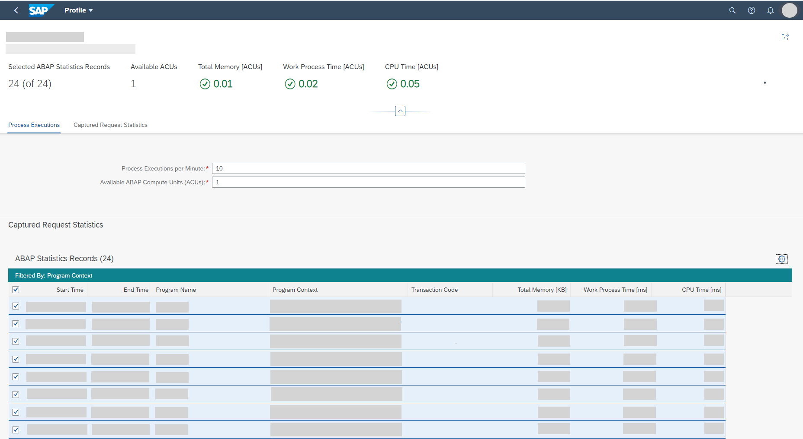

<!-- loio95bc2c1346434032bf79866243cae5a3 -->

# Performing System Sizing

With the *Perform System Sizing* app, you can calculate the required total ABAP memory, the work process time, and the ABAP CPU time in ABAP compute units for a custom application operated in the ABAP environment. You can use these calculations as a basis for ABAP system sizing.

<a name="loio95bc2c1346434032bf79866243cae5a3__prereq_qmx_2qp_sqb"/>

## Prerequisites

Before you start a system sizing, you've used the *Capture Request Statistics* app to capture a snapshot of the expected workload of the custom application.

> ### Note:  
> In the *Capture Request Statistics* app, you must create your own profile for capturing the relevant request statistics. For system sizing, you can't use the predefined SAP capture profiles.

## Context

You want to use the captured request statistics as a basis to perform the system sizing of a production system. The *Perform System Sizing* app uses the captured request statistics to calculate the required total ABAP memory, the work process time per minute, and the ABAP CPU time per minute for the custom application and translates these KPIs into ABAP compute units \(ACUs\).

## Procedure

1.  In the SAP Fiori launchpad, under *Technical Monitoring*, choose the *Capture Request Statistics* app.

2.  Choose the profile that you've defined before to capture the request statistics of the custom application.

    The profile with its settings is shown.

3.  To navigate to the system sizing, choose the *Perform System Sizing* button.

    The *Perform System Sizing* app opens with the captured request statistics of the profile that you've chosen.

    When you open the app, all captured ABAP statistics records are selected for system sizing, and a system sizing for 10 process executions per minute is shown. Initially, 1 ABAP compute unit \(ACU\) is entered as available, but you can also enter a higher number of available ABAP compute units.

    

4.  Replace the default value of 10 process executions per minute with the expected volume as assumed in your sizing-relevant business process definition \(see [Defining the Sizing-Relevant Business Processes](defining-the-sizing-relevant-business-processes-4c482a9.md)\).

    The process execution is the unit to describe the execution of a specific business process by a single business user.

5.  Deselect ABAP statistics records from the table that are not part of the test case definition \(see [Defining Test Cases for Sizing](defining-test-cases-for-sizing-0e95d18.md)\).

6.  Check whether the required ABAP compute units for total ABAP memory, work process time, and ABAP CPU time are still below acceptable thresholds.

    If total ABAP memory, work process time, and ABAP CPU time consume more than 70% of the available ABAP compute units \(ACUs\), a warning sign next to the calculated ABAP compute units is shown, and an error sign if 100% or more is consumed.

7.  If there are still warnings or errors, increase the number of available ABAP compute units until all error or warning signs disappear and the calculated ABAP compute units \(ACUs\) for total ABAP memory, work process time, and ABAP CPU time are displayed with a green OK icon.

    > ### Note:  
    > If you notice an entry in the captured ABAP statistics records that is responsible for a high workload and considerable resource consumption, don't simply accept a high number of required ABAP compute units for your business process. Consider reviewing the relevant request for optimization and, after the optimization, repeat the sizing.

<a name="loio95bc2c1346434032bf79866243cae5a3__result_zzs_51q_sqb"/>

## Results

Combine the results for multiple custom applications that run in the production system to get an idea of the required system size. After you have found the appropriate number of ABAP compute units for your business scenario, you can proceed with using this number for requesting an ABAP system for production.

**Related Information**  

[Combining System Sizing Results](combining-system-sizing-results-c9565cb.md "After performing a system sizing for each business process, combine the results for multiple custom applications that should run in the production system to get an idea of its required system size.")

