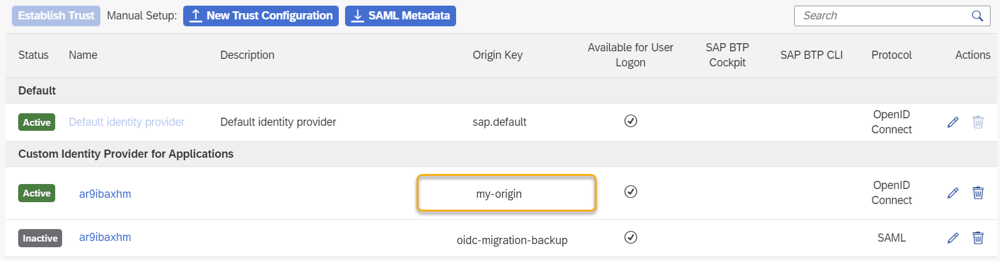

<!-- loio21d86cf36ce94da7b2f2db8271e0b539 -->

# Restore SAML Trust Configuration

You replaced a SAML trust configuration to your custom identity provider with an OpenID Connect \(OIDC\) trust configuration to Identity Authentication, and the authentication of application users in the subaccount isn't working as you expected. Restore your SAML configuration to get your applications working again.

<a name="loio21d86cf36ce94da7b2f2db8271e0b539__prereq_znq_pz3_dxb"/>

## Prerequisites

You previously migrated your trust configuration from SAML to OIDC.

For more information, see [Migrate from SAML Trust Configuration to OpenID Connect Trust with Identity Authentication](migrate-from-saml-trust-configuration-to-openid-connect-trust-with-identity-authenticat-827ae66.md).

## Procedure

1.  Find the inactive OIDC trust configuration with the `oidc-migration-backup` origin key. There is an active trust configuration with the same name and a different origin key. This is the one you can restore to a SAML trust configuration.

    You can look up the origin key in the trust configuration in the SAP BTP cockpit, using the SAP BTP command-line interface \(CLI\), or the Identity Provider Management API.

      
      
    **Finding the Origin Key in the Cockpit**

    

2.  To restore the trust configuration from OIDC to SAML, use the SAP BTP command line interface \(CLI\).

    For more information, see [Managing Trust from SAP BTP to an Identity Authentication Tenant](managing-trust-from-sap-btp-to-an-identity-authentication-tenant-6140107.md).

3.  Log on to the btp CLI \(see [Log in](log-in-e241b30.md)\).

4.  Make sure that you set the target to the relevant SAP BTP subaccount.

5.  Find the name of the \(currently active\) OIDC trust configuration that you want to restore to the SAML protocol.

    > ### Note:  
    > There is also an inactive trust configuration with the same name, but it has the `oidc-migration-backup` origin key and the SAML protocol. It still has the data and assignments of the original SAML trust configuration.

6.  Restore your trust configuration. Use the original key of the active OIDC trust configuration using the following command:

    `btp restore security/trust my-origin-key`

    The btp CLI returns that the restored trust configuration is active and that the protocol is SAML.

7.  Check whether your trust configuration with the OpenID Connect protocol has been restored to SAML. Go to your subaccount in the SAP BTP cockpit and choose *Security* \> *Trust Configuration*. You see only one SAML trust configuration - the restored one. The OIDC trust configuration has disappeared.

<a name="loio21d86cf36ce94da7b2f2db8271e0b539__result_ktm_pfj_dxb"/>

## Results

The original SAML trust configuration has been restored, with its original role collection assignments and origin key. The respective OIDC trust configuration no longer exists. In your Identity Authentication tenant, the application for the OIDC trust configuration, ***XSUAA\_*<subaccount\_display\_name\>**** has been deleted.

