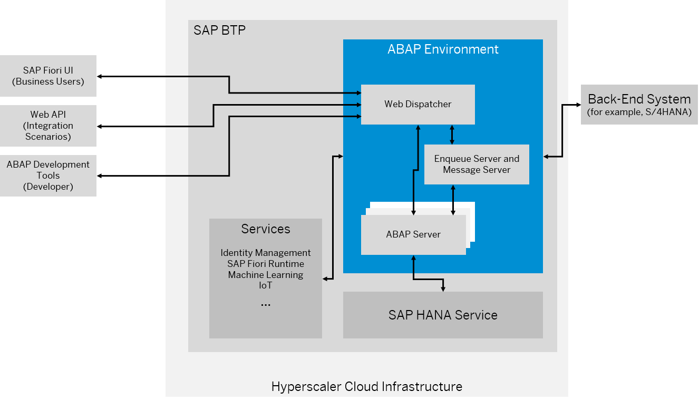

<!-- loiob272506d04ae42c4a23667ee1a942ede -->

# Scalable Applications in the ABAP Environment

Get an overview of the technical architecture of an ABAP environment. It's important to understand which aspects are conditioned by this architecture and are therefore relevant for creating scalable applications in the ABAP environment and for the sizing of such applications.

<a name="loiob272506d04ae42c4a23667ee1a942ede__section_zys_y1b_5qb"/>

## Architecture of the ABAP Environment

The following figure provides an overview of the technical architecture of the ABAP environment:

Both the developer and the business user access the ABAP environment using HTTPS OData calls. The web dispatcher of the ABAP system dispatches these calls to an ABAP server. The respective ABAP server processes the request and might access the SAP HANA database to read or modify data. Besides user-driven calls, the web API can be used to integrate ABAP environment-based applications with other systems, for example, to consume IoT data.

While there's only one web dispatcher and one enqueue and message server, the number of ABAP servers can be increased based on demand \(scale-out approach\). There are always at least two ABAP servers.

The ABAP environment itself consumes reuse services of SAP BTP, for example, identity management or the SAP Fiori UI runtime. The ABAP environment developer can consume additional reuse services such as machine learning. Furthermore, predefined connectivity services of SAP BTP can be consumed to connect an ABAP environment with an SAP S/4HANA \(or SAP ERP\) back-end system.

<a name="loiob272506d04ae42c4a23667ee1a942ede__section_xt4_z1b_5qb"/>

## Relevance for Sizing

The following aspects are important regarding the scalability of the ABAP environment-based applications:

-   The ABAP environment is designed to scale primarily via the number of ABAP servers \(scale-out\), and not via the size of individual ABAP servers \(scale-up\). It's therefore important to split larger work packages into smaller ones, and to process these smaller packages in parallel on many rather small ABAP servers .

-   With the in-memory architecture of SAP HANA and its support for heavily parallelized operations, it has become popular to push down application logic into the database layer \(ABAP supports this pushdown using ABAP-Managed Database Procedures\). While this pushdown remains a valid use case for operations that are time-critical or benefit greatly from being executed close to the data, care must be taken not to overload the central \(and expensive\) SAP HANA instance. In many cases, scaling out by using more \(comparatively cheap\) ABAP servers provides a better total cost of ownership.

-   The ABAP environment and SAP HANA as a cloud service are co-located in a single virtual data center \(one hyperscaler region, but not necessarily the same data center\). Therefore, the network latency between these components is still slightly higher than in a typical on-premise environment. Consequently, performance anti-patterns such as small `SELECT` queries within loops are even more problematic in an ABAP environment than in an on-premise setup.
-   As for any cloud service, network latency is also a limiting factor for clients interacting with the ABAP environment. Avoid performing many small calls to the ABAP environment.

Keep these aspects in mind when you plan scalable applications in the ABAP environment and their sizing.

