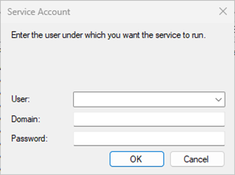
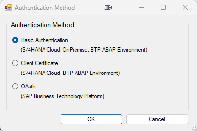
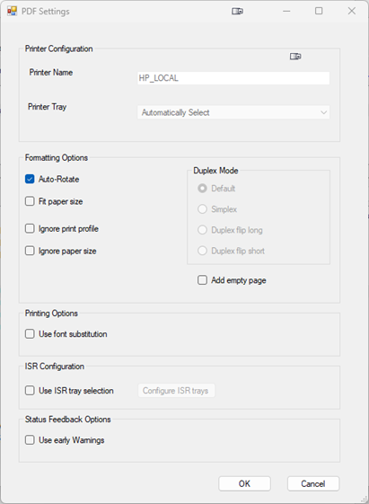
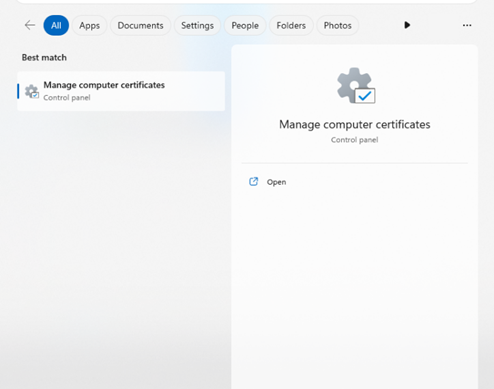
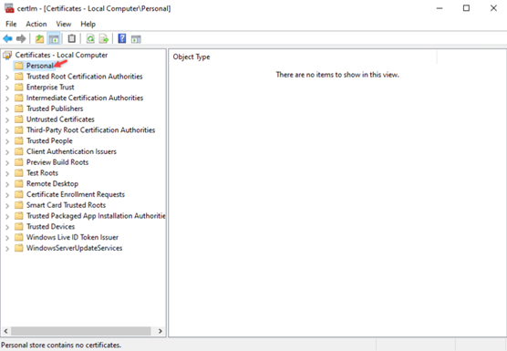

<!-- loio19a3dd9bd4f040cfa8a3a6ce181351cf -->

# Setting Up the SAP Cloud Print Manager for Pull Integration

In the following subsections, you find a description of the different steps necessary to set up the CPM.

## Define Connection Settings

1.  Start the CPM application from the Microsoft Windows® start menu.

2.  Set or change the service user account \(optional step\) \(This step is only required if the service user was not already set during the migration process.\)

    At the first start of the CPM, the service account dialog opens automatically. In case the dialog doesn't open, or you want to change the service user, you can select *Service User* from the*Settings* menu. Enter a service user to run the Microsoft Windows® service. This user should have administration rights on the local computer as well as authorization to access your network printers. The user dropdown shows only local user accounts, but you can also use a domain user by simply filling in the required fields. We recommend to use a local user account as service user.

    

3.  **Optional step:**From the settings menu, select *Proxy* to set up a connection to the internet. It is recommended to use the same configuration required by your company to access the internet. Mostly, the default setting is sufficient and there is no need to change anything.

    After applying these settings, the print service is started and runs as the Windows® service CPM. In addition, as a second Windows® service, you can start the CPM to check if the print service is running. If it’s not running, for example, due to a crash, the CPM restarts the print service to ensure permanent availability of the service. If necessary, you can restart the print service if it has stopped for any reason. You can start both services in the top right corner of the screen.

## Add a New Runtime System

From the runtime system menu, select *New* to add a new runtime system to the CPM.

### Basic Authentication

This method can be used for `S/4HANA Cloud` systems, `OnPremise` or `BTP ABAP Environment` systems.

1.  Select *Basic Authentication* and confirm the dialog.

2.  Enter the following information:
    -   Name: Enter a unique name for the system.

    -   SAP Web Service URL: Enter the URL to your system provided by SAP.
    -   User: Enter the communication user you created while setting up the communication scenario for CPM.
    -   Password: Enter the communication user’s password.

3.  Click *Test* to test the connection to the system and the user credentials.
4.  Click *OK* to save the new configuration.

### Client Certificate

This method can be used for `S/4HANA Cloud` systems or `BTP ABAP Environment` systems.

1.  Select *Client Certificate* and confirm the dialog.

2.  Enter the following information:
    -   Name: Enter a unique name for the system.

    -   SAP Web Service URL: Enter the URL to your system provided by SAP.

    -   Certificate: Select the client certificate that should be used to establish the connection. The dropdown list displays all the certificates installed in the *Personal* folder of the Windows® machine certificate store. The client certificate must be signed by an appropriate certification authority \(CA\) and uploaded to the communication user in the S/4HANA Cloud system. A list of all root CAs approved by SAP Global Security is available in SAP Note [2801396](https://me.sap.com/notes/2801396)

3.  Click *Test* to test the connection to the system and the user credentials.
4.  Click *OK* to save the new configuration.

### OAuth

This method can be used for `SAP Business Technology Platform`.

1.  Select *OAuth* \(SAP Business Technology Platform\) and confirm the dialog.

2.  Enter the following information:
    -   Name: Enter a unique name for the system.

    -   SAP Web Service URL: Enter the URL to your system provided by SAP.
    -   Client ID: Enter the client ID you received during the registration.
    -   Client Secret: Enter the client secret you received during the registration.
    -   Token URL: Enter the token URL you received during the registration.

3.  Click *Test* to test the connection to the system and the user credentials.
4.  Click *OK* to save the new configuration.

    As soon as you have added the runtime system, CPM starts to collect print queues from the SAP Cloud system. All print queues that have been assigned to the communication scenario or user are displayed in CPM. You now need to assign Windows® printers to the print queues to start printing. If you don't immediately see any print queues, select *Check Now* from the*Runtime System* menu to start the connection.

### Remarks

-   It is not supported to connect to the same runtime system with the same communication user multiple times.

## Assign a Printer to a Print Queue

1.  Under *Runtime Systems*, select a system from the list. All print queues that have been assigned to the technical user are displayed in this list.

2.  Under *Print Queues*, select a print queue and choose *Queue Options* from the *Print Queue* menu or use the context menu or a double click on the queue. The *Print Queue Options* dialog opens. Mark the checkbox *Send to Printer* and save the file.

3.  Select a Windows® printer and browse or enter a path and click *OK* to save the configuration.

Note that the printer that you assign to the queue should support the printer language defined in the queue. You can view this information in the*Format* column of the *Print Queues* list. Do not select a printer that requires user interaction for each print job. For example, you should not select a printer that prints to a file with a file selection popup. There is no user interface to the service, so the job wouldn’t print.

As soon you have assigned a printer to the print queue, the documents that have been sent to this print queue will be collected and printed.

CPM can print or save attachments which were added to the document. Attachments can be saved in any format, but you can only print PDF, DOCx, XLSx and PPTx attachments. To save attachments to the specified path, select the checkbox *Save Attachments*.

> ### Note:  
> Mapped network drives might not work correctly if chosen from the *Browse* dialog. In this case, enter the UNC path name `(\\<server_name>\<directory_name>)` manually in the entry field for the file storage directory on the left side.

## Test Printer

1.  Under *Print Queues*, select a *Print Queue* and choose *Output Options* from the print queue menu.

2.  Ensure that *Send to Printer* is checked and a valid printer is selected.
3.  Press the *Test Printer* button. A test page is sent to the defined printer. The test page contains a test sentence in English, Chinese, French, and German.

## PDF Settings

1.  Click on *PDF Settings* to define print settings for your PDF document. This button is only available for queues with a PDF format.

2.  Choose between the following options:
    -   Auto-Rotate: the print settings are adapted in accordance with the orientation of the document that you want to print.

    -   Fit paper size: the print settings are scaled in accordance with the paper size in the paper tray while preserving the aspect ratio of your original document.
    -   Ignore print profile: CPM sends printer specific properties of the attached printer to the print queue in the SAP Cloud system. If supported from the application, these can be used to define print profiles for a print queue item. Print profiles can consist of settings like duplex mode, color mode, tray selection and others. To use the global default settings of CPM, select this option.
    -   Ignore paper size: sending a document with invalid paper size \(for instance, a letter to an A4 tray\) usually causes the printer to ask for a manual confirmation to print. To prevent this, select this option.
    -   Duplex Mode: global print property \(see ‘Ignore print profile’\)
    -   Add empty page: When selecting this option, an empty page is added after a document with odd pages is printed in duplex mode.
    -   Use font substitution: see SAP note [2959085](https://me.sap.com/notes/2959085)for details.
    -   Use ISR tray selection: configure swiss payment form printing. Do not use this for any other printing.
    -   Use early warnings: sends early status feedback to the S/4HANA Cloud or SAP BTP print queue in case of a printer issue. For example: If the printer is out of paper, all items will be set to warning.

3.  Confirm with *OK*.

## Attachment Settings

1.  Click on *Attachment Settings* to define print settings for your attachments.

2.  Choose between the following options from the print mode:
    -   Print as separate file: All attachments are printed separately keeping their original document format.

    -   Print as merged PDF: All attachments are merged into one PDF and are printed in accordance with the selected PDF settings \(see section [PDF Settings](https://help.sap.com/docs/SAP_S4HANA_CLOUD/1634d10899ac45a5b6a6adfba6c9216f/19a3dd9bd4f040cfa8a3a6ce181351cf.html#pdf-settings)\).

3.  Additionally, you can select *Add Page Numbers* for merged PDFs to add page numbering.
4.  Confirm with *OK*.

## Receive Options

Below, you'll find a list of all available Receive options:

-   *Items transferred per Call* specifies the number of print queue items which are transferred in one request using the new print API.

-   *Max. Items in Process per Queue* specifies the maximum number of print queue items that can exist in the internal queue of CPM. If the limit is reached, no new items will be received until some of them were processed. This behavior should prevent memory overflow in case of problems with a printer.
-   *Receive only* is a test option to measure the performance of the item transfer from the SAP Cloud system to CPM. Do not select this option in a productive environment. Nothing is printed or saved. Create many items in a test queue, set the *Log Level* to *Info* \(see section [Other Functions](https://help.sap.com/docs/SAP_S4HANA_CLOUD/a630d57fc5004c6383e7a81efee7a8bb/19a3dd9bd4f040cfa8a3a6ce181351cf.html#other-functions)\) and select*Receive only*. After all print queue items were received, you can find a time stamp for each block of items in the*Error Log*. The block size is the number specified in *Items transferred per Call.*

<a name="loio19a3dd9bd4f040cfa8a3a6ce181351cf__section_t4r_yhy_g1c"/>

## Other Functions

### View Log Information

1.  From the Help menu, select *About*.

2.  Using the links provided in the *About* CPM dialog, you can access the following information:
    -   Document Log: All documents retrieved from the configured runtime system.

    -   Error Log: General errors.
    -   Printing Log: Errors during print job processing.

3.  If you need to provide more detailed log information, select *Options...* from the *Settings* menu, set the*Log Level* to *Info* or *Debug* and mark the checkbox named *Keep Job-Specific Log Files*. Then reproduce the error. This will add more detailed error information to the log files.
4.  If required, click *Save Support Information* to create an archive file containing all log information, which can be attached to a support incident on the application component `BC-CCM-PRN-OM-PM`.

### Cleanup Directories

1.  From the settings menu, select *Clean up Directories*.

2.  All documents and log files stored in CPM’s working directories will be deleted.

### Reset to Factory Defaults

1.  From the *Settings* menu, select *Reset to factory defaults*.

2.  All documents and log files, including the configuration, will be deleted. After performing this action, all the system information, including user and password, must be entered again.

<a name="loio19a3dd9bd4f040cfa8a3a6ce181351cf__section_m21_ymz_g1c"/>

## Appendix

### Self-signed Certificate

To use self-signed certificates, they must be installed in the Windows® computer Certificate Store under the *Personal* folder. After the certificate is installed successfully, the CPM service must be restarted. You can then add connections to the system using the self-signed certificate.

