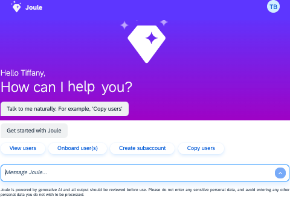

<!-- loio88b02d50ab9143d988ceb4753dfe51f5 -->

# Supported Administrative Tasks \(Beta\)

Learn about the administrative tasks that Joule can perform for you in the SAP BTP cockpit.

> ### Note:  
> This offering is a beta feature. Beta features aren't part of the officially delivered scope that SAP guarantees for future releases. For more information, see [Important Disclaimers and Legal Information](https://help.sap.com/viewer/disclaimer).

You can ask Joule to perform certain administrative tasks for you in the cockpit. If Joule recognizes the task as a supported workflow, then it walks you through the steps to complete the task.

You can ask Joule to do these things in the cockpit:

-   Create a subaccount.

    > ### Note:  
    > Subaccounts are created with a beta label to identify that they're part of the beta program. These subaccounts aren't available in global accounts that are part of a production landscape.

-   Add a new user to a subaccount and assign a role collection.
-   Copy users from a global account to a subaccount. By default, users are assigned the **Subaccount Viewer** role.
-   Copy users from one subaccount to another subaccount. Users are copied over with the same role permissions that they were assigned in the source subaccount.

There are times when it's helpful to see a summary of your global account and subaccount user details. You can also ask Joule to show you these things in the cockpit:

-   View global account users and filter by role.
-   View subaccount users and filter by role.

<a name="loio88b02d50ab9143d988ceb4753dfe51f5__section_e1j_v53_cbc"/>

## Best Practices

-   When working with Joule, you're presented with options in the chat. Make your choices from the options provided for you. Don't type text directly in the chat. Joule works best if you select from the suggested options in the chat.
-   You can't mix an administrative action with a separate conversation about SAP BTP. Let Joule complete a task before you ask questions about SAP BTP.

