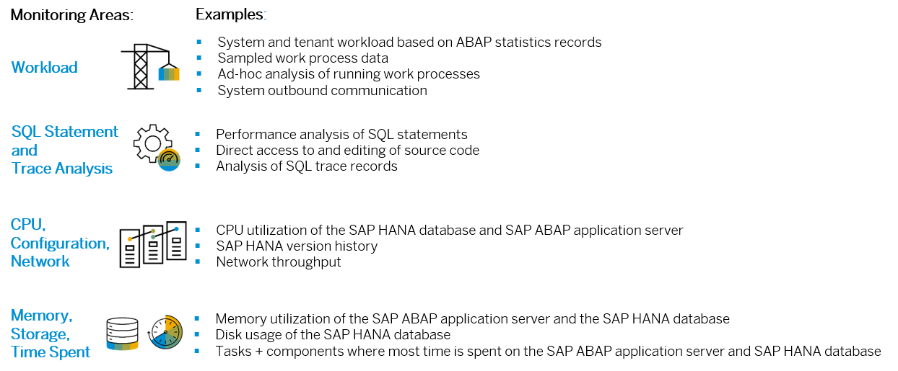

<!-- loioeb867c69739a4cf3be6361d3990d26a2 -->

# Technical Monitoring Cockpit \(Cloud Version\)

The technical monitoring cockpit is a monitoring and analysis tool for the ABAP environment of SAP Business Technology Platform \(SAP BTP\).

<a name="loioeb867c69739a4cf3be6361d3990d26a2__section_jxk_fjw_23b"/>

## What Can You Do with It?

Preconfigured monitoring screens help you identify and solve bottlenecks and performance issues by giving you an in-depth view on important technical data of the database and application server. This includes areas such as the workload on the SAP ABAP application server and SAP HANA database, work processes, SQL statements and SQL traces, as well as CPU and memory utilization, network throughput, storage, time spent, and more.

Note: This image is interactive. Hover over each area for a description. For more information, click the highlighted areas.

<a name="loioeb867c69739a4cf3be6361d3990d26a2__section_e3s_w4d_jqb"/>

## Prerequisites

You have a customer account in the ABAP enviroment of SAP BTP.

You need a business role based on the business role template `SAP_BR_ADMINISTRATOR` or `SAP_BR_DEVELOPER`.

<a name="loioeb867c69739a4cf3be6361d3990d26a2__section_hpk_bgw_23b"/>

## Where Do You Find the Technical Monitoring Cockpit?

The technical monitoring cockpit is available as part of SAP BTP, ABAP environment.

1.  Log on to the SAP Fiori launchpad of the ABAP environment.

2.  In the SAP Fiori launchpad, under *Technical Monitoring*, choose one of the available apps.

3.  You can now use the selected app or choose an entry from the menu of the technical monitoring cockpit.

**Related Information**  

[Getting Started with the User Interface](https://help.sap.com/viewer/b273a660af4e4948a49a316ea2438f24/Cloud/en-US/e49e1c6d50f04f509743f2e3092ef31b.html "The user interface of the technical monitoring cockpit provides a consistent user experience for the entire technology stack.") :arrow_upper_right:

