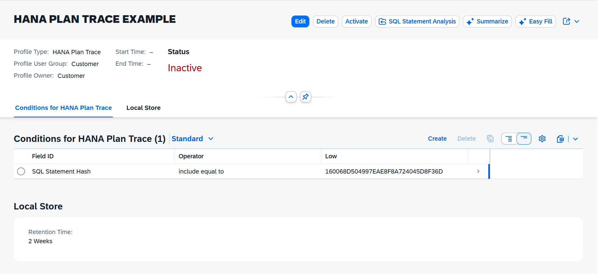
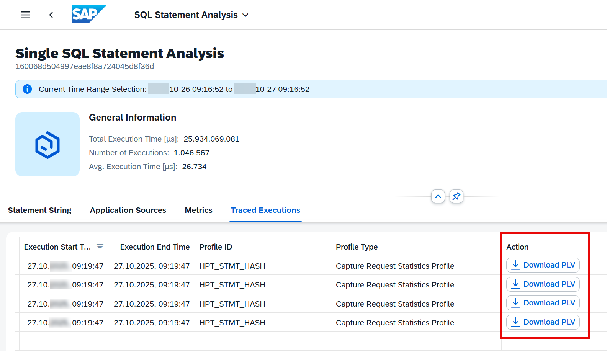
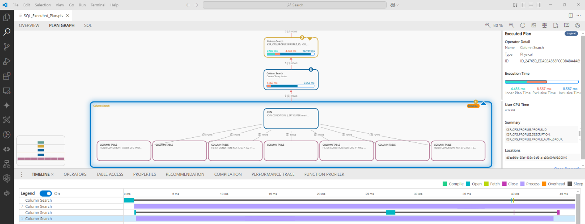

<!-- loioc38357c63266489c92de6feae8efbc6f -->

# Tracing HANA Executed Plans Using the Capture Request Statistics App

If you identify a problematic SQL statement that uses many resources or runs slowly on your ABAP tenant, you might need to analyze the HANA execution plan.

To do this, you can use the `Capture Request Statistics` app and trace these plans during future executions. In the app, create your own HANA plan trace profile or use an existing one to capture PlanViz \(PLV\) files for SQL statement executions. You can then download the PLV files in the `SQL Statement Analysis` app and analyze them using the SQL Analyzer Tool for SAP HANA in Visual Studio Code.

## Prerequisites

You need the `SAP_CORE_BC_TMC` business catalog, which is part of the `SAP_BR_ADMINISTRATOR` and `SAP_BR_DEVELOPER` business role template.

## Procedure

1.  Search for the `Capture Request Statistics` app on the SAP Fiori Launchpad and open it, or navigate to the *Technical Monitoring* page on the SAP Fiori Launchpad and find the app there.

2.  On the home screen of the `Capture Request Statistics` app, choose *Create* or an existing HANA plan trace profile from the list.

3.  To create a new profile, follow these steps:

    1.  Choose a unique *Profile ID* to ensure your trace profile is clearly recognizable. The same applies to the *Description* field.

    2.  As *Profile Type*, choose *HANA Plan Trace*.

    3.  In the *Profile User Group* field, choose the user group you want to trace, for example, *Customer*.

    4.  Choose the *Create* button. The new profile is created and displayed with status *inactive*:

        

4.  In the *Conditions for HANA Plan Trace* section, choose a valid statement hash as a filter condition for your trace profile.

    Note that you can capture HANA executed plans only for SQL statement hashes that have been executed at least once before and therefore can be found, for example, in the `SQL Statement Analysis` or `System Workload` app.

5.  In the *Local Store* section of your profile, adjust the retention time to set how long the traced records will be accessible.

6.  To start the HANA plan trace, choose *Activate*. Trace record generation is limited to collecting 20 traces and to a trace duration of one hour. You can manually deactivate the HANA plan trace profile at any time to stop collecting trace records.

    > ### Note:  
    > If one of these limits is reached, the profile run stops automatically. A small time delay might occur. After the profile stops, the traced records become available. You cannot access the traced records of a profile that is still running.

7.  To download the PLV files, choose the *SQL Statement Analysis* button. The `SQL Statement Analysis` app opens.

8.  In the `SQL Statement Analysis` app, go to the *Traced Executions* tab for the relevant statement hash and download the PLV files.

    

9.  To analyze the PLV files, open them in the SQL analyzer tool for SAP HANA \(Visual Studio Code extension\):

    

## Related Information

[SQL Analyzer Tool for SAP HANA](https://help.sap.com/docs/sql-analyzer)

[Tracing HANA Executed Plans Using the ABAP Cross Trace in ADT](tracing-hana-executed-plans-using-the-abap-cross-trace-in-adt-2056152.md)

[SQL Statement Analysis](https://help.sap.com/viewer/b273a660af4e4948a49a316ea2438f24/Cloud/en-US/2d3e9aff21194e81bbb781384b60b02c.html#loio2d3e9aff21194e81bbb781384b60b02c "Use the SQL Statement Analysis app to analyze the performance and resource consumption of SQL statements within a selectable time range.") :arrow_upper_right:

