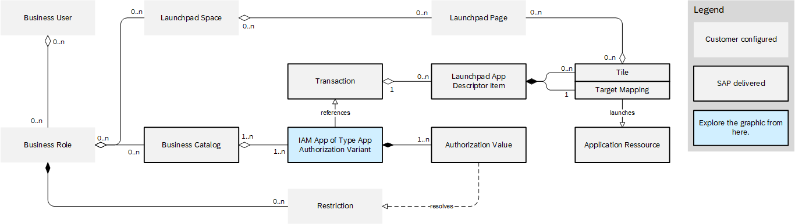
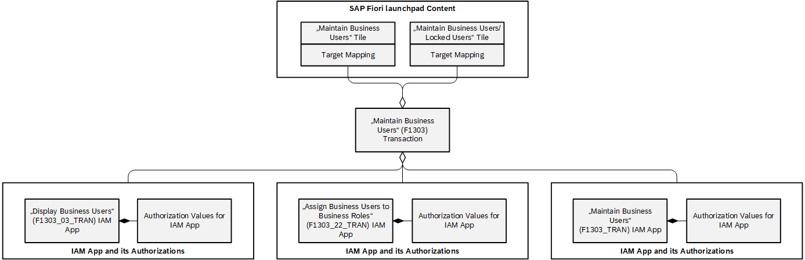
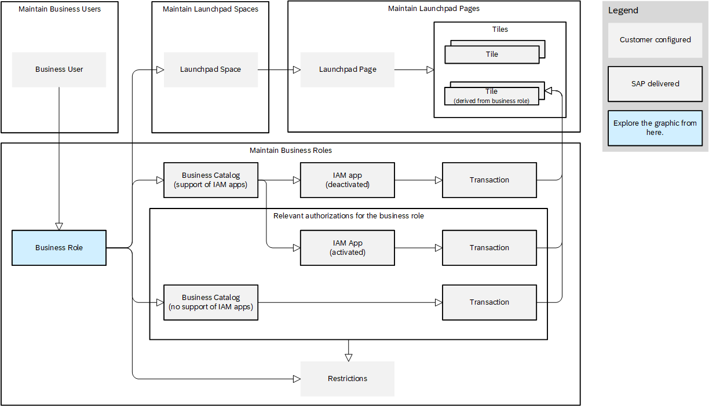

<!-- loioe2b39fb01689420393931a9eb3f627ec -->

# Work with IAM Apps \(App Authorization Variants\)

Learn how to use IAM apps of the app authorization variant type to manage authorizations as an administrator. Discover the impact of IAM apps on the end-user experience.

> ### Caution:  
> IAM apps of the app authorization variant type are not to be confused with app variants. An app variant is an adapted version of an original SAP Fiori app. A key user can adapt an original app in UI adaptation mode and then save it as an app variant to be used by other users. For more information, refer to [App Variants: All You Need to Know](https://help.sap.com/docs/SAP_S4HANA_CLOUD/4fc8d03390c342da8a60f8ee387bca1a/af47058ad66144579db6a990f3b7b919.html).
> 
> IAM apps of the app authorization variant type should be differentiated from IAM apps used in developer extensibility. You can use the latter to define necessary authorizations for business users for one or more services created in ABAP Development Tools \(ADT\). For more information, refer to [Authorization Basics](https://help.sap.com/docs/SAP_S4HANA_CLOUD/6aa39f1ac05441e5a23f484f31e477e7/3461653ff5cc4cb1b13e578cadc412bb.html).

<a name="loio1b490cc68ad641af93cfa64c284d5aab"/>

<!-- loio1b490cc68ad641af93cfa64c284d5aab -->

## Administrator

Understand the architecture and app views on authorization management for business users. As an administrator, this will help you work with IAM apps of the app authorization variant type.

<a name="loio1b490cc68ad641af93cfa64c284d5aab__section_wx5_gsw_hdc"/>

## Architecture View

The graphic provides an architecture view on the entities involved in authorization management and the relationships between them using cardinalities to indicate how many instances of one entity relate to instances of another \(for example, one-to-one or one-to-many\).

Generally, IAM apps are units that grant access to a set of services and authorizations. IAM apps of the app authorization variant type are IAM apps based on transactions containing services, authorizations, restriction types, and dependencies.

A transaction is an entity in the SAP system that represents an application or an executing program. Each transaction is identified by a transaction code, which is a technical ID used to call or identify the transaction. For SAP Fiori apps, for example, the transaction code equals the SAP Fiori ID.

Each transaction can be associated with multiple launchpad app descriptor items. A launchpad app descriptor item consists of a target mapping and one or more tiles. Apps need a launchpad app descriptor item to be accessed from SAP Fiori launchpad.

Target mappings are a prerequisite for navigating to an app in the SAP Fiori launchpad. Tiles serve as the visual representation of an app. It is possible that only a target mapping is provided if the app is not launched from a tile and only from another app \(app-to-app navigation\). Tiles can be referenced in SAP Fiori launchpad pages. Pages are grouped into SAP Fiori launchpad spaces that are then assigned to business roles.

A transaction can relate to several IAM apps that define different access rights through the defined authorization values, for example, to differentiate read and write access. IAM apps are bundled in business catalogs and provide sets of authorization values. Business catalogs can be assigned to business roles. The related restrictions become available for the business roles through the authorization values of the active IAM apps contained in the business role. Business roles are then assigned to a business user. The business user can access the related tiles and target mappings of the associated transactions from the active IAM apps available through the business role.

Let's focus more on the relationship between transactions and app authorization variants as illustrated in the following graphic using an example. An app authorization variant relates to one transaction, but a transaction can relate to several app authorization variants to define different access rights. The different app authorization variants grant access to the same SAP Fiori launchpad content through the transaction.

> ### Example:  
> The *Maintain Business Users* app has the Fiori ID `F1303` and, for example, the following app authorization variants:
> 
> -   an app authorization variant called *Display Business Users* \(IAM app ID: `F1303_03_TRAN`\) with read authorization
> 
> -   an app authorization variant called *Assign Business Users to Business Roles* \(IAM app ID: `F1303_22_TRAN`\) with write authorization
> 
> -   an app authorization variant called *Maintain Business Users* \(IAM app ID: `F1303_TRAN`\) with write authorization
> 
> 
> All three app authorization variants belong to the transaction code `F1303`. They grant access to the same tiles and target mappings in SAP Fiori launchpad but have separate IAM app IDs with the prefix `F1303`. If you only want to grant read access to business users assigned to a specific business role, for example, you activate the *Display Business Users* app authorization variant \(`F1303_03_TRAN`\).

<a name="loio1b490cc68ad641af93cfa64c284d5aab__section_xfh_ksw_hdc"/>

## App View

In contrast to the architecture view on authorization management, the following graphic highlights the apps you can use as an administrator to manage authorizations for business roles using app authorization variants.

Use the *Maintain Business Users* app to provide business users with access rights to SAP Fiori apps through business roles.

Use the *Maintain Business Roles* app to define business roles that control the access to your applications by combining predefined business catalogs. If the business catalogs support IAM apps, they bundle app authorization variants. After such business catalogs are assigned to a business role, you have the option to deactivate individual IAM apps according to your business requirements. This allows you to assign only the apps that are required for a business role to it giving you the flexibility to manage authorizations for business users on a more granular level. For more information, refer to [How to Activate or Deactivate IAM Apps \(App Authorization Variants\)](how-to-activate-or-deactivate-iam-apps-app-authorization-variants-61f5a1a.md).

Use the *Maintain Launchpad Spaces* and *Maintain Launchpad Pages* apps to define the SAP Fiori launchpad of the business user. In the *Maintain Launchpad Pages* app you can display all tiles that are referenced by transactions and available through the corresponding business role for a specific page using the role context feature. The activation status of IAM apps is not considered for this feature.

### Related Information

[Managing Launchpad Spaces and Pages](https://help.sap.com/docs/SAP_S4HANA_CLOUD/4fc8d03390c342da8a60f8ee387bca1a/e55f5cc8ccec490f83a00284659bce9f.html)

[Maintain Business Users](https://help.sap.com/docs/SAP_S4HANA_CLOUD/53e36b5493804bcdb3f6f14de8b487dd/e40e710321c74f28916affa9ae984bce.html)

[Maintain Business Roles](https://help.sap.com/docs/SAP_S4HANA_CLOUD/53e36b5493804bcdb3f6f14de8b487dd/8980ad05330b4585ab96a8e09cef4688.html)

[Manage Launchpad Spaces](https://help.sap.com/docs/SAP_S4HANA_CLOUD/4fc8d03390c342da8a60f8ee387bca1a/ad119b284f8249cfb4c3fc86c76404c5.html)

[Manage Launchpad Pages](https://help.sap.com/docs/SAP_S4HANA_CLOUD/4fc8d03390c342da8a60f8ee387bca1a/8a174e235493472095c0bcec957dfee0.html)

[Personas](https://help.sap.com/docs/SAP_S4HANA_CLOUD/53e36b5493804bcdb3f6f14de8b487dd/1a17ec8626a641e68c9006b415e4a9f9.html)

<a name="loioa5a3d783fc0b46b2af66647e862d8122"/>

<!-- loioa5a3d783fc0b46b2af66647e862d8122 -->

## End User

Business roles assigned to your business user define the access to apps and the layout of your SAP Fiori launchpad \(spaces, pages, tiles\) through provided authorizations. There are two main effects for you as an end user:

-   To manage authorizations more granularly, administrators can deactivate IAM apps in business roles assigned to your business user. Authorizations for deactivated IAM apps assigned to a business role are removed. This means that you no longer have access to apps you previously accessed by default.

-   An app can have multiple tiles as access points on SAP Fiori launchpad. This can be the case if tiles have been provided with different parameters to display different information in the app.

    All tiles for apps you are authorized to access are available in the app finder. On an SAP Fiori launchpad page, tiles are visible based on the authorization of your business user and based on the tiles the administrator has selected during the creation of the SAP Fiori launchpad page.

### Related Information

[App Finder](https://help.sap.com/docs/SAP_S4HANA_CLOUD/4fc8d03390c342da8a60f8ee387bca1a/48a5dbb0308b47d8969485845d5966ae.html)

[Personas](https://help.sap.com/docs/SAP_S4HANA_CLOUD/53e36b5493804bcdb3f6f14de8b487dd/1a17ec8626a641e68c9006b415e4a9f9.html)

