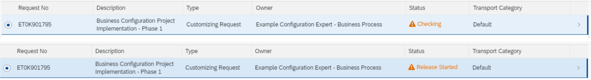

<!-- loiocc16fd0c10ef4ed39a50ac718c71e5a8 -->

# Working in the Export Customizing Transports App

Find out how to create, release, or merge customizing requests using the *Export Customizing Transports* app.

-   If a software component of the type `Business Configuration` is available in the system, the created request will target this software component. If no such software component is available, the request will be created without any target.
-   The target of a request can currently only be changed in the ADT editor.

### Changing Client-Specific Business Configurations

The client settings determine whether changes to business configurations are allowed or recorded automatically in a request.

If the automatic recording for the client is activated, you have to select a request number for the recording whenever you save changed client-specific configurations. If there is no request number selected, the configurations can't be saved.

If the automatic recording for the client is not allowed, you can save changed client-specific configurations without selecting a request number.

<a name="loiocc16fd0c10ef4ed39a50ac718c71e5a8__section_qfh_hwf_bpb"/>

## Create Request

1.  Open the *Export Customizing Transports* app. A list of customizing requests is displayed, with the latest request shown first at the top.
2.  Use the search bar to filter for specific requests based on search criteria like the *Request No*, the *Owner*, or the *Status*.
3.  Click *Create* to create a new request.

    > ### Note:  
    > Note that there can only be one default customizing request.

4.  \(Optional\) Add business configurations to this request by, for instance, using the *Upload Business Configurations* app or the *Manage Number Range Intervals* app.

<a name="loiocc16fd0c10ef4ed39a50ac718c71e5a8__section_kcp_j5s_vrb"/>

## Display Request

1.  Navigate to a request's object page to display its tasks, objects, attributes, and logs.
2.  Select a customizing task to display the objects recorded in it.
3.  Select an object to display the table keys recorded in it.

<a name="loiocc16fd0c10ef4ed39a50ac718c71e5a8__section_wmc_m5s_vrb"/>

## Release Request

1.  Release any tasks belonging to your transport request. A request can't be released until all its tasks have been released.
2.  Check the consistency of your request by triggering a release simulation: Select the request and click *Release* \> *Check*.
3.  You can also release your request directly without triggering a simulation: Select the request and click *Release* \> *Execute*.

4.  To refresh the status of a released or simulated request: Select the request with the status *Checking* or *Release Started* and click *Refresh*.

      

5.  View the results of the simulation or direct release in the *Logs* tab.

<a name="loiocc16fd0c10ef4ed39a50ac718c71e5a8__section_mh5_ljs_vrb"/>

## Merge Request

If there are dependencies between different requests or several business users have recorded their configuration changes in different requests, you can choose to merge these different requests into one.

1.  Select the request you want to merge.

2.  Select *Merge*.

3.  In the selection dialog, enter the target request number to which the selected request should be merged, and click *Merge*.

      

> ### Note:  
> The configuration changes recorded in the request you selected to merge are copied to the target request. After merging, the previously selected request will be deleted.

<a name="loiocc16fd0c10ef4ed39a50ac718c71e5a8__section_ljq_mjs_vrb"/>

## Create Copy

It can happen that for technical reasons, it's necessary for you to create a copy of an exported request. This can be the case if, for example, your exported request containing the business configurations didn't synchronize to the Git Repository. In order to synchronize these business configurations with the Git Repository again, a copy is needed.

1.  Select the request you want to copy.

2.  Click on *Create Copy*.

<a name="loiocc16fd0c10ef4ed39a50ac718c71e5a8__section_j4k_bcb_55b"/>

## Change Request Target

You can change the target of a request.

1.  Open the request where the target needs to be changed.

2.  Select *Edit*. The option *Target* is now enabled for editing.

3.  To open the list of available targets, open the value help.

4.  Select the suitable target with the relevant software component and save your changes.

