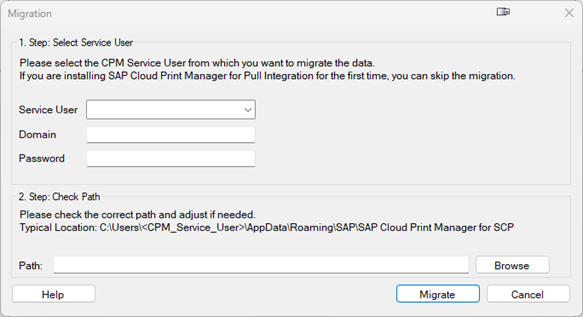

<!-- loio964486f5b55347bea772211a02838b71 -->

# Working with the SAP Cloud Print Manager for Pull Integration

You can use the `SAP Cloud Print Manager for Pull Integration` \(from now on abbreviated as CPM\) to establish a connection between an SAP Cloud-based solution and printers available in your network. It requires the CPM to enable automatic transmission and printing of documents from the cloud-based system to local printers.

You should install the CPM once in your network. Download the CPM installation package from the*Install Additional Software* app and select *Run as Administrator*.

> ### Note:  
> Keep in mind that you need to have administrator rights in order to proceed with the installation. The installation should be performed on a Windows server.

Start the downloaded installer executable file. The`SAP Front-End Installer` opens. Select CPM and click *Next*. Wait until the installation has finished and confirm the final dialog. The CPM is now installed.

As a Windows® service, CPM is available for print queue output from the cloud-based system as long the Windows® computer is up and running and the CPM Windows® service has not been stopped manually. Thus, we recommend to install CPM on a central print server that is up and running all the time or at least during the time in which printing is needed.

You only need to install CPM more than once if you have multiple separate networks with printers that you want to use for process-integrated printing.

<a name="loio964486f5b55347bea772211a02838b71__section_ylp_lsl_21c"/>

## Prerequisites

-   **Prerequisites on the Print Server**

    You have administration authorization for the computer on which you install CPM.

    **Note that** when CPM collects documents from a print queue and sends them to a printer, the documents are stored temporarily on the server CPM is installed on. If you are using CPM to print sensitive documents, it is recommended that you ensure that only authorized users can access this folder. The folder, called the working directory, can be found in the following path on the Windows® computer running CPM:

    `C:\ProgramData\SAP\Cloud Print Manager for PI`

    Since the CPM can run under a different user than the `SAP Cloud Print Service`, the working directory is stored under the`ProgramData` folder as it can be accessed from both users.

    For the storage of the temporary documents and the configuration, the embedded `NoSQL` database`LiteDB` is used. `LiteDB` is a serverless database fully written in `.NET C#` managed code. The stored data can be viewed with the [LiteDB.Studio](https://github.com/mbdavid/LiteDB.Studio).

-   **Prerequisites in the SAP Cloud Systems**

    In S/4HANA Cloud the integration with CPM is done with an appropriate communication scenario. Please follow the instructions in [Integrating SAP S/4HANA Cloud and Local Printers](https://help.sap.com/docs/SAP_S4HANA_CLOUD/0f69f8fb28ac4bf48d2b57b9637e81fa/d07a4297e776446e898f2b27532f63c6.html?locale=en-US). For SAP Business Technology Platform please get more information from the `SAP Print Service` documentation on [how to integrate your system with SAP Cloud Print Manager for Pull Integration](https://help.sap.com/docs/SCP_PRINT_SERVICE/7615de0949ce441d8bc5df7725a6bfc6/2a1a47535a5948aabf4225e1f7d24a16.html).

<a name="loio964486f5b55347bea772211a02838b71__section_ahp_rct_21c"/>

## Migrate to Release 800

Starting with release 800 of the CPM some major changes have been made that require a migration. For this, a new migration tool was introduced. At the first start the migration tool is launched automatically.

> ### Note:  
> Please make sure that the print service is stopped, and that the migration process is started during a phase with low printing amount.

1.  Here you must select the CPM service user that you have previously used and from which you want to migrate the data. It is also required to type in the corresponding password to perform the migration.

2.  Please verify that the path to the CPM application data is filled and correct. Usually, nothing needs to be changed here.

After the migration is done, the service user selected in the migration tool is automatically set as CPM service user as well. The service user can be changed as described here: [Setting Up the SAP Cloud Print Manager for Pull Integration](setting-up-the-sap-cloud-print-manager-for-pull-integration-19a3dd9.md).

