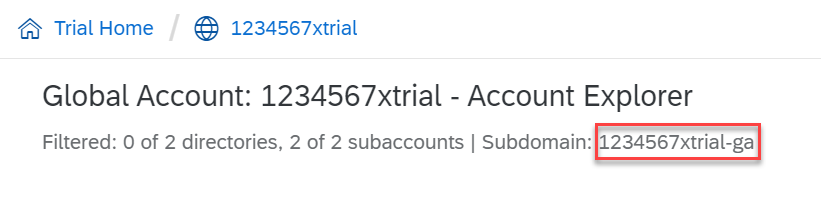

<!-- loioe241b30195ff4d009dba3076e0ae8d27 -->

# Log in

Log in with the btp CLI is on global account level.


<a name="loioe241b30195ff4d009dba3076e0ae8d27__prereq_jwk_x1v_qhb"/>

## Prerequisites

-   Your global account is on feature set B. See [Cloud Management Tools — Feature Set Overview](../10_concepts/cloud-management-tools-feature-set-overview-caf4e4e.md).
-   You have the subdomain of your global account ready. You can find it in the cockpit in the global account view or under *Switch Global Account*.

-   You have the CLI server URL: `https://cpcli.cf.eu10.hana.ondemand.com` . Only if your operator has provided you with a different server URL, you'll have to enter this.


<a name="loioe241b30195ff4d009dba3076e0ae8d27__context_nwm_mqd_fmb"/>

## Context

When you log in to your global account with the btp CLI, a token is created and stored on your computer that allows to close and reopen the command line without losing your login. With each command call, this token is renewed and valid for 24 hours. So, if you take a longer break from working with the btp CLI, you’ll have to log in again. If you want to end your login earlier, you can use `btp logout`.

Alternatively, you can also log in with single sign-on directly at your identity provider through a web browser. See [Log In Through a Browser](log-in-through-a-browser-b2a56a8.md).


## Procedure

1.  Use `btp login`. The btp CLI prompts for all login information, but optionally, you can provide the required information as parameters.

    Usage: `btp [OPTIONS] login [PARAMS]`

    <a name="loioe241b30195ff4d009dba3076e0ae8d27__table_l3v_w4l_w3b"/>Parameters


    <table>
    <tr>
    <td valign="top">

    `--url` *<URL\>*


    
    </td>
    <td valign="top">

    The client proposes this URL: `https://cpcli.cf.eu10.hana.ondemand.com`, which you can confirm by pressing [ENTER\]. If your operator has provided you with a different server URL, you can specify it here. Note that when you enter a new server URL for the first time, you’re asked to confirm that you trust it.

    > ### Note:  
    > There is just one central CLI server, independent of the regions of your subaccounts. Unless you're in a private cloud and have received a CLI server URL from your operator, you should not change the proposed URL.


    
    </td>
    </tr>
    <tr>
    <td valign="top">

    `--subdomain` *<GLOBALACCOUNT\>*


    
    </td>
    <td valign="top">

    The subdomain of the global account you want to log in to. You should have obtained the subdomain from your operator; but you can also find it in the cockpit in the global account view or under *Switch Global Account* dialog.

      

    > ### Note:  
    > If you don't find the subdomain of the global account in your cockpit, your global accoiunt is probably not on SAP BTP feature set B, which means you cannot access it with the btp CLI. See [Cloud Management Tools — Feature Set Overview](../10_concepts/cloud-management-tools-feature-set-overview-caf4e4e.md).


    
    </td>
    </tr>
    <tr>
    <td valign="top">

    `--user` *<USER\>*


    
    </td>
    <td valign="top">

    Your user name, usually an email address.


    
    </td>
    </tr>
    <tr>
    <td valign="top">

    `--password` *<PASSWORD\>*


    
    </td>
    <td valign="top">

    Your password. Note that if two-factor authentication is enabled, concatenate your password and the passcode in a single string.

    > ### Tip:  
    > We don’t recommend to provide the password with this parameter, as it appears in plain text and may be recorded in your shell history. Rather, enter it when you’re prompted.


    
    </td>
    </tr>
    </table>
    
    ```nocode
    btp login --url https://cpcli.cf.eu10.hana.ondemand.com --subdomain my-global-account --user name@example.com
    ```

    > ### Note:  
    > To log on with SAP Universal ID, you need a browser in the logon process. Use the option `--sso`.
    > 
    > For more information, see [Log In Through a Browser](log-in-through-a-browser-b2a56a8.md).
    > 
    > Otherwise log on with the password associated with your account \(S-user or P-user\) in the default identity provider, SAP ID service.
    > 
    > If you've forgotten this password and this user is associated with your SAP Universal ID user, reset your password.
    > 
    > For more information, see SAP Note [3085908](https://launchpad.support.sap.com/#/notes/3085908).

    If you've logged in before, the server URL, the subdomain, and the user from the last login are suggested. You can then press [Enter\] to confirm, or type in different values.

    ```
    `CLI server URL [https://cpcli.cf.eu10.hana.ondemand.com]>
    `Subdomain [my-global-account]>
    `User [name@example.com]>`
    ```


<a name="loioe241b30195ff4d009dba3076e0ae8d27__result_yvj_3hy_m3b"/>

## Results

Upon successful login, the btp CLI creates a folder \(`btp`\) and a configuration file \(`config.json`\) in the default location of your user data directory:

-   Microsoft Windows: `C:\Users\*<username\>*\AppData\Roaming\SAP\btp\config.json`

-   Apple macOS ; `~/Library/Application Support/.btp/config.json`

-   Linux: `~/.config/.btp/config.json`


To change this location, use the `--config` option or the environmnet variable. See [Specify the Location of the Configuration File](specify-the-location-of-the-configuration-file-e57288d.md).

> ### Tip:  
> You’ve logged in to the global account and all commands are executed in the context of this global account. To change this default context for subsequent commands to a subaccount or directory of this global account, use `btp target`. See [Set the Default Command Context](set-the-default-command-context-720645a.md).

**Related Information**  


[Get Help](get-help-f8fd1e5.md "There is extensive help in the btp CLI about every command. You can get help with the help action or the --help option.")

[View Version and Current Context](view-version-and-current-context-9c29222.md "To find out the current context you’re working in, run the command btp --info or simply btp.")

[Log out](log-out-9f1c87a.md "Logging out of the configured server removes all user-specific data from the configuration file.")

[Enable Command Autocompletion](enable-command-autocompletion-46355fa.md "Use command autocompletion to save keystrokes when entering command actions, group-object combinations, and their parameters in the SAP BTP command line interface (btp CLI).")

[Set the Default Command Context](set-the-default-command-context-720645a.md "Change the default context for all command calls to the global account, a directory, or a subaccount by using the btp target command.")

[Change the Output Format to JSON](change-the-output-format-to-json-dcb85b7.md "Use the --format json option to change the output format of a command to JSON.")

[Specify the Location of the Configuration File](specify-the-location-of-the-configuration-file-e57288d.md "You can change the location of the configuration file by using the --config option or the environment variable.")

[Commands in the btp CLI](commands-in-the-btp-cli-a03a555.md "A list of all tasks and respective commands that are available in the SAP BTP command line interface (btp CLI).")

