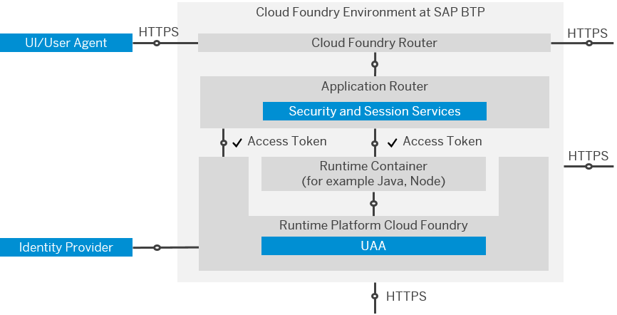

<!-- loio70a62d12cf91493cb9d1ec3c04d19ff9 -->

# Web Access Control

The Cloud Foundry environment extends SAP BTP. It provides platform security functions such as business user authentication, authorization management, and other security functions for access to the applications in the runtime container. To access the runtime container, the business user can use a browser or a browser-based user interface.

The following diagram shows the architecture with the components that are responsible for business user authentication, authorization management, and security. It is not mandatory for applications to use the User Account and Authentication service and the application router.

  

The User Account and Authentication \(UAA\) component provides a programming model for business applications. It is the central infrastructure component of the runtime platform for business user authentication and authorization management. The users can be stored in the following identity providers:

-   SAP ID service

-   SAP Cloud Identity Services - Identity Authentication

-   Any SAML 2.0 identity provider

Applications authenticate using OAuth 2.0. When business users access an application, the application router acts as OAuth client and redirects their request to the OAuth authorization server for authentication \(see the *Applications* section\). Runtime containers act as resource servers, using the container security API of the relevant container \(for example, Java\) to validate the token issued by the OAuth authorization server.

