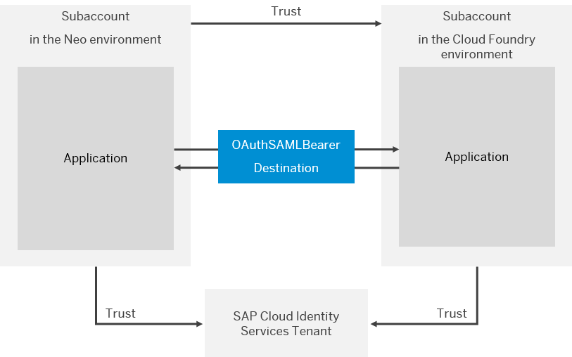

<!-- loio85200d8509004236b2a3a637bf1471a8 -->

# Authentication and Authorization in the Kyma Environment

Kyma allows you to use the default or a custom Identity Provider to authenticate in the Kyma environment.

<a name="loio85200d8509004236b2a3a637bf1471a8__section_jsc_p14_zkb"/>

## Default Identity Provider for Kubernetes Access

With Kyma version 2.0, all managed Kyma runtimes are configured to use a default Identity Provider \(IdP\). The default IdP configuration uses a specific SAP Cloud Identity Services - Identity Authentication on-demand tenant that is shared across all managed Kyma runtimes.

In managed Kyma customers can’t manage the tenant themselves, for example, make changes in user groups. In this setup, admins can assign roles only targeting users.

The Identity Authentication on-demand tenant uses SAP Corporate IdP as an upstream source of identities. Therefore, it recognizes everyone with an account at `accounts.sap.com` and issues a valid OIDC access token to any SAP customer or employee.

It doesn't mean that anybody with an account at `accounts.sap.com` has access to your Kyma runtime. The shared IdP validates identities, but permissions \(roles and role bindings\) are configured in your Kyma runtime, and not in the IdP or SAP BTP cockpit. Kyma uses Kubernetes Role Based Access Control \(RBAC\) and has the provisioning process that assures that a user who creates and owns a particular runtime is given the **cluster-admin** role. The **cluster-admin** can define any additional cluster roles or use those defined in Kyma and bind them to other users \(by username\) from Kyma Dashboard or via kubectl CLI tool.

<a name="loio85200d8509004236b2a3a637bf1471a8__section_rqx_sbr_psb"/>

## Custom Identity Provider for Kubernetes Access

The default setup is sufficient for most users. However, in some cases, you may need the flexibility of using your own IdP. You can configure a custom identity provider during Kyma provisioning or updating an existing instance of your Kyma runtime.

You can choose any OpenID Connect compliant service. For example, you can use your own tenant of SAP Cloud Identity Services - Identity Authentication, which allows you to:

-   manage users

-   manage user groups and bind cluster roles to the user groups instead of individual usernames in your Kyma runtime

-   configure your own risk-based security measures, such as two-factor authentication, IP ranges, etc.

-   delegate authentication to an upstream corporate IdP in order not to introduce redundant identities and benefit from SSO based on identity provided "centrally"

**Related Information**  

[Assign Roles in the Kyma Environment](../50-administration-and-ops/assign-roles-in-the-kyma-environment-148ae38.md "Kyma uses roles to manage access within the cluster, which give the assigned users the permissions suitable for their purposes.")

[Authorization in Kyma](https://kyma-project.io/docs/kyma/latest/04-operation-guides/security/sec-02-authorization-in-kyma)

[Initial Setup](https://help.sap.com/viewer/6d6d63354d1242d185ab4830fc04feb1/LATEST/en-US/31af7da133874e199a7df1d42905241b.html)

[User Groups](https://help.sap.com/viewer/6d6d63354d1242d185ab4830fc04feb1/LATEST/en-US/ddd067c899f94e2f9006cc4dd417be80.html)

[Configure Risk-Based Authentication for an Application](https://help.sap.com/viewer/6d6d63354d1242d185ab4830fc04feb1/LATEST/en-US/bc52fbf3d59447bbb6aa22f80d8b6056.html)

[Corporate Identity Providers](https://help.sap.com/docs/IDENTITY_AUTHENTICATION/6d6d63354d1242d185ab4830fc04feb1/19f3eca47db643b6aad448b5dc1075ad.html?locale=en-US)

[Configure a Custom Identity Provider for Kyma](configure-a-custom-identity-provider-for-kyma-67bcc6e.md "Enable the Kyma environment with a custom identity provider (IdP).")

