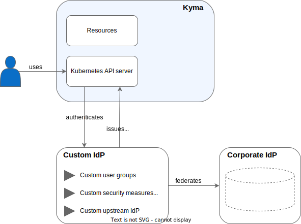

<!-- loio85200d8509004236b2a3a637bf1471a8 -->

# Authentication in the Kyma Environment

To authenticate in the Kyma environment, you can either use the default identity provider \(IdP\) or set up a custom identity provider.

<a name="loio85200d8509004236b2a3a637bf1471a8__section_aw4_kk3_fcc"/>

## Default vs. Custom Identity Provider

SAP BTP, Kyma runtime uses OpenID Connect for authentication. Kyma runtime is configured with a default IdP: a shared [SAP Cloud Identity Services](https://help.sap.com/docs/cloud-identity-services/cloud-identity-services/landing-page?version=Cloud) tenant. This is a good starting point for development and testing purposes. For production scenarios, it's recommended that you set up your own SAP Cloud Identity Services tenant which provides the following features:

-   manages users

-   manages user groups and binds cluster roles to the user groups instead of individual usernames in your Kyma runtime

-   configures your own risk-based security measures, such as two-factor authentication, IP ranges, etc.

-   delegates authentication to an upstream corporate IdP to prevent introducing redundant identities and to benefit from SSO, based on identity provided "centrally"

Learn how to [Get Your Tenant](https://help.sap.com/docs/cloud-identity-services/cloud-identity-services/get-your-tenant?version=Cloud) from SAP Cloud Identity Services.

Alternatively, you can choose any other service compliant with OpenID Connect.

Having an SAP Cloud Identity Services tenant, you can configure it as the custom identity provider of your Kyma cluster. See [Configure a Custom Identity Provider for Kyma](configure-a-custom-identity-provider-for-kyma-67bcc6e.md).

