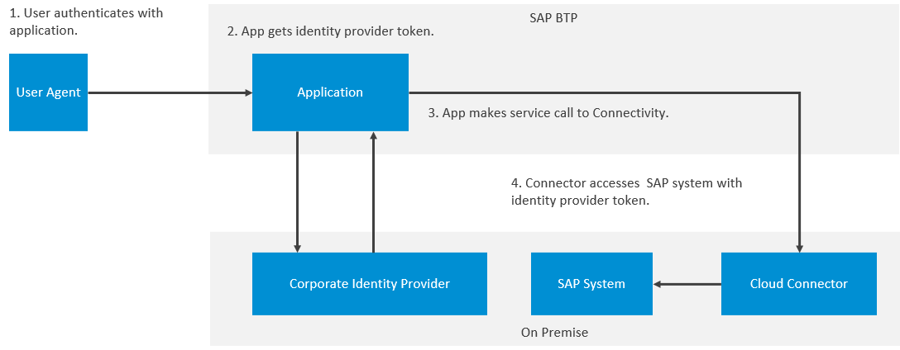

<!-- loio1503442f766145fd8cfe9caa0c087da3 -->

# Principal Propagation from SAP BTP Applications to On-Premise Systems Using Corporate IdP Tokens

You have a scenario where your SAP BTP application, such as SAP Build Work Zone, interacts with on-premise systems for which you don't want to accept tokens from SAP BTP identity and access management services, namely SAP Cloud Identity Services and SAP Authorization and Trust Management service. You can configure SAP BTP applications to include a token from the corporate identity provider you trust.

<a name="loio1503442f766145fd8cfe9caa0c087da3__prereq_dfq_qzt_xfc"/>

## Prerequisites

-   You have configured trust between your subaccount and an SAP Cloud Identity Services tenant with OpenID Connect \(OIDC\).

    For more information, see [Establish Trust and Federation Between SAP Authorization and Trust Management Service and SAP Cloud Identity Services](../50-administration-and-ops/establish-trust-and-federation-between-sap-authorization-and-trust-management-service-a-161f8f0.md).

-   You have configured trust between a corporate identity provider and your SAP Cloud Identity Services tenant with OIDC.

    For more information, see [Configure Trust with OpenID Connect Corporate Identity Provider](https://help.sap.com/docs/IDENTITY_AUTHENTICATION/6d6d63354d1242d185ab4830fc04feb1/8ff83a12bbb8491c9558d635d6bbb287.html) in the SAP Cloud Identity Services documentation.

-   You have configured both your Cloud application and your on-premise application to authenticate with the same corporate identity provider.

    Set the corporate identity provider as the default identity provider.

    For more information, see [Choose Default Identity Provider for an Application](https://help.sap.com/docs/cloud-identity-services/cloud-identity-services/choose-default-identity-provider-for-application?version=Cloud).

## Context

> ### Note:  
> The content in this section is not relevant for China \(Shanghai\) and Government Cloud \(US\) regions.

In this scenario, the SAP BTP application passes the token of a corporate identity provider with the help of connectivity services to your on-premise SAP system. To configure this form of principal propagation, you must ensure SAP Cloud Identity Services and the relevant connectivity services are set up to support this scenario.

The following figure illustrates this scenario.

  
  
**Cloud Connector Using Embedded Tokens**

> ### Restriction:  
> All functions that depend on principal propagation to back-end applications that require tokens from the corporate identity provider only work for users hosted by that corporate identity provider. Users from identity providers other than the corporate identity provider, including local users in the Identity Directory of SAP Cloud Identity Services can only perform the functions defined by the application.

## Procedure

1.  Subscribe to an application in your subaccount that supports this principal propagation scenario.

    Refer to the documentation of the application, which supports this scenario.

2.  Enable SAP Cloud Identity Services to forward tokens of the corporate identity provider.

    -   For pure proxy scenarios:

        Enrich the `forward_corp_idp_token` claim with the `id_token` value.

        For more information, see [Enrich Token Claims Coming from Corporate IdP](https://help.sap.com/docs/cloud-identity-services/cloud-identity-services/enrich-token-claims-coming-from-corporate-idp?version=Cloud).

    -   For federation scenarios:

        Add the `forward_corp_idp_token` claim with the `id_token` value as a custom attribute mapping on each relevant application in the SAP Cloud Identity Services tenant.

        For more information, see [Configuring User Attributes from a Corporate Identity Provider](https://help.sap.com/docs/cloud-identity-services/cloud-identity-services/configure-default-attributes-for-subscribed-applications?version=Cloud).

3.  Check if you need to configure a destination to connect your application to the Cloud Connector.

    The application you subscribed to may have provisioned this destination for you. Check the configuration documentation of the application to which you subscribed.

    For more information, see [Principal Propagation SSO Authentication for HTTP](https://help.sap.com/docs/connectivity/sap-btp-connectivity-cf/principal-propagation-sso-authentication-for-http?version=Cloud).

4.  Check the Cloud Connector configuration to disable trust to SAP Cloud Identity Services and SAP Authorization and Trust Management service.

    For more information, see [Configure Trusted Entities in the Cloud Connector](https://help.sap.com/docs/connectivity/sap-btp-connectivity-cf/set-up-trust-for-principal-propagation?version=Cloud#configure-trusted-entities-in-the-cloud-connector).

<a name="loio1503442f766145fd8cfe9caa0c087da3__postreq_dyf_rcd_yfc"/>

## Next Steps

You can now test the application you subscribed to. If the principal propagation doesn't work as expected, try the following:

-   Troubleshooting logs of SAP Cloud Identity Services

    For more information, see [Logging OpenID Connect Tokens](https://help.sap.com/docs/cloud-identity-services/cloud-identity-services/logging-openid-connect-tokens?version=Cloud).

-   Logs of the Cloud Connector

    For more information, see [Monitoring, Logging, And Troubleshooting](https://help.sap.com/docs/connectivity/sap-btp-connectivity-cf/cloud-connector-troubleshooting?version=Cloud).

