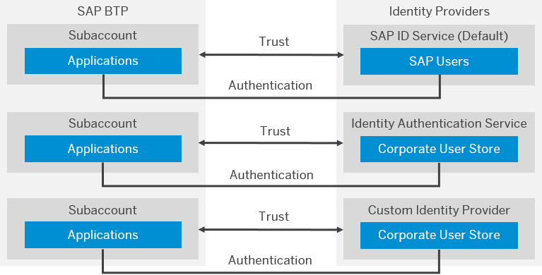

<!-- loioe129aa20c78c4a9fb379b9803b02e5f6 -->

# Security

Use the security features and functions of SAP BTP to support the security policies of your organization.

<a name="loioe129aa20c78c4a9fb379b9803b02e5f6__section_svv_c1s_tlb"/>

## User Model

SAP BTP distinguishes between **platform users** \(for global accounts and subaccounts\) and **business users** \(for the applications\).

SAP ID service is the default identity provider for both. You can configure each of your subaccounts to use a custom identity provider for its platform or business users.

See [User and Member Management](../10-concepts/user-and-member-management-cc1c676.md).

<a name="loioe129aa20c78c4a9fb379b9803b02e5f6__section_cxy_5hc_jmb"/>

## Authorizations

You can configure authorizations using **roles** and **role collections** for your global account, subaccount, directory or individual applications.

See [Security Administration: Managing Authentication and Authorization](../50-administration-and-ops/security-administration-managing-authentication-and-authorization-1ff47b2.md).

<a name="loioe129aa20c78c4a9fb379b9803b02e5f6__section_jjc_bzr_tlb"/>

## Identity Providers

Identity providers \(IdP\) supply the user store for your business applications or for your subaccount. You can re-use existing corporate identity management infrastructure \(on-premise or on the cloud\), or use the default one \(SAP ID service\). You can have a different identity provider for each subaccount you own, and this feature is configurable using the cockpit.

> ### Note:  
> For China \(Shanghai\) region, a different default identity provider is used.
> 
> For more information, see this [blog article](https://blogs.sap.com/2021/02/22/activate-totp-two-factor-authentication-on-sap-business-technology-platform-formerly-known-as-cloud-platform-at-alibaba-cloud/) on *SAP Community*.

The following figure illustrates the high-level architecture of identity management in SAP BTP.

See [SAP Authorization and Trust Management Service in the Cloud Foundry Environment](sap-authorization-and-trust-management-service-in-the-cloud-foundry-environment-6373bb7.md).

<a name="loioe129aa20c78c4a9fb379b9803b02e5f6__IDS"/>

## SAP ID Service

SAP ID service is the default identity provider for both platform users and business users \(in applications\) at SAP BTP.

SAP ID service is the place where you register to get initial access to SAP BTP. If you are a new user, you can use the self-service registration option at the [SAP Web site](https://www.sap.com) or [SAP ID Service](https://accounts.sap.com). SAP ID service manages the users of official SAP sites, including the SAP developer and partner community. If you already have such a user, then you are already registered with SAP ID service.

SAP ID service provides:

-   A central user store
-   A Single Sign-On \(SSO\) service. It enables users to log on once and get access to all your applications.

You can use SAP ID service as a pre-configured user store in your starter scenarios, or for testing. Optionally, you can configure role assignments to SAP ID users.

See [Default Identity Provider](../50-administration-and-ops/default-identity-provider-d6a8db7.md).

<a name="loioe129aa20c78c4a9fb379b9803b02e5f6__section_wcc_f5t_wlb"/>

## Identity Authentication Service

Identity Authentication service provides authentication and single sign-on in the cloud. You can use a corporate identity provider for your business applications. You need to configure your subaccount for trust with Identity Authentication service. See [SAP Cloud Identity Services - Identity Authentication](https://help.sap.com/viewer/product/IDENTITY_AUTHENTICATION/Cloud/en-US).

<a name="loioe129aa20c78c4a9fb379b9803b02e5f6__section_fdb_tjv_42b"/>

## Transport Layer Security \(TLS\) Connectivity Support

SAP BTP uses encrypted communication channels based on HTTPS/TLS, supporting TLS version 1.2 or higher.

> ### Note:  
> TLS versions 1.0 and 1.1 are no longer supported.

Make sure you use HTTP clients \(such as Web browsers\) that support TLS version 1.2 or higher for connecting to SAP BTP.

> ### Note:  
> You can optionally use TLS 1.3 in the Custom Domain Manager. This allows the use of TLS 1.3 with applications running on SAP BTP. It's not allowed to use TLS 1.3, for example for the SAP BTP cockpit or SAP Cloud Identity Services. These services are still using TLS 1.2.
> 
> See [What Is Custom Domain?](https://help.sap.com/viewer/6f35a23466ee4df0b19085c9c52f9c29/Cloud/en-US/4f4c3ff62fd2413089dce8a973620167.html "Configure and expose your application under your own domain.") :arrow_upper_right:.

<a name="loioe129aa20c78c4a9fb379b9803b02e5f6__section_nn2_kyt_wlb"/>

## Audit Logging

Use the Audit Log Retrieval API to view the audit logs stored for your subaccount. Use the audit log viewer to display the audit logs for your Cloud Foundry account, produced by SAP applications and services you’ve subscribed to. See [Audit Logging in the Cloud Foundry Environment](../50-administration-and-ops/audit-logging-in-the-cloud-foundry-environment-f92c86a.md).

<a name="loioe129aa20c78c4a9fb379b9803b02e5f6__section_tnp_n15_wlb"/>

## Credential Store

SAP Credential Store provides a repository for passwords and keys for applications that are running on SAP BTP, Cloud Foundry environment. It enables the applications to retrieve credentials and use them for authentication to external services, or to perform cryptographic operations and TLS communication.

See [SAP SAP Credential Store](https://help.sap.com/viewer/product/CREDENTIAL_STORE/Cloud/en-US).

**Related Information**  

[SAP Authorization and Trust Management Service in the Cloud Foundry Environment](sap-authorization-and-trust-management-service-in-the-cloud-foundry-environment-6373bb7.md "The global account and subaccounts get their users from identity providers. Administrators make sure that users can only access their dedicated subaccount by making sure that there is a dedicated trust relationship only between the identity providers and the respective subaccounts. Developers configure and deploy application-based security artifacts containing authorizations, and administrators assign these authorizations using the SAP BTP cockpit.")

[Audit Logging in the Cloud Foundry Environment](../50-administration-and-ops/audit-logging-in-the-cloud-foundry-environment-f92c86a.md "In this section you can find information for audit log functionalities in the Cloud Foundry environment.")

[Principal Propagation](principal-propagation-f70fcf1.md "Exchange user ID information between systems or environments in SAP BTP.")

[Data Protection and Privacy](data-protection-and-privacy-7e513d3.md "Data protection is associated with numerous legal requirements and privacy concerns. In addition to compliance with general data protection and privacy acts, it is necessary to consider compliance with industry-specific legislation in different countries.")

[Security in the Kyma Environment](security-in-the-kyma-environment-ee08fdf.md "The Kyma environment-specific security aspects include guidelines on personal data protection and details on processing and storing logs.")

