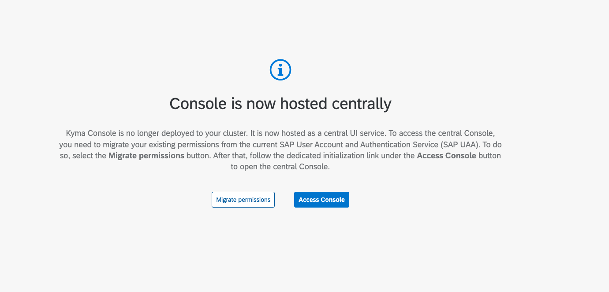

<!-- loioa779e5107dbb49a78b77c11f0f39e4ac -->

# Troubleshooting Guide for the Lost Access to the Kyma Runtime

Learn how to get rid of the `forbidden` error messages while using Kyma Dashboard or kubectl CLI tool.

<a name="loioa779e5107dbb49a78b77c11f0f39e4ac__section_bp1_ysh_wtb"/>

## Symptom

You see the `forbidden` error messages while using Kyma Dashboard or kubectl CLI tool, even though they worked fine before.

<a name="loioa779e5107dbb49a78b77c11f0f39e4ac__section_mm2_gth_wtb"/>

## Cause

Before 2.0 Kyma used XSUAA instance for user authenticaion and authorization. Prior to 2.0 your roles were assigned through role collections in SAP BTP cockpit With [Kyma 2.0](https://help.sap.com/docs/BTP/922bf2dbe0b646aaaa8cb5e077cfd799/70470339bd09423782c18f2c3a5d7f28.html), we changed the authentication and authorization model. XSUAA is no longer valid. Instead, now Kyma uses the [OIDC Identity Provider](https://help.sap.com/docs/BTP/65de2977205c403bbc107264b8eccf4b/85200d8509004236b2a3a637bf1471a8.html) \(default or custom one\) to issue access tokens. Because of that Kyma roles and Role Bindings must be redefined taking into account new identity subjects, as provided by the new Identity Provider.

After the 2.0 release, Kyma hosted a migrator tool, which helped with the migration of user permissions.

  

However, the unused XSUAA instances must be now cleaned up, together with the migrator tool.

<a name="loioa779e5107dbb49a78b77c11f0f39e4ac__section_ons_fvh_wtb"/>

## Remedy

You need to bound with a Role or Cluster Role that matches your role in your team or organization. Kyma administrator must define a \(Cluster\) Role Binding for you, matching your identity subject \(your email or group\).

Please follow the [Assign Roles in the Kyma Environment](https://help.sap.com/docs/BTP/65de2977205c403bbc107264b8eccf4b/148ae38b7d6f4e61bbb696bbfb3996b2.html) guide.

If there is no one with the administrative access, follow [Overwrite Kyma Administrators](https://help.sap.com/docs/BTP/65de2977205c403bbc107264b8eccf4b/df7f9d7dedf84f1a8f2fda4e86ad4950.html) to learn how to overwrite administrators in your Kyma runtime

.

