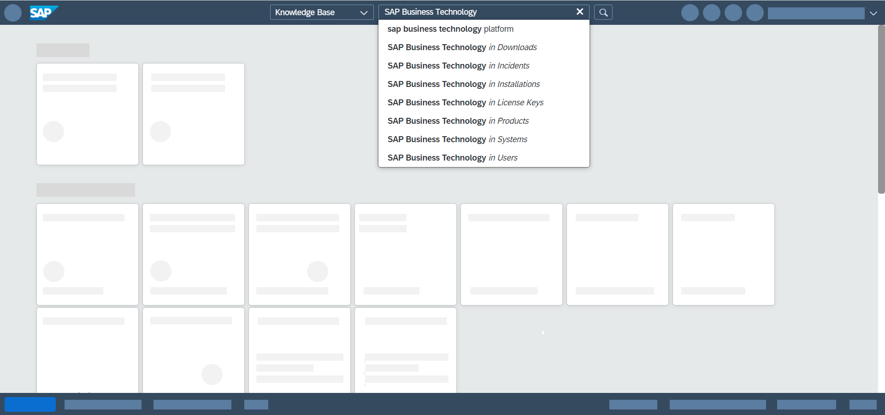
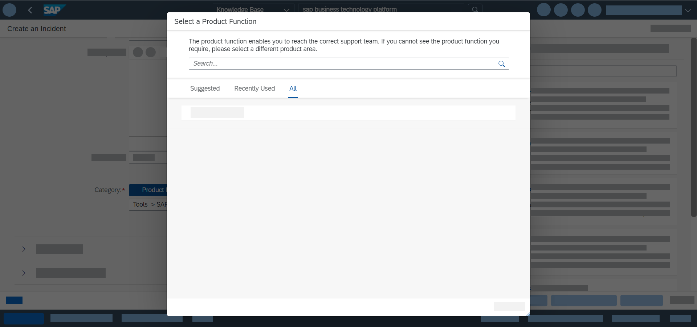
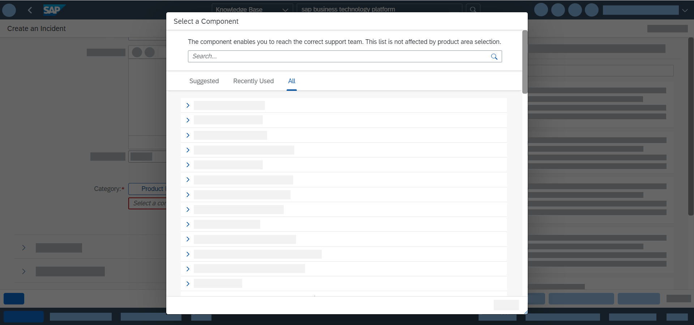

<!-- loio5dd739823b824b539eee47b7860a00be -->

# Getting Support

Use SAP Community, get guided answers, or explore SAP Support Portal.

> ### Note:  
> This section is applicable for all multicloud environments. To find which environments are available in your region, see [Regions](../10-concepts/regions-350356d.md).

<a name="loio5dd739823b824b539eee47b7860a00be__section_bmj_j4x_2nb"/>

## Prerequisites

Before you report an incident, ensure the following:

### Check Platform Status

-   **Running on the AWS, Azure, or GCP regions:** visit [SAP Trust Center](https://www.sap.com/about/trust-center/cloud-service-status.html). You can check:

    -   availability by service on *Cloud Status* tab page;

    -   availability by region on the *Data Center* tab page.

    For more information about selected platform incidents, see [Root Cause Analyses](https://help.sap.com/viewer/product/SCP_RCA/Latest/en-US).

-   **Running on the China \(Shanghai\) region:** check [https://status.cn40.platform.sapcloud.cn/](https://status.cn40.platform.sapcloud.cn/).

-   **Running on the Government Cloud \(US\) region:** planned downtimes and outage communication are sent through e-mail to the initial administrator of your global account.

### Check Tools Versions

Make sure that you've the latest versions of the tools you're using \(recommended\), or at least the versions you're using are still supported. For more information, see [SAP Development Tools](https://tools.hana.ondemand.com/).

> ### Note:  
> Trial users \(without an S-user\) can ask for support by posting a question in [SAP Community](https://www.sap.com/community/topic/cloud-platform.html). However, they should first check for answers in [SAP Community](https://www.sap.com/community/topic/cloud-platform.html) and [Guided Answers](https://ga.support.sap.com/dtp/viewer/#/tree/2065/actions/26547).

 <a name="concept_tbg_yzt_mqb"/>

<!-- concept\_tbg\_yzt\_mqb -->

## Procedure

To report an incident \(issue\) in SAP Support Portal, proceed as follows:

 <a name="task_hpg_4tm_s2b"/>

<!-- task\_hpg\_4tm\_s2b -->

## 1. Log On to SAP ONE Support Launchpad

<a name="task_hpg_4tm_s2b__context_vmv_rvc_t4b"/>

## Context

Open [SAP ONE Support Launchpad](https://launchpad.support.sap.com/).

 <a name="task_d4t_cvc_t4b"/>

<!-- task\_d4t\_cvc\_t4b -->

## 2. \(Optional\) Search in the Knowledge Base for Existing Solutions

<a name="task_d4t_cvc_t4b__context_l4t_gvc_t4b"/>

## Context

You can search in Knowledge Base for existing solutions in:

-   SAP Notes & KBAs

-   SAP Community

-   SAP Community Wiki

-   SAP Support Portal

-   Product Documentation

-   Guided Answers

 <a name="task_jf1_4vc_t4b"/>

<!-- task\_jf1\_4vc\_t4b -->

## 3. Choose Report an Incident

<a name="task_jf1_4vc_t4b__context_cpd_qvc_t4b"/>

## Context

> ### Caution:  
> If your S-user is assigned to several customer numbers, select a customer number from the drop-down list.

 <a name="task_z4m_25m_s2b"/>

<!-- task\_z4m\_25m\_s2b -->

## 4. Provide System Information

<a name="task_z4m_25m_s2b__steps_tpw_jxs_r4b"/>

## Procedure

1.  Select system.

    Specify the affected system. To report an issue for a service, filter your systems by the leading product: SAP Business Technology Platform or a service name.

    

2.  Select product area.

    You can select the area for your service or for a related product.

    

    For more information, see KBA [3023272](https://launchpad.support.sap.com/#/notes/3023272).

<a name="task_z4m_25m_s2b__result_vh1_sxs_r4b"/>

## Results

You can see recommended knowledge resources for the selected product area on the right-side panel.

> ### Note:  
> When you specify the correct system, the correct support SLA is applied to your case.
> 
> Not choosing the appropriate system and product area may negatively affect the processing of the incident.

 <a name="task_smh_4vm_s2b"/>

<!-- task\_smh\_4vm\_s2b -->

## 5. Provide Description

<a name="task_smh_4vm_s2b__steps_hxz_nzm_s2b"/>

## Procedure

1.  Enter a subject.

2.  To help support staff process your issue as fast as possible, fill in the *Description* field:

    Enter the steps to reproduce the issue.

    -   For the Cloud Foundry environment, provide:
        -   Region and global account name. In the cockpit, open the affected subaccount, and copy the URL.
        -   Java application name and URL \(if the problem is related to Java applications\). In the cockpit, open the respective Java application’s Overview page.
        -   Database-related details based on your environment and infrastructure provider \(if the problem is related to SAP HANA\). See [Providing Details for SAP HANA Service Database Problems](providing-details-for-sap-hana-service-database-problems-75cde53.md).

    -   For the Kyma environment, provide:
        -   the subaccount name, or
        -   the URL to the Kyma Console

    You can see SAP Knowledge Base Articles and SAP Notes recommended by Incident solution matching service as potential solutions. See [Incident Solution Matching](https://support.sap.com/en/my-support/product-support.html/section_903672625.html#section_1903672625)

3.  Select a category. You can either select:

    -   *Product Function*

        Product functions are prefiltered by the selected system and product area. When you select the right product function, the component is automatically assigned to the incident.

        

        For more information, see KBA [3023272](https://launchpad.support.sap.com/#/notes/3023272).

    -   *Component*

        Select the component name of the area that best fits your issue. Selecting the right component directs the issue to the corresponding support team. To check the complete list of components, see [Support Components \(prefiltered for the Cloud Foundry environment\)](https://help.sap.com/viewer/65de2977205c403bbc107264b8eccf4b/Cloud/en-US/08d1103928fb42f3a73b3f425e00e13c.html?scp-env=Cloud%20Foundry).

        > ### Note:  
        > For the Kyma environment issues, select **BC-CP-XF-KYMA**.

        

 <a name="task_gg4_qrb_q4b"/>

<!-- task\_gg4\_qrb\_q4b -->

## 6. Provide Attachments

<a name="task_gg4_qrb_q4b__context_hg4_qrb_q4b"/>

## Context

Upload attachments complying with the required size and file types.

 <a name="task_g4p_p4b_q4b"/>

<!-- task\_g4p\_p4b\_q4b -->

## 7. Set Priority

<a name="task_g4p_p4b_q4b__steps_hxd_lsb_q4b"/>

## Procedure

-   If you set a high or very high priority, you must also describe the business impact of the incident.

-   \(Optional\) Define any additional contacts, apart from the reporter \(who is filled in automatically\).

 <a name="id_ofw_ssb_q4b"/>

<!-- id\_ofw\_ssb\_q4b -->

## 8. Choose Support Channel

<a name="id_ofw_ssb_q4b__context_y5j_vsb_q4b"/>

## Context

To submit an incident, you can use one of the following support channels:

<a name="id_ofw_ssb_q4b__steps-unordered_mzt_21t_r4b"/>

## Procedure

-   Review & Submit Incident

    The incident is submitted and the communication is carried out through the incident.

-   Schedule an Expert

    You can book a 30-minute meeting slot with a support expert. An incident is automatically created and used to document the session. For more information, see KBA [2651981](https://launchpad.support.sap.com/#/notes/2651981).

-   Expert Chat

    You can start a chat with an expert. An incident is created to document your communication with the expert. For more information, see KBA [2570790](https://launchpad.support.sap.com/#/notes/2570790).

<a name="id_ofw_ssb_q4b__result_ywk_g1t_r4b"/>

## Results

> ### Note:  
> If you have problems creating and sending an incident, or your incident isn’t processed as fast as you need, contact the 24/7 phone hotlines. See SAP Note [560499](https://launchpad.support.sap.com/#/notes/560499).

**Related Information**  

[Users and Authorizations for SAP One Support Launchpad](https://support.sap.com/en/my-support/users.html)

[Cloud Management Tools — Feature Set Overview](../10-concepts/cloud-management-tools-feature-set-overview-caf4e4e.md "Cloud management tools represent the group of technologies designed for managing SAP BTP.")

[Gather Support Information](gather-support-information-6daa475.md "The Eclipse tools come with a wizard for gathering support information in case you need help with a feature or operation (during deploying/debugging applications, logging, configurations, and so on).")

[Platform Updates and Notifications](platform-updates-and-notifications-99070c7.md "")

[Root Cause Analyses](https://help.sap.com/viewer/product/SCP_RCA/Latest/en-US)

