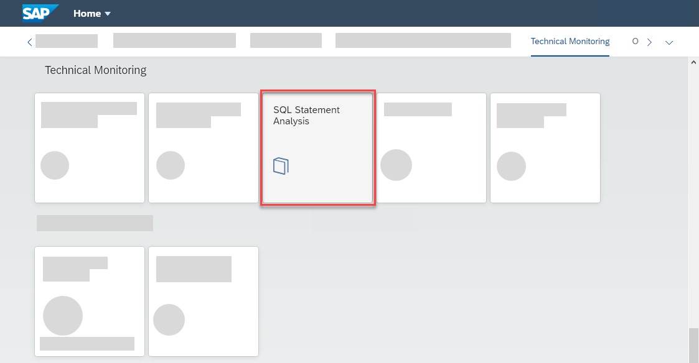

<!-- loiobae88ec6a1714e0783aaa56504583b29 -->

# Analyzing SQL Statements in the Context of What Else Is Going On on the Database

<a name="loiobae88ec6a1714e0783aaa56504583b29__context_ynt_y33_jpb"/>

## Context

When developing and operating applications on your ABAP environment, you turn to the SQL statement analysis typically in the following situations:

-   You want to see the performance of one SQL statement of your application alongside the rest of the SQL activity on your database for a given time period.
-   You're planning to identify the expensive SQL statements in your system to find candidates that merit the effort of performance tuning.

In the second situation, your starting point isn't a particular SQL statement but you have a look at the whole set of statements running on the database. The most important metric to look at is the share of total execution time. However, you might also like to look for a large lock-wait time, if locking is an issue \(for example, for data changing statements\). Choosing specific time ranges can help to highlight SQL statements that are expensive when they run but don't run often. They can also show a large average execution time while the total execution time on a larger time scale isn't that prominent in the top 25.

Once you've identified expensive SQL statements, which you would like to analyze in more detail to find potential for performance improvement. In any case, you also end up with analyzing single statements in the end.

<a name="loiobae88ec6a1714e0783aaa56504583b29__steps_e2d_1j3_jpb"/>

## Procedure

1.  Log on to the SAP Fiori launchpad of your ABAP environment.

2.  In the group *Technical Monitoring*, choose the tile *SQL Statement Analysis*.

    

    The screen *SQL Statement Analysis* opens on the leftmost tab page *Plan Cache*. There, you get performance information on the top 25 SQL statements by total execution time in the last 24 hours.

    

    Note that the percentage *Share of Total Execution Time* is always based on the overall sum of total execution time of SQL statements on the SAP HANA database for the selected time range, regardless of how you apply further filters. Hence, it allows you to judge the absolute relevance of the execution-time footprint of your statement.

    The UI philosophy of the *SQL Statement Analysis* screen is: With each move to a tab page to the right, you get more information about what you've selected on the previous tabs to the left.

3.  Use the sorting and filtering functions of the technical monitoring cockpit to get what you want:

    If the statement you want to analyze isn't among the 25 most expensive statements in the last 24 hours, use sorting, filtering, or the time slider to find it. For example, you can change the time period, set filters on the statement string, or sort by another metric to highlight other aspects of SQL statement execution. On the *Plan Cache* tab page, you can also display more SAP HANA plan cache characteristics and metrics than shown by default by choosing *Characteristics* or *Metrics* and following the selection dialog.

    Once you've found your statement in the list, you can put the performance of your statement into perspective. Compare it to other statements appearing in the list, but also against the accumulated performance of all the rest of the statements matching your filter criteria. The accumulated performance of all statements not matching your filter criteria is subsumed in the bottom row, labeled with the statement string *R*.

4.  Choose the statement that you are interested in.

    As a result, all subsequent tabs to the right of *Plan Cache* now contain detailed information on the statement that you have selected.

5.  Choose the *Analysis* tab page to see how your statement’s execution performance has developed over time.

    On the screen area *Access Plans for Selected Statement*, you can see whether your statement has entered the HANA plan cache with different plan IDs in the selected time range. The bottom row, labeled with plan ID *T*, shows you the metrics totals, that is, the aggregated values.

    

    Seeing more than one plan ID often only means that the access plan of a statement was evicted from the plan cache at some point and reentered it later. However, it can sometimes also indicate a change of the access plan of your statement with implications for its performance. As you get the same performance metrics as on the *Plan Cache* tab page separately for each plan ID, you can check whether the average execution time has significantly changed with plan ID. If this is the case, you may be on to something.

    On the *Metrics History* screen area, you can see the time dependence of the major performance metrics in relative units. You get the absolute value of a metric by hovering over a datapoint.

    When you choose a particular plan ID in the upper screen area, you'll see the performance metrics of the execution of your chosen SQL statement with this plan ID only. When you choose the totals row \(plan ID *T*\), the overall performance metrics of the statement are shown, regardless of the plan ID.

    If you want to go further into detail from here, you can use the tabs *SQL Statement*, *Cached Plan*, *Prepared Plan*, and *Executed Plan*, which are mostly independent of each other. You can, for example, jump from here directly to the calculation of an executed access plan for your statement. However, we follow here the order of the tabs in the program.

6.  Choose the *SQL Statement* tab page to get a decent view of your selected SQL statement, pretty-printed and with syntax highlighting.

    The *Application Sources* dropdown list shows you the list of ABAP code locations \(if available\) where the SQL statement originated from in the selected time range. Choose an ABAP location from the list and choose one of the *Show ABAP Source in …* buttons to display the ABAP source in the web browser or ABAP Development Tools.

    You can also edit the SQL statement and recalculate the prepared or executed access plan. In this way, you can try out if changes to the statement or adding optimizer hints have a positive or negative impact on the access plan. You can iterate this procedure. Note though that the information on the tab page *Analysis* corresponds to the SQL statement that you selected originally on the *Plan Cache* tab page. There is no cached access plan for your edited statement on the *Cached Plan* tab page, obviously. Once you've edited the SQL statement, you can get back to the original statement by using the undo function \(CTRL+Z\) of your browser while having focused on the statement display area. Alternatively, you can go back to the*Plan Cache* tab page and choose the relevant SQL statement there.

    Note that the SQL statement analysis doesn't support SQL query parameters.

7.  Choose the *Cached Plan* tab page to display and analyze the prepared plan that has been calculated when your SQL statement entered the HANA plan cache with the selected Plan ID from tab page *Analysis*.

8.  Choose the *Prepared Plan* tab page to display and analyze a newly calculated prepared access plan for your SQL statement.

9.  Choose the *Executed Plan* tab page to display and analyze a newly calculated executed access plan for your SQL statement.

    You can also download the PlanViz \(PLV\) file of the executed access plan containing the comprehensive plan information to display it with other SAP HANA plan visualizing tools like HANA SQL Analyzer.

