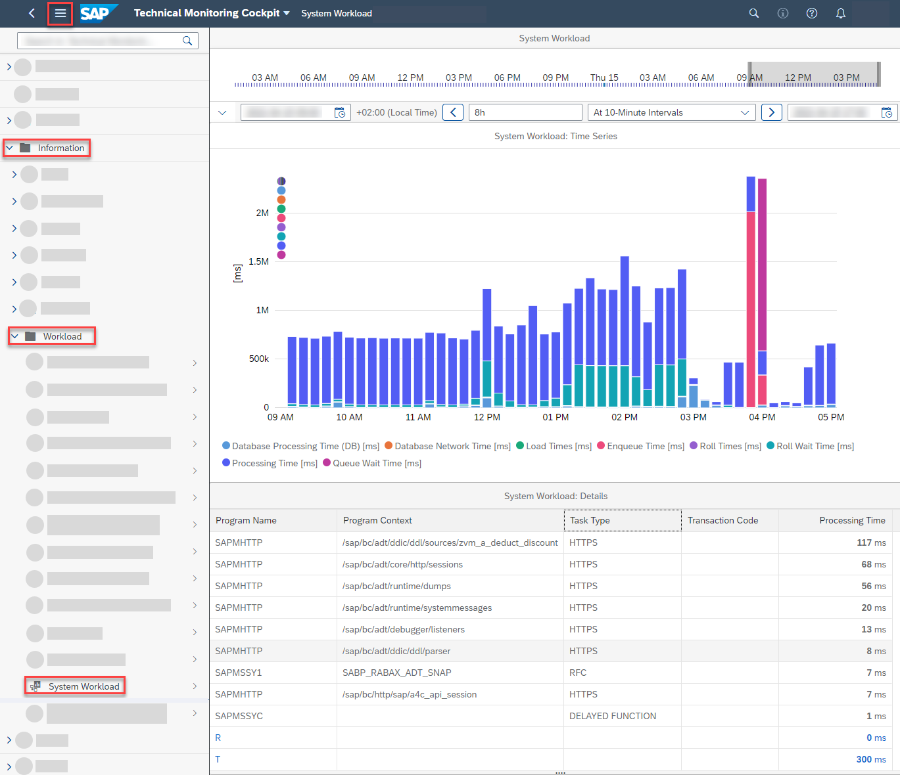

<!-- loioc54ec5e640b44651828300e44b110b1c -->

# Analyzing the ABAP Resource Utilization of the ABAP Environment

<a name="loioc54ec5e640b44651828300e44b110b1c__context_e3p_pg5_3pb"/>

## Context

When you're planning, for example, system capacities or facing performance issues with hosted applications, you want to understand the resource utilization of your ABAP environment.

<a name="loioc54ec5e640b44651828300e44b110b1c__steps_f3p_pg5_3pb"/>

## Procedure

1.  Log on to the SAP Fiori launchpad of your ABAP environment.

2.  In the group *Technical Monitoring*, choose the *Application System Dashboard* tile.

      

3.  To gain insights into the memory utilization of the ABAP application server, choose the *Memory Utilization* tile.

      

    For more information about the *Memory Utilization* screen, see [Memory Utilization \(Application Server ABAP\)](https://help.sap.com/viewer/tmc_cloud/d4d31df7fa044d6ebe0a47ee449cbacb.html).

4.  To gain further insights into the work process utilization of the ABAP application server, choose the *Batch Work Process Utilization* and the *Dialog Work Process Utilization* tiles.

    A high load on the batch work processes isn’t critical if it’s only for a short duration. If the batch work process utilization is at 100%, jobs are started delayed.

    For more information about the *Work Process Utilization* screen, see [Work Process Utilization](https://help.sap.com/viewer/tmc_cloud/14104d33a68d44e3848780368b76db8a.html).

5.  To gain more insights into the application workload of the system, choose the *System Workload* tile from the application system dashboard.

    Click on any peak in the chart to get the top 10 most contributing ABAP requests in the *System Workload: Details* section.

      

    For more information about the *System Workload* screen, see [System Workload](https://help.sap.com/viewer/tmc_cloud/178c9777ad174bf5a2710312f009745a.html).

