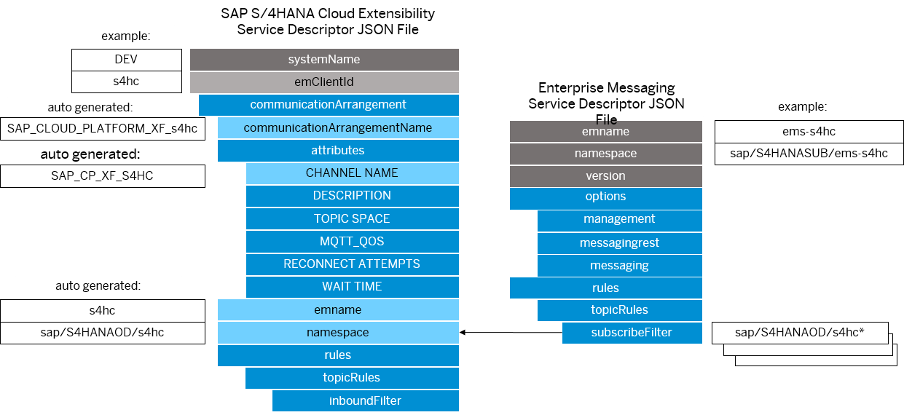

<!-- loio5722fc4466cb43c1aae9625742185b64 -->

# Define SAP Event Mesh Service Descriptor JSON File

The SAP Event Mesh service descriptor defines details of a message client and needs to be provided when provisioning new SAP Event Mesh service instances with service plan `default`.


<a name="loio5722fc4466cb43c1aae9625742185b64__section_nhk_wtq_xnb"/>

## Prerequisites

You have created an SAP S/4HANA Cloud Extensibility service instance with defined SAP S/4HANA Cloud Extensibility descriptor. See [Define SAP S/4HANA Cloud Extensibility Service Descriptor JSON File](Define_SAP_S4HANA_Cloud_Extensibility_Service_Descriptor_JSON_File_2d50d91.md).


<a name="loio5722fc4466cb43c1aae9625742185b64__section_pm3_sbl_d4b"/>

## Context

You set up service instance of the SAP Event Mesh service to receive the events which are sent by the SAP S/4HANA Cloud Extensibility service. In the JSON file for this service instance needs to be created with a different `emname` as well as a different `namespace`. The rule set here is important as each client should only publish in its own namespace. Since this message client's purpose is to receive messages from a different client, the rules of the `subscribeFilter` for topics need to take care of that. So the value of the message client defined in the SAP Event Mesh JSON file has to be configured to have the value of the `subscribeFilter` to be the same as the value of the `namespace` of the other client defined in the SAP S/4HANA Cloud Extensibility JSON file.

After both message clients are set up, you have to create a queue in the message client which refers to the SAP Event Mesh service instance. You can name the queue as you like and it will be created in the namespace of the client. This queue can now be subscribed to the topic configured **step 7** in the [Create an SAP S/4HANA Extensibility Service Instance in the Cloud Foundry Environment](Create_an_SAP_S4HANA_Extensibility_Service_Instance_in_the_Cloud_Foundry_Environment_531a909.md) page. This topic in defined in the namespace of the S/4HANA Cloud Extensibility service descriptor, for example ***sap/S4HANAOD/s4hc/myTopic***.

The service instance of SAP Event Mesh is the message client which consumes the messages and should be bound to the actual application. These are the important aspects of the whole configuration:

-   When creating a service instance of the SAP S/4HANA Cloud Extensibility service:

    -   Use unique emname per subaccount

    -   Use unique namespace per subaccount, for example ***a/b/c***

-   When creating a service instance of the SAP Event Mesh service:

    -   Use unique emname per subaccount

    -   Use unique namespace per subaccount, for example ***d/e/f***

    -   Use the namespace defined in the SAP S/4HANA Cloud Extensibility JSON file and put it in the `subscribeFilter` parameter

        > ### Sample Code:  
        > ```
        >  "subscribeFilter": [
        >  "a/b/c/*",
        > "${namespace}/*"
        >  ]
        > ```

    -   Create queue for this client

    -   Subscribe this queue to the topic defined in the namespace of the SAP S/4HANA Cloud Extensibility JSON file





<a name="loio5722fc4466cb43c1aae9625742185b64__section_qhv_g5s_shb"/>

## Procedure

Define the JSON file for the SAP Event Mesh service instance following the requirements for the properties and their values listes below:


<table>
<tr>
<th>

Parameter


</th>
<th>

Description


</th>
</tr>
<tr>
<td>

`emname`


</td>
<td>

Specifies the name of the SAP Event Mesh client. It is used by SAP Event Mesh to identify clients.

> ### Note:  
> The `emname` parameter in this descriptor must be unique per subaccount, so it must have the different value than the `emname` parameter in the SAP S/4HANA Cloud service descriptor. See [Define SAP S/4HANA Cloud Extensibility Service Descriptor JSON File](Define_SAP_S4HANA_Cloud_Extensibility_Service_Descriptor_JSON_File_2d50d91.md).

**Rules/Guidelines**

-   Required: Yes

-   Allowed characters: \[a-zA-Z0-9\_-\]

-   Max length: 100


**Rules/Guidelines:** It is unique within a subaccount.


</td>
</tr>
<tr>
<td>

`version`


</td>
<td>

It specifies the version of the service descriptor.

> ### Note:  
> The version parameter is optional when you use the deprecated syntax. See [Syntax for Service Descriptor](https://help.sap.com/viewer/bf82e6b26456494cbdd197057c09979f/Cloud/en-US/5696828fd5724aa5b26412db09163530.html).

**Rules/Guidelines**

-   Required: Yes

-   Allowed value: 1.1.0


</td>
</tr>
<tr>
<td>

`namespace`


</td>
<td>

Namespace for the messaging client.

> ### Note:  
> The `namespace` parameter in this descriptor must be unique per subaccount, so it must have the different value than the `namespace` parameter in the SAP S/4HANA Cloud service descriptor. See [Define SAP S/4HANA Cloud Extensibility Service Descriptor JSON File](Define_SAP_S4HANA_Cloud_Extensibility_Service_Descriptor_JSON_File_2d50d91.md).

**Rules/Guidelines**

-   Required: Yes

-   Allowed characters: \[a-zA-Z0-9//\]

-   Max length: 24

-   It is unique within a subaccount

-   Contains exactly three segments, for example ***d/e/f***.


</td>
</tr>
<tr>
<td>

`options`


</td>
<td>

Defines the access channels for the message client.


</td>
</tr>
<tr>
<td>

`management`


</td>
<td>

An `options` attribute.

Enables/disables the usage of the management REST APIs.

**Rules/Guidelines**

-   Default: false

-   Allowed values: true | false


</td>
</tr>
<tr>
<td>

-   `messagingrest`


</td>
<td>

An `options` attribute.

Enables/Disables the usage of the messaging REST APIs.

**Rules/Guidelines**

-   Default: false

-   Allowed values: true | false


</td>
</tr>
<tr>
<td>

`messaging`


</td>
<td>

An `options` attribute.

Enables/disables the usage of the messaging gateway.

**Rules/Guidelines**

-   Default: true

-   Allowed values: true | false


</td>
</tr>
<tr>
<td>

`rules`


</td>
<td>

Defines the access privileges of the messaging client.

**Rules/Guidelines**

-   Required: true

-   **Guidelines/Rules:** In order to allow access to a queue or a topic, the namespace of the corresponding owner client has to be added. The placeholder `${namespace}` can be used instead of the defined namespace.


</td>
</tr>
<tr>
<td>

`topicRules`


</td>
<td>

A `rules` attribute.

**Rules/Guidelines**

-   Type: Object


</td>
</tr>
<tr>
<td>

`subscribeFilter`


</td>
<td>

A `topicRules` attribute.

Filters from which topics a client \(receiver\) is allowed to receive messages.

**Rules/Guidelines**

-   Type: Array

-   Allowed characters: \[a-zA-Z\*?/\]

-   Default: no default

-   Example values: ***$\{namespace\}/foo/bar/\****, ***$\{namespace\}/\****.


> ### Note:  
> The `namespace` part of the value must be specified exactly as the `namespace` value of the SAP S/4HANA Cloud Extensibility service descriptor JSON File described in [Define SAP S/4HANA Cloud Extensibility Service Descriptor JSON File](Define_SAP_S4HANA_Cloud_Extensibility_Service_Descriptor_JSON_File_2d50d91.md).


</td>
</tr>
</table>


<a name="loio5722fc4466cb43c1aae9625742185b64__section_ijt_pj2_phb"/>

## Example

```lang-json
{
	"emname": "ems-s4hc",
	"namespace": "sap/S4HANAOD/ems-s4hc",
   "version": "1.1.0", 
	"options": {
		"management": true,
		"messagingrest": true,
		"messaging": true
	},
	"rules": {
		"queueRules": {
			"subscribeFilter": [
				"${namespace}/*"
			]
		},
		"topicRules": {
			"subscribeFilter": [
				"${namespace}/*",
				"sap/S4HANAOD/s4hc/*"
			]
		}
	}
}
		
```


<a name="loio5722fc4466cb43c1aae9625742185b64__section_wmm_mdh_vhb"/>

## Related Information

[Syntax for Service Descriptor in SAP Event Mesh documentation](https://help.sap.com/viewer/bf82e6b26456494cbdd197057c09979f/Cloud/en-US/5696828fd5724aa5b26412db09163530.html)

