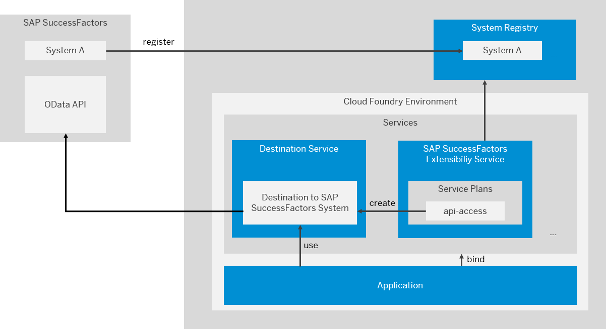

<!-- loio9e33934540c44681817567d6072effb2 -->

# Extending SAP SuccessFactors in the Cloud Foundry and Kyma Environment

Use SAP BTP to extend SAP SuccessFactors with extension applications running on the cloud platform.

<a name="loio9e33934540c44681817567d6072effb2__section_ydf_wtk_y3b"/>

## Overview

> ### Note:  
> EU Access is not available for the SAP SuccessFactors Extensibility service, and the integration is not supported for SAP SuccessFactors systems that require EU Access.

SAP BTP offers a standard way for extending SAP solutions.

You can extend SAP SuccessFactors systems without disrupting the performance and the core processes. When building extension applications, you can also benefit from the automation of the integration between the cloud platform and SAP SuccessFactors.

The following graphic provides a high-level overview of the integration between SAP BTP, Cloud Foundry environment and SAP SuccessFactors:

## Process Flow

To integrate SAP BTP and SAP SuccessFactors so that you can build extension applications, you need to perform the following tasks:

<a name="loio9e33934540c44681817567d6072effb2__table_cyp_dpr_y3b"/>Integrating SAP BTP and SAP SuccessFactors

<table>
<tr>
<th>

Process Step

</th>
<th>

Related Documentation

</th>
</tr>
<tr>
<td>

1. Connect the SAP SuccessFactors system that you want to extend with the corresponding global account in SAP BTP.

During the pairing process you create an integration token which is then used by the SAP SuccessFactors system tenant administrator to configure the integration on the SAP SuccessFactors system side.

</td>
<td>

 [Register an SAP SuccessFactors System in a Global Account in SAP BTP](Register_an_SAP_SuccessFactors_System_in_a_Global_Account_in_SAP_BTP_e956ba2.md).

</td>
</tr>
<tr>
<td>

2. Make the SAP SuccessFactors system accessible in the subaccounts in which you want to build your extension applications.

To do so, you configure the entitlements and assign the corresponding quota where the extension applications will reside.

</td>
<td>

 [Configure the Entitlements for the SAP SuccessFactors Extensibility Service](Configure_the_Entitlements_for_the_SAP_SuccessFactors_Extensibility_Service_b01e625.md) 

</td>
</tr>
<tr>
<td>

3. Configure the communication flow.

To do so, create a service instance of the SAP SuccessFactors Extensibility service using the *api-access* service plan.

During the service instance creation an HTTP destination on a subaccount level is automatically generated in this subaccount. It contains all instance binding properties which are sufficient to establish connection to the SAP SuccessFactors system.

SAP BTP supports the following authentication scenarios for SAP SuccessFactors:

-   OData access with OAuth 2.0 SAML bearer assertion

-   OData access with OAuth 2.0 SAML bearer assertion with technical user

</td>
<td>

 [Create a Service Instance to Consume the SAP SuccessFactors HXM Suite OData API](Create_a_Service_Instance_to_Consume_the_SAP_SuccessFactors_HXM_Suite_OData_API_46c5ea1.md) 

</td>
</tr>
<tr>
<td>

4. Configure the Single-Sign On \(SSO\) between the subaccount in SAP BTP and the SAP SuccessFactors system.

To ensure the required security for accessing the applications, you need to configure the single sign-on between the subaccount in SAP BTP and the SAP SuccessFactors system using a SAML identity provider.

</td>
<td>

 [Configure Single-Sign On Between a Subaccount in SAP BTP and SAP SuccessFactors](Configure_Single-Sign_On_Between_a_Subaccount_in_SAP_BTP_and_SAP_SuccessFactors_64da613.md) 

</td>
</tr>
<tr>
<td>

5. If you have performed an automated instance refresh or your cloud operators have performed a manual instance refresh, you need to restore some of the extension configuration settings.

</td>
<td>

[Restore Configuration Settings After an Instance Refresh](Restore_Configuration_Settings_After_an_Instance_Refresh_4c1bf98.md)

</td>
</tr>
</table>

-   **[Register an SAP SuccessFactors System in a Global Account in SAP BTP](Register_an_SAP_SuccessFactors_System_in_a_Global_Account_in_SAP_BTP_e956ba2.md "To connect an SAP SuccessFactors system with a global account in SAP BTP, you need to register
		the system in the corresponding global account.")**  
To connect an SAP SuccessFactors system with a global account in SAP BTP, you need to register the system in the corresponding global account.
-   **[Configure the Entitlements for the SAP SuccessFactors Extensibility Service](Configure_the_Entitlements_for_the_SAP_SuccessFactors_Extensibility_Service_b01e625.md "Configure the required entitlements to make the SAP SuccessFactors HXM Suite OData APIs
		of the registered SAP SuccessFactors system accessible in your subaccount in which your
		extension applications will reside.")**  
Configure the required entitlements to make the SAP SuccessFactors HXM Suite OData APIs of the registered SAP SuccessFactors system accessible in your subaccount in which your extension applications will reside.
-   **[Create a Service Instance to Consume the SAP SuccessFactors HXM Suite OData API](Create_a_Service_Instance_to_Consume_the_SAP_SuccessFactors_HXM_Suite_OData_API_46c5ea1.md "To enable the integration of your extension applications with the SAP SuccessFactors
		system you have registered in the global account in SAP BTP, you first need to
		create a service instance of the corresponding service. ")**  
To enable the integration of your extension applications with the SAP SuccessFactors system you have registered in the global account in SAP BTP, you first need to create a service instance of the corresponding service.
-   **[Configure Single-Sign On Between a Subaccount in SAP BTP and SAP SuccessFactors](Configure_Single-Sign_On_Between_a_Subaccount_in_SAP_BTP_and_SAP_SuccessFactors_64da613.md "Use this procedure to configure the Single-Sign On (SSO) between the subaccount in
			SAP BTP and the SAP
		SuccessFactors system.")**  
Use this procedure to configure the Single-Sign On \(SSO\) between the subaccount in SAP BTP and the SAP SuccessFactors system.
-   **[Restore Configuration Settings After an Instance Refresh](Restore_Configuration_Settings_After_an_Instance_Refresh_4c1bf98.md "After an instance refresh, you must restore some of your extension integration artifacts
		and configuration settings for the SAP SuccessFactors target company.")**  
After an instance refresh, you must restore some of your extension integration artifacts and configuration settings for the SAP SuccessFactors target company.
-   **[Auditing and Logging Information](Auditing_and_Logging_Information_d73ae90.md "Here you can find a list of the events that are logged by SAP SuccessFactors
            Extensibility service. To retrieve the audit logs stored for SAP
            SuccessFactors Extensibility create a support ticket in component BC-NEO-EXT-SF. ")**  
Here you can find a list of the events that are logged by SAP SuccessFactors Extensibility service. To retrieve the audit logs stored for SAP SuccessFactors Extensibility create a support ticket in component BC-NEO-EXT-SF.

