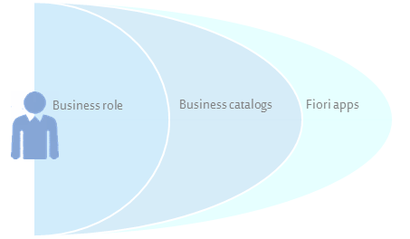

<!-- loiodb1d0b4119d74dc6970adde9c85069b4 -->

# How to Maintain Business Users

<a name="loiodb1d0b4119d74dc6970adde9c85069b4__HowToMaintainBusinessUsers_context"/>

## Context

You can change user data \(for example, the user name\) and regional settings \(for example, the date and time format\).

   
  
<a name="loiodb1d0b4119d74dc6970adde9c85069b4__fig_m52_bml_45"/>How users get access to SAP Fiori apps

  

<a name="loiodb1d0b4119d74dc6970adde9c85069b4__HowToMaintainBusinessUsers_steps"/>

## Procedure

-   **Creating New Business Users**
-   To create a new business user, proceed as follows:

    1.  Choose *Create* on the main screen of the app.

    2.  Select the employee you want to create the user for, and fill in the required fields.

        For *User Name*, enter a name or ID that is identical with the login name of the same user in the on-premise identity provider.

        The name the user enters to log on to the SAP Fiori launchpad. The user name can only contain uppercase letters, numbers, and underscores. It must have a maximum length of 40 characters and must not start with an underscore, or with SAP.

-   **Assigning Roles to Business Users**
-   To grant users access to applications, you assign the respective business roles to them.

    1.  Select the required user.

    2.  Click *Add Business Roles*.

    3.  Search for the required roles and select them.

    4.  Click *Apply* and *Save*.

        You can navigate from the Maintain Business Users app to the Maintain Business Roles app by choosing a business role ID in the list of assigned business roles.

        The user then sees the respective app tiles in the tile catalogs.

-   **Removing Role Assignments from Business Users**
-   To remove a role assignment from a user, proceed as follows:

    1.  Select the business user and then the assigned business role.

    2.  Choose *Remove* above the list or *Remove Business Roles* at the bottom of the screen.

-   **Updating User Role Assignments**
-   To update the assignments of roles to a user individually, edit the affected business user.

-   To mass update user role assignments, upload a `CSV` file.

    > ### Note:  
    > The CSV file needs to be UTF-8-encoded and must comply with the following pattern:
    > 
    > 
    > <table>
    > <tr>
    > <td>
    > 
    >  `User Name` 
    > 
    > 
    > 
    > </td>
    > <td>
    > 
    >  `Role ID` 
    > 
    > 
    > 
    > </td>
    > </tr>
    > <tr>
    > <td>
    > 
    >  *<User name 1\>* 
    > 
    > 
    > 
    > </td>
    > <td>
    > 
    >  *<Business role ID 2\>* 
    > 
    > 
    > 
    > </td>
    > </tr>
    > <tr>
    > <td>
    > 
    >  *<User name 1\>* 
    > 
    > 
    > 
    > </td>
    > <td>
    > 
    >  *<Business role ID 6\>* 
    > 
    > 
    > 
    > </td>
    > </tr>
    > <tr>
    > <td>
    > 
    >  *<User name 2\>* 
    > 
    > 
    > 
    > </td>
    > <td>
    > 
    >  *<Business role ID 2\>* 
    > 
    > 
    > 
    > </td>
    > </tr>
    > <tr>
    > <td>
    > 
    >  *<User name n\>* 
    > 
    > 
    > 
    > </td>
    > <td>
    > 
    >  *<Business role ID n\>* 
    > 
    > 
    > 
    > </td>
    > </tr>
    > </table>
    > 
    > In the app, you are provided with a `CSV` template that you can download and use for filling in the user role assignments. When uploading the `CSV` file, you can decide if you want to add the role assignments to a user, or if you want to overwrite them completely.

-   **Downloading User Lists**
-   To download a list of all users with an email address as `CSV` files for upload to *SAP Cloud Identity Services - Identity Authentication*, proceed as follows:

    1.  To open the file, you have to set the list separator to comma by setting the format in the regional settings of your operating system to*English \(United States\)*.

    2.  Open the *Administration Console for SAP Cloud Identity Services – Identity Authentication*.

    3.  To upload the `CSV` file, go to *User Management* \> *Import Users*.

        > ### Note:  
        > Make sure that the `CSV` file is not opened with any program before the upload.

-   Changing the Default Settings for a Business User

    To change the default settings for a business user, select it for editing and adjust the values as required.

    If you create a new business user, the following fields in the *User Data* area and the *Regional Settings* area are automatically filled with default values. You can adjust them if necessary.

    <a name="loiodb1d0b4119d74dc6970adde9c85069b4__table_e45_53h_zpb"/>Default Values

    <table>
    <tr>
    <th>

    Field

    
    </th>
    <th>

    Default Value

    
    </th>
    </tr>
    <tr>
    <td>

    *Valid From*

    
    </td>
    <td>

    01/01/1901

    
    </td>
    </tr>
    <tr>
    <td>

    *Valid To*

    
    </td>
    <td>

    12/31/9999

    
    </td>
    </tr>
    <tr>
    <td>

    *Decimal Format*

    
    </td>
    <td rowspan="5">

    This default value is derived from the standard setting that is valid in the country of the workplace address. If the workplace address is not maintained, the value is derived from the business user’s private address.

    
    </td>
    </tr>
    <tr>
    <td>

    *Date Format*

    
    </td>
    </tr>
    <tr>
    <td>

    *Time Format*

    
    </td>
    </tr>
    <tr>
    <td>

    *Time Zone*

    
    </td>
    </tr>
    <tr>
    <td>

    *Language*

    
    </td>
    </tr>
    </table>
    
-   
