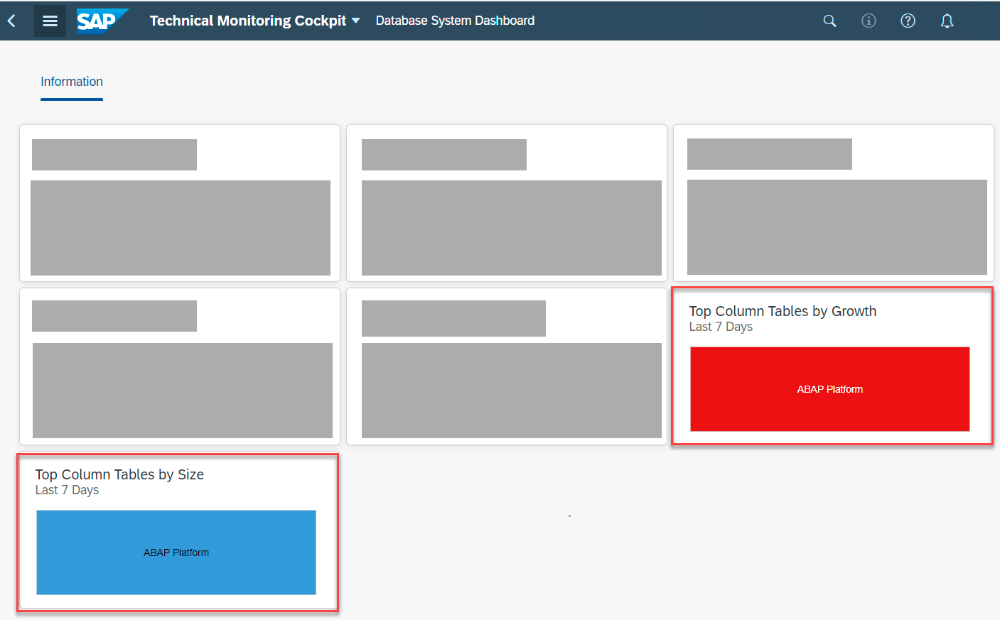

<!-- loio2f55a4c2d2af4af5a3739d3262bfa6d4 -->

# Identifying Large and Rapidly Growing Tables of Your ABAP Environment

## Context

All data that is business-relevant or necessary for technical reasons is stored in tables on the SAP HANA database. Although many table management tasks are automatically performed by the database, large tables consume, of course, memory resources as well as disk space and may even run into the technical 2-billion-record count limit of the database.

On large tables, activities such as SQL statements, column loads, and merges are also more expensive in terms of memory consumption, CPU time, and performance. That’s why housekeeping activities for the largest tables, such as regularly deleting irrelevant data, is an important task.

To identify the largest or most rapidly growing tables, follow these steps:

## Procedure

1.  Log on to the SAP Fiori launchpad of your ABAP environment.

2.  In the group *Technical Monitoring*, you have two options for finding information about your system’s largest or most rapidly growing tables:

    -   For a quick overview, you can choose the *Database System Dashboard* tile.

    -   For an in-depth analysis of your largest tables, you may as well directly choose the *Table Analysis* tile.
    

    Let’s go with the *Database System Dashboard* first.

3.  On the *Database System Dashboard*, you can see at a glance on the *Top Column Tables by Size* and *Top Column Tables by Growth* tiles if there are exceptionally large and fast-growing tables. Hovering over the tile charts will reveal actual sizes in the tooltip.

    > ### Note:  
    > In an empty ABAP Environment, the largest and most rapidly growing tables belong to the ABAP Platform itself and are therefore displayed under the name *ABAP Platform*.

    

    You can choose one of these two tiles to see more details. Let's go with *Top Column Tables by Size* here.

4.  On the screen that opens, you can switch between different sorting options by using the *By Size*, *By Growth*, *By Reads*, and *By Writes* buttons over the chart. It doesn't really matter which of the two tiles you chose in the previous step because they both lead to the same screen - only with a different sorting preselected \(by size or by growth\) - and you can go back and forth between them using the mentioned sorting buttons.

    

5.  If you want to get an in-depth view on a table including its properties, select a table and choose the *Analyze Table* button, which leads you to the *Table Analysis* screen. \(This is the same *Table Analysis* screen you could have optionally chosen from the beginning on the SAP Fiori launchpad, remember?\)

6.  Use the *Table Analysis* screen to learn about the memory consumption of a table, its partitions and indexes, how the table was used, which events occurred on it, and how the memory consumption developed over time.

    

    For more information, see [Table Analysis](https://help.sap.com/viewer/b273a660af4e4948a49a316ea2438f24/Cloud/en-US/33d2484c3c3c4e6f9ba00c4eca043c47.html).

