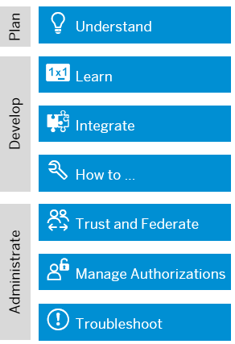

<!-- loio6373bb7a96114d619bfdfdc6f505d1b9 -->

# SAP Authorization and Trust Management Service in the Cloud Foundry Environment

The global account and subaccounts get their users from identity providers. Administrators make sure that users can only access their dedicated subaccount by making sure that there is a dedicated trust relationship only between the identity providers and the respective subaccounts. Developers configure and deploy application-based security artifacts containing authorizations, and administrators assign these authorizations using the SAP BTP cockpit.

> ### Note:  
> Before you start, make yourself familiar with the sections about authentication and authorization of the SAP BTP Planning and Lifecycle-Management Guide. See the [Setting Up Your Security and Compliance Model](https://help.sap.com/viewer/df50977d8bfa4c9a8a063ddb37113c43/Cloud/en-US/aaaad9424e7442eab5d44b20f0ecbfd7.html "Applications on SAP BTP are exposed to the Internet and should therefore fulfill the highest possible security requirements to prevent unauthorized access.") :arrow_upper_right: section.

-   [6373bb7a96114d619bfdfdc6f505d1b9.md\#loio6373bb7a96114d619bfdfdc6f505d1b9\_\_subsection-im1](SAP_Authorization_and_Trust_Management_Service_in_the_Cloud_Foundry_Environment_6373bb7.md#loio6373bb7a96114d619bfdfdc6f505d1b9__subsection-im1)
-   [6373bb7a96114d619bfdfdc6f505d1b9.md\#loio6373bb7a96114d619bfdfdc6f505d1b9\_\_subsection-im2](SAP_Authorization_and_Trust_Management_Service_in_the_Cloud_Foundry_Environment_6373bb7.md#loio6373bb7a96114d619bfdfdc6f505d1b9__subsection-im2)
-   [6373bb7a96114d619bfdfdc6f505d1b9.md\#loio6373bb7a96114d619bfdfdc6f505d1b9\_\_subsection-im3](SAP_Authorization_and_Trust_Management_Service_in_the_Cloud_Foundry_Environment_6373bb7.md#loio6373bb7a96114d619bfdfdc6f505d1b9__subsection-im3)
-   [6373bb7a96114d619bfdfdc6f505d1b9.md\#loio6373bb7a96114d619bfdfdc6f505d1b9\_\_subsection-im7](SAP_Authorization_and_Trust_Management_Service_in_the_Cloud_Foundry_Environment_6373bb7.md#loio6373bb7a96114d619bfdfdc6f505d1b9__subsection-im7)
-   [6373bb7a96114d619bfdfdc6f505d1b9.md\#loio6373bb7a96114d619bfdfdc6f505d1b9\_\_subsection-im4](SAP_Authorization_and_Trust_Management_Service_in_the_Cloud_Foundry_Environment_6373bb7.md#loio6373bb7a96114d619bfdfdc6f505d1b9__subsection-im4)
-   [6373bb7a96114d619bfdfdc6f505d1b9.md\#loio6373bb7a96114d619bfdfdc6f505d1b9\_\_subsection-im5](SAP_Authorization_and_Trust_Management_Service_in_the_Cloud_Foundry_Environment_6373bb7.md#loio6373bb7a96114d619bfdfdc6f505d1b9__subsection-im5)
-   [6373bb7a96114d619bfdfdc6f505d1b9.md\#loio6373bb7a96114d619bfdfdc6f505d1b9\_\_subsection-im6](SAP_Authorization_and_Trust_Management_Service_in_the_Cloud_Foundry_Environment_6373bb7.md#loio6373bb7a96114d619bfdfdc6f505d1b9__subsection-im6)

### 

Hold your pointer over a box for a description. Select a box to display more information.

### Overview of the SAP Authorization and Trust Management Service

Get a high-level overview of the concepts that underpin the SAP Authorization and Trust Management service for SAP BTP in the Cloud Foundry environment.

For more information, see [What Is the SAP Authorization and Trust Management Service?](What_Is_the_SAP_Authorization_and_Trust_Management_Service_649961f.md).

### Tutorials for the SAP Authorization and Trust Management Service

Follow the tutorials below to get familiar with the SAP Authorization and Trust Management service in the Cloud Foundry environment of SAP BTP.

<table>
<tr>
<th>

Tutorials for the SAP Authorization and Trust Management service in the Cloud Foundry environment

</th>
<th>

Language / Framework

</th>
<th>

Link

</th>
</tr>
<tr>
<td>

Learn how to secure a basic single-tenant Node.js application. Start with a Node.js application that uses the express framework and SAPUI5 to display a list of products and add the security components step by step.

</td>
<td>

Node.js

</td>
<td>

 [SAP Developers](https://developers.sap.com/tutorials/cp-cf-security-xsuaa-create.html) 

</td>
</tr>
<tr>
<td>

Learn how to secure a basic java application. This tutorial starts with a Hello World Java application built with SAP Cloud SDK.

</td>
<td>

Java, SAP Cloud SDK

</td>
<td>

 [SAP Developers](https://developers.sap.com/tutorials/s4sdk-secure-cloudfoundry.html) 

</td>
</tr>
<tr>
<td>

Learn how to secure microservices in SAP BTP using `spring-xsuaa` and Spring security. Furthermore, learn how to test the secured application using the`java-security-test` utilities.

</td>
<td>

Spring \(Boot\)

</td>
<td>

 [GitHub](https://github.com/SAP/cloud-security-xsuaa-integration/tree/master/samples/spring-security-xsuaa-usage) 

</td>
</tr>
<tr>
<td>

Learn how to add multitenancy to a node.js application and make it available for other subaccounts using the SaaS Provisioning service and the XSUAA.

</td>
<td>

Node.js

</td>
<td>

 [SAP Developers](https://developers.sap.com/tutorials/cp-cf-security-xsuaa-multi-tenant.html) 

</td>
</tr>
<tr>
<td>

Learn how to secure microservices in SAP BTP. This sample provides J2EE Configuration using web.xml and uses the SAP Java Buildpack.

</td>
<td>

J2EE, SAP Java Buildpack

</td>
<td>

[GitHub \(SAP Java Buildpack version <= 1.26.0\)](https://github.com/SAP/cloud-security-xsuaa-integration/tree/master/samples/sap-java-buildpack-api-usage)

[GitHub \(SAP Java Buildpack version \>=1.26.1\)](https://github.com/SAP/cloud-security-xsuaa-integration/tree/master/samples/java-security-usage)

</td>
</tr>
<tr>
<td>

Learn how to build a cloud-native Node.js application that features secured service-to-service communication. The application shows you two different ways of securing service-to-service-communication \(by propagating a business user or using a technical user\).

</td>
<td>

Node.js

</td>
<td>

 [GitHub](https://github.com/SAP-samples/cloud-nodejs-oflm#readme) 

</td>
</tr>
<tr>
<td>

Learn how to use `java-security` to perform JWT Validation as part of your Java application. Furthermore, learn how to test the secured application using the `java-security-test` utilities.

</td>
<td>

Java

</td>
<td>

 [GitHub](https://github.com/SAP/cloud-security-xsuaa-integration/tree/master/samples/java-security-usage) 

</td>
</tr>
<tr>
<td>

Learn in this reference application how the service fits into a complete architecture of microservices that interact with each other propagating user information.

</td>
<td>

Java

</td>
<td>

 [GitHub](https://github.com/SAP-samples/cloud-espm-cloud-native#security-implementation) 

</td>
</tr>
</table>

### Principal Propagation

Exchange user ID information between systems or environments in SAP BTP.

**In This Section**

-   [Principal Propagation from the Cloud Foundry to the Neo Environment](Principal_Propagation_from_the_Cloud_Foundry_to_the_Neo_Environment_391e9ed.md#loio391e9ed92ff448e0b4bacac69f853516)
-   [Principal Propagation from the Neo to the Cloud Foundry Environment](Principal_Propagation_from_the_Neo_to_the_Cloud_Foundry_Environment_6e194f8.md#loio6e194f8e919a40bab7e39cd992677cb7)

**Other Principal Propagation Scenarios**

-   [On-Premise User Store](https://help.sap.com/viewer/ea72206b834e4ace9cd834feed6c0e09/Cloud/en-US/04cbd0f30d524612aa438ed0b0eed217.html "If you already have an existing on-premise system with a populated user store, you can configure SAP BTP applications to use that on-premise user store. This approach is similar to implementing identity federation with a corporate identity provider. In that way, applications do not need to keep the whole user database, but request the necessary information from the on-premise system.") :arrow_upper_right:
-   [Principal Propagation to OAuth-Protected Applications](https://help.sap.com/viewer/ea72206b834e4ace9cd834feed6c0e09/Cloud/en-US/310f39e504024079933066db8b6c6d00.html "Propagate users from external applications with SAML identity federation to OAuth-protected applications running in the Neo environment of SAP BTP. Exchange the user ID and attributes from a SAML assertion for an OAuth access token, and use the access token to access the OAuth-protected application.") :arrow_upper_right:
-   [Connectivity in the Cloud Foundry Environment: Principal Propagation](https://help.sap.com/viewer/cca91383641e40ffbe03bdc78f00f681/Cloud/en-US/e2cbb48def4342048362039cc157b12e.html)
-   [Connectivity in the Neo Environment: Principal Propagation](https://help.sap.com/viewer/cca91383641e40ffbe03bdc78f00f681/Cloud/en-US/d4d3e1e9b2dd44318b49a4812cd51383.html)

### Trust and Federation

When setting up accounts you need to assign users. While we provide you with your first users to get you started, your organization has its own user bases which you want to integrate.

SAP BTP supports identity federation, a concept of linking and reusing digital identities of a user base across loosely coupled systems. Identity federation frees applications on SAP BTP from the need to obtain and store the credentials of users to can authenticate them. Instead, the application user base is reused from identity providers, which support the administration of digital user identities, authentication, and authorizations in a centralized and decoupled manner. To enable communication between SAP BTP and identity providers, you must cross-configure the communication endpoints of the involved systems, establishing a trust relationship between them.

> ### Recommendation:  
> We recommend that you use SAP Cloud Identity Services - Identity Authentication as a hub, especially if your business users are stored in multiple corporate identity providers.
> 
> For this scenario, connect Identity Authentication as single custom identity provider to SAP BTP. Next use Identity Authentication to integrate your corporate identity providers.
> 
> For more information, see [Corporate Identity Providers](https://help.sap.com/viewer/6d6d63354d1242d185ab4830fc04feb1/Cloud/en-US/19f3eca47db643b6aad448b5dc1075ad.html) and [Configure Conditional Authentication for an Application](https://help.sap.com/viewer/6d6d63354d1242d185ab4830fc04feb1/Cloud/en-US/0143dce88a604533ab5ab17e639fec09.html) in [What Is Identity Authentication](https://help.sap.com/viewer/6d6d63354d1242d185ab4830fc04feb1/Cloud/en-US/27882717f44b445fa287936c6f43dc1f.html) and [SAP Cloud Identity Services - Identity Authentication](https://help.sap.com/viewer/product/IDENTITY_AUTHENTICATION/Cloud/en-US)

   
  
<a name="loio6373bb7a96114d619bfdfdc6f505d1b9__fig_k5y_t5n_wmb"/>Identity Provider and XSUAA in SAP BTP Architecture

  

Identity Authentication is a multitenancy enabled identity management service for all applications powered by SAP BTP and optionally on-premise applications. The service provides capabilities for authentication, single sign-on, user provisioning, and on-premise integration as well as self-services like registration or password reset — for both the employees and the partners and customers of your organization. For administrators, the service offers features for user lifecycle management and reporting capabilities in the administration console.

SAP BTP has its own Identity Authentication tenant, SAP ID Service. SAP ID Service is the default identity provider of SAP BTP and where you register to get initial access to SAP BTP. Trust to SAP ID service is preconfigured by default.

We recommend that you request your own Identity Authentication tenant, but you can also use any other identity provider, which supports the SAML 2.0 protocol. To establish trust with your identity provider, perform one of the following procedures.

For business users:

-   [Establish Trust and Federation Between UAA and Identity Authentication](Establish_Trust_and_Federation_Between_UAA_and_Identity_Authentication_161f8f0.md#loio161f8f0cfac64c4fa2d973bc5f08a894)

-   [Manually Establish Trust and Federation Between UAA and Identity Authentication](Manually_Establish_Trust_and_Federation_Between_UAA_and_Identity_Authentication_7c6aa87.md#loio7c6aa87459764b179aeccadccd4f91f3)

-   [Establish Trust and Federation with UAA Using Any SAML Identity Provider](Establish_Trust_and_Federation_with_UAA_Using_Any_SAML_Identity_Provider_2ce3938.md#loio2ce3938c66d94479848bff3090999027)

For platform users:

-   [Establish Trust and Federation of Custom Identity Providers for Platform Users in Multi-Environment Subaccounts \[Feature Set A\]](Establish_Trust_and_Federation_of_Custom_Identity_Providers_for_Platform_Users_in_Multi-Environment_Subaccounts_Feature_Set_A_8600afb.md)

For default identity provider:

-   [Default Identity Federation with SAP ID Service in the Cloud Foundry Environment](Default_Identity_Federation_with_SAP_ID_Service_in_the_Cloud_Foundry_Environment_36d21ac.md)

    > ### Note:  
    > How you assign users to their authorizations depends on the type of trust configuration. If you’re using the default trust configuration via SAP ID service, you can assign users directly to role collections. For more information, see [Default Identity Federation with SAP ID Service in the Cloud Foundry Environment](Default_Identity_Federation_with_SAP_ID_Service_in_the_Cloud_Foundry_Environment_36d21ac.md).
    > 
    > However, if you’re using a custom trust configuration as described in this topic, you can assign individual users or groups to role collections. Assigning users to their authorizations is part of application administration, which is described here. For more information, see [Assigning Role Collections](Assigning_Role_Collections_9e1bf57.md).

    The identity provider hosts the business users, who belong to user groups. It’s efficient to use federation by assigning role collections to one or more user groups. The role collection contains all the authorizations that are necessary for this user group. This method saves time when you add a new business user. Simply add the users to the respective user groups and the new business users automatically get all the authorizations that are included in the role collection.

### Administration: Managing Authentication and Authorization

In the Cloud Foundry environment, application developers create and deploy application-based authorization artifacts for business users. Administrators use this information to assign roles, build role collections, and assign these collections to business users or user groups. In this way, they control the users' permissions.

<a name="loio6373bb7a96114d619bfdfdc6f505d1b9__table_b4h_4rg_vbb"/>Setting Up Authorization Artifacts \(Administrators\)

<table>
<tr>
<th>

Task

</th>
<th>

User Role

</th>
<th>

Tool

</th>
</tr>
<tr>
<td>

Use an existing role or create a new one using role templates

[Add Roles to Role Collections on the Application Level](Add_Roles_to_Role_Collections_on_the_Application_Level_7596a0b.md)

</td>
<td>

Administrator of the Cloud Foundry environment

</td>
<td>

SAP BTP cockpit

Command line interface for SAP BTP

</td>
</tr>
<tr>
<td>

Create a role collection and assign roles to it

[Maintain Role Collections](Maintain_Role_Collections_d5f1612.md)

</td>
<td>

Administrator of the Cloud Foundry environment

</td>
<td>

SAP BTP cockpit

Command line interface for SAP BTP

</td>
</tr>
<tr>
<td>

Assign the role collections to users

[Managing Users and Their Authorizations Using the btp CLI](Managing_Users_and_Their_Authorizations_Using_the_btp_CLI_94bb593.md) or [Assigning Role Collections](Assigning_Role_Collections_9e1bf57.md)

</td>
<td>

Administrator of the Cloud Foundry environment

</td>
<td>

SAP BTP cockpit

Command line interface for SAP BTP

</td>
</tr>
<tr>
<td>

\(If you do not use `SAP ID Service`\) Assign the role collections to user groups \(cloud management tools feature set A regions\)

[Map Role Collections to User Groups](Map_Role_Collections_to_User_Groups_51acfc8.md)

</td>
<td>

Administrator of the Cloud Foundry environment

</td>
<td>

SAP BTP cockpit

</td>
</tr>
<tr>
<td>

Assign the role collection to the business users provided by an identity provider \(cloud management tools feature set A\)

[Directly Assign Role Collections to Users](Directly_Assign_Role_Collections_to_Users_a55a3fe.md)

</td>
<td>

Administrator of the Cloud Foundry environment

</td>
<td>

SAP BTP cockpit

</td>
</tr>
</table>

### Troubleshooting

This section provides information on troubleshooting-related activities for the SAP Authorization and Trust Management service in the Cloud Foundry environment.

> ### Tip:  
> We also recommend that you regularly check the SAP Notes and Knowledge Base for component `BC-CP-CF-SEC-IAM` in the [SAP Support Portal](https://support.sap.com/home.html). These contain information about program corrections and provide additional information.
> 
> To help you troubleshoot your issue, we also recommend increasing the log verbosity of your application and application router. We provide a [script](https://github.com/SAP/cloud-security-xsuaa-integration/tree/master/troubleshooting/logcollector) to help you. If for some reason you can't use this script, increase the log verbosity manually, see related link.

Our troubleshooting information can be found in our Guided Answers [Troubleshooting for the SAP Authorization and Trust Management service in the Cloud Foundry environment](https://ga.support.sap.com/dtp/viewer/index.html#/tree/2212/actions/28290). Guided Answers are a specialized format to guide you step by step through troubleshooting topics. Check the individual troubleshooting topics for your error message. If you can't find your problem, create an incident in the component `BC-CP-CF-SEC-IAM`. For more information, see the related link.

-   [The Security Tab Is Missing in the Subaccount](https://ga.support.sap.com/dtp/viewer/index.html#/tree/2212/actions/28290:34793)

-   [Access Is Denied or Forbidden](https://ga.support.sap.com/dtp/viewer/index.html#/tree/2212/actions/28290:28291)

-   [Identity Provider Could Not Process Authentication Request](https://ga.support.sap.com/dtp/viewer/index.html#/tree/2212/actions/28290:28292)

-   [Logon Screen Shows "SAP HANA XS Advanced"](https://ga.support.sap.com/dtp/viewer/index.html#/tree/2212/actions/28290:28293)

-   [Requested Route Does Not Exist](https://ga.support.sap.com/dtp/viewer/index.html#/tree/2212/actions/28290:34795)

-   [Subdomain Does Not Map to a Valid Identity Zone](https://ga.support.sap.com/dtp/viewer/index.html#/tree/2212/actions/28290:34797)

-   [No Client with Requested ID](https://ga.support.sap.com/dtp/viewer/index.html#/tree/2212/actions/28290:34801)

-   [Cannot Add Role Templates to Predefined Role Collections](https://ga.support.sap.com/dtp/viewer/index.html#/tree/2212/actions/28290:35574)

-   [502 Error: Call to /oauth/token Was Not Successful](https://ga.support.sap.com/dtp/viewer/index.html#/tree/2212/actions/28290:40211)

### Adding Authentication and Authorization

Developers create authorization information for business users in their environment and deploy this information in an application. They make this available to administrators, who complete the authorization setup and assign the authorizations to business users.

Developers store authorization information as design-time role templates in the `xs-security.json` security descriptor file. Using the cockpit, administrators of the environment assign the authorizations to business users.

The following sections contain the process of adding authentication and authorization checks for protecting your applications, links to a number of associated tutorials, extended tasks for creating authorization artifacts, as well as reference information, including the syntax required to set the properties and values defined in the application security descriptor file.

-   [Protecting Your Application](Protecting_Your_Application_7c5c565.md)
-   [Tutorials for the SAP Authorization and Trust Management Service](Tutorials_for_the_SAP_Authorization_and_Trust_Management_Service_902ae80.md)
-   [Application Security Descriptor Configuration Syntax](Application_Security_Descriptor_Configuration_Syntax_517895a.md)

-   **[What Is the SAP Authorization and Trust Management Service?](What_Is_the_SAP_Authorization_and_Trust_Management_Service_649961f.md "Get a high-level overview of the concepts that underpin the
                        SAP Authorization and Trust
                                    Management service for
                        SAP BTP in
                    the Cloud
                                Foundry environment.")**  
Get a high-level overview of the concepts that underpin the SAP Authorization and Trust Management service for SAP BTP in the Cloud Foundry environment.
-   **[Web Access Control](Web_Access_Control_70a62d1.md "The Cloud
                                Foundry environment extends SAP BTP. It provides platform security functions such as business user
		authentication, authorization management, and other security functions for access to the applications in the runtime container. To access the
		runtime container, the business user can use a browser or a browser-based user interface.")**  
The Cloud Foundry environment extends SAP BTP. It provides platform security functions such as business user authentication, authorization management, and other security functions for access to the applications in the runtime container. To access the runtime container, the business user can use a browser or a browser-based user interface.
-   **[API Access Control](API_Access_Control_3a23d64.md "The Cloud
                                Foundry environment extends SAP BTP. It provides platform security functions such as business system
		authentication, authorization management, and other security functions to enable business systems to access the applications (for example,
		Java or Node.js) in the runtime container. Business systems use APIs to access the runtime container.")**  
The Cloud Foundry environment extends SAP BTP. It provides platform security functions such as business system authentication, authorization management, and other security functions to enable business systems to access the applications \(for example, Java or Node.js\) in the runtime container. Business systems use APIs to access the runtime container.
-   **[Authorization Entities](Authorization_Entities_5d8ed75.md "Business users in an application require different authorizations because they work in different jobs.")**  
Business users in an application require different authorizations because they work in different jobs.
-   **[Monitoring and Troubleshooting](Monitoring_and_Troubleshooting_1b3e89e.md "This section provides information on troubleshooting-related
                activities for the SAP Authorization and Trust
                                    Management service in the
                    Cloud
                                Foundry
                environment.")**  
This section provides information on troubleshooting-related activities for the SAP Authorization and Trust Management service in the Cloud Foundry environment.
-   **[Security Considerations for the SAP Authorization and Trust Management Service](Security_Considerations_for_the_SAP_Authorization_and_Trust_Management_Service_f117cab.md#loiof117cab6b92d438cb2a0b5204713994b "Decisions you make when using or administrating the SAP Authorization and Trust
                                    Management service (XSUAA) can
		have an impact on the security of your applications. The information provided is meant to
		help you in decide.")**  
Decisions you make when using or administrating the SAP Authorization and Trust Management service \(XSUAA\) can have an impact on the security of your applications. The information provided is meant to help you in decide.
-   **[Configuration Options for the SAP Authorization and Trust Management Service](Configuration_Options_for_the_SAP_Authorization_and_Trust_Management_Service_3654087.md#loio3654087e15864b49a1bca3967a54a095 "The following configuration options enable you to manipulate the operation of the SAP Authorization and Trust
                                    Management service (XSUAA). Set
		these options in the application security descriptor (xs-security.json)
		at design time for your application.")**  
The following configuration options enable you to manipulate the operation of the SAP Authorization and Trust Management service \(XSUAA\). Set these options in the application security descriptor \(`xs-security.json`\) at design time for your application.
-   **[Rate Limiting](Rate_Limiting_d203e2d.md "This section provides information on the rate limiting in the SAP Authorization and Trust
                                    Management service.")**  
This section provides information on the rate limiting in the SAP Authorization and Trust Management service.

**Related Information**  

[Cloud Management Tools — Feature Set Overview](Cloud_Management_Tools_—_Feature_Set_Overview_caf4e4e.md "Cloud management tools represent the group of technologies designed for managing SAP BTP.")

