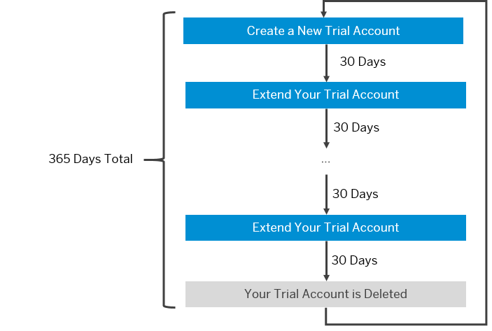

<!-- loio046f127f2a614438b616ccfc575fdb16 -->

# Trial Accounts

Trial accounts let you try out SAP BTP for free with a restricted use of the platform resources and services.

 SAP BTP provides different types of global accounts, **enterprise and** **trial**. The type you choose determines pricing, conditions of use, resources, available services, and hosts.

It depends on your use case whether you choose a free trial account or a paid enterprise account. You may want to start out with an SAP BTP trial account that also gives you access to our community, including free technical resources such as tutorials and blog posts. If you plan to use your global account in productive mode, you must purchase a paid enterprise account. It’s important that you’re aware of these differences when you’re planning and setting up your account model. For more information, see [Enterprise Accounts](Enterprise_Accounts_171511c.md).

A **trial account** lets you try out SAP BTP for free. Access is open to everyone. Trial accounts are intended for personal exploration, and not for production use or team development. They allow restricted use of the platform resources and services.

<a name="loio046f127f2a614438b616ccfc575fdb16__section_trial-lifecycle"/>

## Trial Lifecycle

-   **Create a SAP BTP trial account.**

    You can self-register for a trial account. For more information, see [Get a Free Trial Account](Getting_a_Global_Account_d61c281.md#loio42e7e54590424e65969fced1acd47694).

-   **Use your SAP BTP trial account.**

    To find out how you can use your trial account, see [Trial Scope](Trial_Accounts_046f127.md#loio046f127f2a614438b616ccfc575fdb16__section_trial-scope) or try out one of our [Starter Scenarios](https://developers.sap.com/tutorial-navigator.html?tag=tutorial:topic/cp-starter-scenario) on the [Tutorial Navigator](https://developers.sap.com/tutorial-navigator.html?tag=products:technology-platform/sap-business-technology-platform).

-   **Extend your SAP BTP trial account in 30-day intervals.**
    -   Extend your trial account by clicking *Extend Trial Account* in the popup window that appears once 30 days have passed.

    -   If you sign into your trial account regularly, the 30-day intervals are extended automatically for you.

    -   If you don't sign into your trial account regularly, your account will be suspended after your current 30-day interval. You aren’t able to use applications or services in suspended accounts. To reactivate a suspended trial account, click *Extend Trial Account* in the popup window that appears when you try to sign in. You'll be then able to use your account again.

-   **Delete your SAP BTP trial account.**

    -   365 days after you registered for your trial account, your account is deleted automatically.

    -   If you ever want to proactively delete your SAP BTP trial account, you can navigate to the global accounts scope and select the *Account Explorer* page, then click the *Delete Trial Account* button.

After your trial account has been deleted, you can create a new trial account, anytime.

  

<a name="loio046f127f2a614438b616ccfc575fdb16__section_trial-scope"/>

## Trial Scope

-   A trial account enables you to explore the basic functionality of SAP BTP for 365 days.

-   SAP BTP trial accounts use cloud management tools feature set B. For more information, see [Cloud Management Tools — Feature Set Overview](Cloud_Management_Tools_—_Feature_Set_Overview_caf4e4e.md).

-   SAP BTP trial accounts are available in several regions. For more information, see [Regions](Regions_350356d.md#loio350356d1dc314d3199dca15bd2ab9b0e).

-   You can create directories in your trial account. For more information, see [Managing Directories Using the Cockpit \[Feature Set B\]](Managing_Directories_Using_the_Cockpit_Feature_Set_B_f495ac1.md)

-   You can use productive and beta services. To consume beta services, you must enable the subaccount for beta features during the subaccount creation or when you edit the subaccount details.

-   You can manage security useres in your subaccounts by assigning them role collections. For more information, see [Working with Role Collections](Working_with_Role_Collections_393ea0b.md).

-   A trial account includes 4 GB of memory for applications.

-   You can use 8 GB of instance memory.

-   There are 10 total routes and 40 total services available.

-   You can use 2 configured on-premise systems with the Cloud connector.

-   There’s no service level agreement with regards to the availability of the platform.

-   You can use HDI containers in a shared SAP HANA database \(only available on cf-eu10 or cf-us10\).

-   For cleanup purposes, applications stop automatically on a daily basis. You need to manually restart them when needed.

    > ### Note:  
    > Applications are stopped at midnight \(or some time thereafter depending on server load\) relative to the region in which you created your trial account. If you’re working in a time zone that is far from the region where you trial account was created, then your applications may stop during business hours.

**Related Information**  

[Getting Started with a Trial Account in the Cloud Foundry Environment](Getting_Started_with_a_Trial_Account_in_the_Cloud_Foundry_Environment_e50ab7b.md "Quickly get started with a trial account.")

[Getting Started with a Trial Account in the ABAP Environment](Getting_Started_with_a_Trial_Account_in_the_ABAP_Environment_720c423.md "Quickly get started with a trial account.")

[Getting Started with a Trial Account in the Kyma Environment](Getting_Started_with_a_Trial_Account_in_the_Kyma_Environment_ccb83c7.md "Quickly get started with a trial account.")

